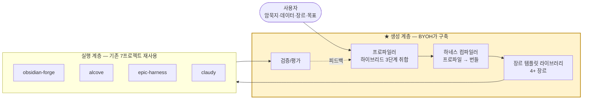
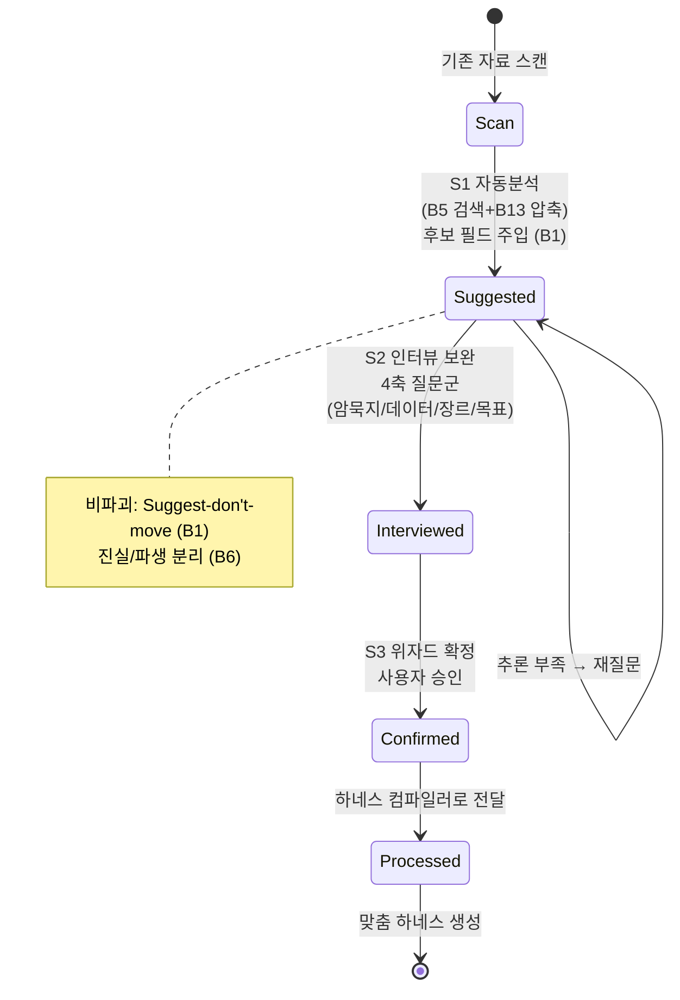
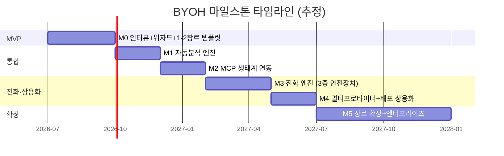

# BuildYourOwnHarness (BYOH)

> **사용자의 암묵지·데이터·비즈니스 장르·목표를 인터랙티브하게 취합하여, 사용자만의 맞춤형 AI 하네스 엔지니어링 시스템을 생성·배포·운영·진화시키는 서비스.**
>
> epiccounty 워크스페이스의 7개 프로젝트를 레퍼런스로 삼아, 그 검증된 빌딩 블록 위에 **"생성 계층(generation layer)"** 을 추가하는 프로젝트 기획 패키지.

---

## 🦀 구현 상태 (Implementation)

이 저장소는 기획서(`docs/00..04`)를 기반으로 **생성 계층의 Rust 구현체**를 포함한다. 헥사고날 아키텍처(domain / ports / adapters / application / compiler / evolve / templates / deploy / i18n / obs / security / cli).

### 빌드 및 검증

```bash
cargo build --release            # 단일 바이너리 byoh
cargo clippy --all-targets -- -D warnings   # 경고 0
cargo test                       # 단위 + 통합 테스트 (98개)
./target/release/byoh --help
```

### CLI 진입점

```bash
byoh profile init <slug> [--paths ...]   # 초안 프로파일 + (선택) M1 자동분석
byoh profile interview <slug>            # S2 인터뷰 (Suggest-don't-move + Council)
byoh profile confirm <slug> --genre <g>  # S3 위자드 확정
byoh compile <slug> [--dry-run]          # 정적 게이트 + dry-run 게이트 → HarnessBundle
byoh doctor                              # 의존 실행 계층 도구 검증
byoh install <slug>                      # 부트스트래퍼 기반 설치
byoh run <slug>                          # 공통 실행 진입점
byoh evolve <slug>                       # 3중 안전장치 진화 사이클
```

### 구현된 요구사항 (R1–R20)

| 영역 | 구현 |
|------|------|
| 프로파일 스키마 | `truth`/`candidates`/`derived` 중첩 블록 + 4상태 머신(`draft→interviewed→confirmed→evolving`) |
| 3단계 취합 | S1 자동분석(비파괴, vector→BM25→grep 폴백) · S2 인터뷰(Suggest + Council 4음성) · S3 위자드(자기-설명 옵션) |
| 컴파일러 | 4-Ring 골격 자동생성 · MCP 도구 자동생성(B4) · 정적 게이트(3계약) · dry-run 게이트(샌드박스 폴백) · diff 기반 증분 재컴파일(3a/3b/3c) |
| 장르 템플릿 | base 상속(불변 Ring 0-3 + 3중 안전장치) + developer/creator(MVP) + researcher/business(확장) |
| 진화 엔진 | Critic(보상해킹 방어) · Seesaw(파괴적 망각) · Stagnation(정체 롤백) 3중 강제 + SkillOpt 패턴 마이닝 |
| 리콜/압축 | B11 장르별 가중 스마트 리콜 · B13 4단계 적응형 압축(장르별 중요도) |
| 배포 | install.sh/install.ps1/cargo-binstall 부트스트래퍼 · 정적 레지스트리 · B14 CapabilityProfile 매칭 · B17 ko/en i18n · B9 파일기반 상태(45분 크래시 복구) |
| 보안 | 시크릿 마스킹(OC=/bearer/api_key/sk-) · 합성 데이터만 · `#![forbid(unsafe_code)]` |

> 외부 실행 계층 도구(obsidian-forge/alcove/epic-harness/claudy)는 BYOH가 재구현하지 않고 `CommandPort` 뒤에서 호출한다 — BYOH는 생성 계층만 담당한다(스펙 §Out).

---


---

## 📖 산출물 네비게이션

본 패키지는 한 편의 기획서처럼 읽히도록 5개 문서로 구성되어 있다. 권장 순서대로 읽으면 "왜 → 무엇 → 어떻게 → 핵심 차별 → 언제"가 완성된다.

| # | 문서 | 역할 | 분량 |
|---|------|------|------|
| 00 | [리서치 보고서](docs/00_RESEARCH_REPORT.md) | **근거**: 7개 프로젝트에서 17개 빌딩 블록(B1-B17) 추출 + 갭 분석 + epic-harness 자산 전수 매핑 + 외부 생태계 교차 검증 | 625줄 / 7 다이어그램 |
| 01 | [프로젝트 계획서](docs/01_PROJECT_PLAN.md) | **무엇을**: 비전·페르소나·가치제안·비즈니스모델·KPI·경쟁분석 | 478줄 / 7 다이어그램 |
| 02 | [아키텍처 설계서](docs/02_ARCHITECTURE.md) | **어떻게**: C4 컨테이너·3단계 취합 파이프라인·컴파일러·데이터모델 | 910줄 / 14 다이어그램 |
| 03 | [인터뷰 설계서](docs/03_INTERVIEW_DESIGN.md) | **차별 핵심**: 암묵지 발굴 루프·질문 뱅크·장르별 분기·프로파일 스키마 | 681줄 / 5 다이어그램 |
| 04 | [기술 로드맵](docs/04_ROADMAP.md) | **언제**: M0-M5 마일스톤·의존관계·평가게이트·기술부채 | 638줄 / 7 다이어그램 |

```
BuildYourOwnHarness/
├── README.md                      ← 본 파일 (오버뷰 + 네비게이션)
└── docs/
    ├── 00_RESEARCH_REPORT.md      ← 근거 (빌딩 블록 카탈로그)
    ├── 01_PROJECT_PLAN.md         ← 서비스 기획
    ├── 02_ARCHITECTURE.md         ← 시스템 설계
    ├── 03_INTERVIEW_DESIGN.md     ← 인터랙티브 취합 설계
    └── 04_ROADMAP.md              ← 실행 계획
```

> **통계**: 총 3,615줄, 43개 mermaid 다이어그램, 17개 빌딩 블록 전수 인용 + epic-harness 자산 16종 매핑 + 커뮤니티 플러그인 11종 인용. 작성일 2026-06-24 (레퍼런스 강화 업데이트).

---

## 🎯 30초 요약

**문제**: 강력한 AI 하네스 도구(epic-harness, alcove, obsidian-forge 등)는 이미 존재하지만, 그것은 *"이미 하네스를 가진 고급 사용자"* 를 위한 부품이다. 대다수 사용자는 자신의 암묵지·업무 장르·목표를 그 부품에 *어떻게 녹일지* 모른다.

**해결책**: BYOH는 부품 자체를 만드는 게 아니라, **사용자를 인터뷰하고 자료를 분석해 올바른 부품 조합을 자동 생성하는 "생성 계층"** 을 추가한다.



---

## 🔑 핵심 통찰 (리서치에서 도출)

BYOH의 타당성은 3가지 통찰에 기반한다 (상세: [리서치 보고서 §0](docs/00_RESEARCH_REPORT.md)).

1. **암묵지→형식지 변환 파이프라인이 이미 존재한다** — obsidian-forge의 `status: inbox→suggested→confirmed→processed` + AI 후보 필드는 "사용자 암묵지를 AI가 제안하고 인간이 승인하는" 루프의 완성된 구현(B1). BYOH의 인터랙티브 취합은 이 패턴의 일반화다.

2. **하네스는 4개 분리 계층(수집·검색·실행·진화)이며, 각 계층은 독립 교체 가능하다** — 느슨한 결합 3계약(MCP/Hooks/CLI)으로 사용자가 자신의 장르에 맞춰 부분만 채택할 수 있다.

3. **자기 진화는 점진적 누적으로 통제된다** — epic-harness Ring 3는 Critic(보상해킹 방어)·Seesaw(파괴적망각 방지)·Stagnation(정체시롤백) 3중 안전장치로 진화를 통제한다(B10). 맞춤형 하네스도 동일한 통제가 필수다.

---

## 🧩 하이브리드 3단계 취합 (BYOH의 차별적 핵심)

사용자 입력을 취합하는 핵심 메커니즘. 단일 방식이 아닌 **3단계 하이브리드**로 암묵지의 주관성을 보완한다 (상세: [인터뷰 설계서 §2](docs/03_INTERVIEW_DESIGN.md), [아키텍처 §3](docs/02_ARCHITECTURE.md)).



| 단계 | 이름 | 입력 | 출력 | 재사용 블록 |
|------|------|------|------|------------|
| **S1** | 자동분석 (베이스라인) | 볼트/문서/코드/이메일 | 후보 필드 + 신뢰도 | B5(하이브리드검색), B13(적응형압축), B6(진실/파생분리) |
| **S2** | 인터뷰 (보완) | 후보 + 4축 질문 | 보강된 프로파일 | B1(Suggest-don't-move), B12(Council 검증) |
| **S3** | 위자드 (확정) | 보강 프로파일 | 승인된 Profile YAML | B4(자기-설명 원칙) |

> **설계 원칙**: AI는 사용자 자료를 *이동시키지 않고* frontmatter에 후보만 채운다(Suggest-don't-move). 사용자가 승인한 사실(truth)과 AI 추론(candidates/derived)을 명확히 분리해, 하네스 컴파일러는 truth만 불변 1차 소스로 취급한다(B6 역유도 불변량).

---

## 🏗️ 7개 레퍼런스 프로젝트 매핑

BYOH는 아래 7개 프로젝트를 그대로 재사용한다. BYOH가 새로 짓는 것은 *생성 계층*뿐이다.

| 프로젝트 | 역할 (축) | BYOH에서의 재사용 | 핵심 블록 |
|---------|----------|------------------|----------|
| **obsidian-forge** | 지식 수집·분류 (축1) | 인터랙티브 취합 파이프라인 원형 | B1, B2, B3 |
| **alcove** | 지식 검색·서빙 (축2) | 장르 RAG, 맞춤 도구 자동생성 | B4, B5 |
| **Episteme** | 정규화 지식 그래프 (축3) | 진실/파생 분리, 장르 엔티티 확장 기반 | B6, B7 |
| **epic-harness** | 실행·자기진화 (축4) | 생성된 하네스의 골격 + 진화 엔진 | B8, B9, B10, B11, B12 |
| **llm-transpile** | 컨텍스트 최적화 (축5) | 대용량 지식 토큰 압축 | B13 |
| **claudy** | 멀티프로바이더 런처 (축6) | 사용자 LLM 선택 지원 | B14, B15 |
| **epiccounty.com** | 배포·버전관리 (축7) | 생성된 하네스 패키징·배포 | B16, B17 |

상세 패턴 분석: [리서치 보고서 §2-3](docs/00_RESEARCH_REPORT.md).

### 🔧 epic-harness에서 차용하는 구체 자산

7개 프로젝트 중 **epic-harness는 BYOH의 뼈대(B8-B12)를 기여**하지만, 그 구현 자산이 빌딩블록 ID 뒤에 숨어 있다. 아래는 BYOH가 *직접 차용/복제/재사용*하는 epic-harness의 구체 자산 매핑이다. (모든 산출물은 이 표를 레퍼런스로 소급한다.)

| epic-harness 자산 | 소스 경로 | BYOH 적용점 |
|---|---|---|
| `_dispatch` (디스패치 라우터) | `registry/skills/_dispatch/SKILL.md` | 생성된 하네스의 컨텍스트→스킬 라우팅 원형 (B8 Ring 2) |
| `SPEC-{ts}.md` (R1/AC1 번호 요구사항) | `registry/skills/spec/SKILL.md` | 인터뷰 산출 Profile 명세 패턴 ([03 §6](docs/03_INTERVIEW_DESIGN.md)) |
| `harness-mem` (메모리 그래프) | `src/mem/` (+ MCP `registry/mcp.json`) | B11 사용자 메모리 그래프의 구현체 |
| `registry/presets` (cold-start 스택 프리셋) | `registry/presets/` | 장르 템플릿 라이브러리 상속 메커니즘 원형 ([02 §6](docs/02_ARCHITECTURE.md)) |
| `SKILL.md` 4섹션 (Process / Anti-Rationalization / Evidence / Red Flags) | `registry/skills/*/SKILL.md` | 컴파일러가 생성하는 스킬의 명세 표준 ([02 §5.2](docs/02_ARCHITECTURE.md)) |
| `hooks/hooks.json` (6훅 계약) | `hooks/hooks.json` | 번들의 Ring 0 훅 계약 (SessionStart/PreToolUse/PostToolUse/PostEdit/PreCompact/SessionEnd) |
| `install.js` (자동설치) | `registry/scripts/install.js` | 번들 부트스트래퍼 — SessionStart 훅이 바이너리 누락 시 자동 설치 |
| `gen-skills` / `lint-skills` | `Makefile` | M0 컴파일러의 스킬 검증 (frontmatter+name+description, CSO compliance) |
| `evolved/` (진화 스킬 디렉토리) | `~/.harness/projects/{slug}/evolved/` | 맞춤 하네스의 진화 스킬 저장소 (`MAX_EVOLVED_SKILLS=10`) |
| `EditType` (AddSkill/ModifyInstinct/ModifyConfig/AddGuardRule/ModifyPrompt) | `src/shared/evolution.rs` | 진화 엔진의 적응 분류 체계 |
| `anti-anchoring` (독립 컨텍스트) | `registry/skills/council/SKILL.md` | B12 Council — 각 음성이 대화·타 음성 없이 질문만 수신 |
| `go:plan` / `go:build` / `go:integrate` (TDD Red→Green→Refactor) | `registry/skills/go/SKILL.md` | Ring 1 파이프라인의 구현 모드 |
| `orbit` (자율 파이프라인 + 복구 프로토콜) | `registry/commands/orbit.md`, `src/shared/orbit.rs` | 긴 취합/컴파일 자동화 (B9, 45분 timeout·`phase_history` 우선) |
| 게이트 상수 (`STAGNATION_LIMIT=3`, `IMPROVEMENT_THRESHOLD=2%`, 거절버퍼 TTL=10세션) | `src/evolve/{critic,seesaw,metrics,skills,edits}.rs` | B10 진화 통제 기본값 (3중 안전장치) |
| `SkillOpt` 미니배치 (N 관찰→우세에러≥60% & ≥2파일→재사용) | `src/evolve/skills.rs` | 진화 스킬 시딩 휴리스틱 |

> **차용 원칙**: BYOH의 "하네스 컴파일러"가 생성하는 번들은 위 자산의 *구조와 계약*을 따른다. 단, 장르별 오버라이드(도메인 엔티티·검색 가중치·프롬프트)는 BYOH가 추가하는 부분이다. 자산별 상세 차용 시점은 [로드맵 M0/M3](docs/04_ROADMAP.md) 참조.

---

## 🌐 커뮤니티 생태계 레퍼런스 (awesome-claude-plugins)

BYOH는 단일 org 내부 프로젝트에만 의존하지 않는다. 외부 커뮤니티에서 검증된 Claude Code 플러그인 생태계를 장르 템플릿의 *참조 구현* 및 경쟁 분석의 근거로 삼는다.

**소스**: [`quemsah/awesome-claude-plugins`](https://github.com/quemsah/awesome-claude-plugins) — "Top 100 Claude Code Plugins", 23,121개 저장소 인덱싱 (2026-06-22 업데이트, 886★). n8n 워크플로로 GitHub 플러그인 채택 메트릭을 자동 수집한 리스트.

### 유사 하네스 / 경쟁 지형

BYOH가 "생성 계층"으로 차별화하는 대상 — 기존에는 이들이 *하나의 고정된 하네스*를 제공한다.

| 순위 | 저장소 | 스타(2026-06) | BYOH와의 관계 |
|------|--------|----------|--------------|
| #1 | `obra/superpowers` | 234k | agentic skills 프레임워크 — 고정 스킬셋 |
| #2 | `affaan-m/ECC` | 219k | "agent harness performance optimization" — BYOH와 가장 직접적 경쟁 |
| #14 | `ruvnet/ruflo` | 60k | "agent meta-harness" + multi-agent swarm + adaptive memory |
| #33 | `wshobson/agents` | 37k | 멀티하네스 플러그인 마켓플레이스 (84 플러그인) |
| #70 | `browser-use/browser-harness` | 15k | 브라우저 자동화 특화 하네스 |

> **BYOH 차별점**: 위 하네스들은 *스킬/메모리/파이프라인을 고정 제공*한다. BYOH는 사용자 인터뷰로 **장르에 맞춰 그 조합을 생성**한다. 상세 비교: [계획서 §10](docs/01_PROJECT_PLAN.md).

### BYOH 빌딩 블록 ↔ 커뮤니티 플러그인 (검증된 구현체)

BYOH의 각 축이 커뮤니티에서 *별도 플러그인*으로 존재한다는 사실은 BYOH 설계의 외부 타당성을 입증한다 (상세: [리서치 §4.5](docs/00_RESEARCH_REPORT.md)).

| BYOH 축/블록 | 대표 커뮤니티 플러그인 (순위/스타) |
|---|---|
| **B11 메모리 그래프** | #8 claude-mem(83k), #15 mem0(59k), #17/#31 mempalace(56k/41k), #49/#61 beads, #51 agentmemory(23k), #67 hindsight |
| **B13 컨텍스트 압축** | #9 caveman(75k, 65% 절감), #24 headroom(45k, 60-95%), #65 context-mode(98%), #47 repomix(26k) |
| **B5 지식그래프/RAG** | #12/#19 Understand-Anything(64k/54k), #29 GitNexus(42k), #45 qmd(26k), #16 context7(57k) |
| **B9 퍼시스턴트 플래닝** | #50 planning-with-files(23k, SKILL.md standard 명시), #59 ralph(20k), #44 claude-task-master(27k) |

### 장르별 참조 스킬 (템플릿 구성의 근거)

장르 템플릿([02 §6](docs/02_ARCHITECTURE.md))이 도메인 스킬을 어떻게 재구성하는지의 근거가 되는 커뮤니티 플러그인:

| 장르 | 참조 플러그인 |
|------|-------------|
| **developer** | #13 agent-skills(64k), #5 anthropics/skills(153k), #23 last30days, #25 ponytail |
| **creator** | #7 ui-ux-pro-max(94k), #11 open-design(68k), #21 taste-skill(47k), #32 impeccable(39k), #42 ppt-master, #43 hyperframes |
| **researcher** | #39 academic-research-skills(33k, research→write→review→revise), #69 deepeval(16k), #53 promptfoo(22k) |
| **business** | #18 career-ops(54k), #38 marketingskills(34k), #60 pm-skills(20k), #86 claude-seo(9k) |
| **obsidian 통합** | #36 obsidian-skills(36k, kepano) — obsidian-forge 보완 |
| **M5 확장 후보** | #95 claude-for-legal(8k), #40/#98 financial-services(32k/7k), #66 cybersecurity(17k) |

> **표준 준거**: BYOH가 따르는 SKILL.md 표준은 #50 planning-with-files와 #66 Anthropic-Cybersecurity-Skills(agentskills.io 표준)에서도 사용된다. 공식 디렉터리: #41 `anthropics/claude-plugins-official`(30k, 234 플러그인), #93 `modelcontextprotocol`.

---

## 📊 빌딩 블록 카탈로그 (B1-B17)

리서치에서 추출한 17개 재사용 가능한 빌딩 블록. 모든 산출물은 이 블록 ID로 소통한다. 전체 정의: [리서치 보고서 §5](docs/00_RESEARCH_REPORT.md#5-재사용-빌딩-블록-요약표).

| ID | 블록 | 출처 | BYOH 역할 |
|----|------|------|----------|
| B1 | Suggest-don't-move 암묵지 발굴 | obsidian-forge | 인터랙티브 취합 핵심 원형 |
| B2 | PARA + Zettelkasten + Karpathy 3-Layer | obsidian-forge | 수집 지식 구조화 |
| B3 | AI 그래프 강화 | obsidian-forge | 지식 자가 조직화 |
| B4 | MCP 자기-설명적 도구 | alcove | 맞춤 도구 디스패치 |
| B5 | 하이브리드 검색 티어링 | alcove | 장르 지식 검색 |
| B6 | 역유도 불변량 (진실 vs 파생) | Episteme | 사용자 사실/AI추론 분리 |
| B7 | 헥사고날 아키텍처 | Episteme/claudy | 장르 도메인 교체 가능 |
| B8 | 4-Ring 모델 | epic-harness | 하네스 전체 골격 |
| B9 | 파일 기반 파이프라인 상태 | epic-harness | 긴 작업 복구 |
| B10 | 진화 엔진 + 3중 안전장치 | epic-harness | 맞춤 하네스 자가개선 |
| B11 | 스마트 리콜 메모리 | epic-harness | 사용자 메모리 그래프 |
| B12 | Council 4음성 심의 | epic-harness | 복잡 결정 검증 |
| B13 | 적응형 토큰 압축 | llm-transpile | 대용량 지식 토큰 최적화 |
| B14 | CapabilityProfile | claudy | 타입안전 프로바이더 선택 |
| B15 | shim + MCP 위임 런처 | claudy | 에이전트 실행 통제 |
| B16 | 정적 레지스트리 + 부트스트래퍼 | epiccounty.com | 생성 하네스 배포 |
| B17 | 이중언어(en/ko) i18n | epiccounty.com | 한국 사용자 타겟 |

---

## 🚀 실행 로드맵 (M0-M5)

상세: [기술 로드맵 §2-3](docs/04_ROADMAP.md).



| 마일스톤 | 핵심 산출물 | 주요 블록 |
|---------|-----------|----------|
| **M0** MVP | 인터뷰+위자드 프로파일링, 개발자/크리에이터 템플릿, 최소 컴파일러 | B1, B4, B8, B16 |
| **M1** | 자동분석 엔진 (자료 스캔+인덱싱+후보추출) | B5, B6, B13 |
| **M2** | alcove/Episteme/obsidian-forge 통합 자동설정 | B2, B3, B11 |
| **M3** | 맞춤 하네스 자가학습 + 3중 안전장치 | B9, B10, B12 |
| **M4** | B14/B15 런처 통합, 배포파이프라인, 클라우드 호스팅 | B14, B15, B16 |
| **M5** | 법률/의료/금융 장르, 팀 협업, 컴플라이언스 | (B블록 장르 특화) |

---

## ⚠️ 핵심 리스크 (요약)

전체 매트릭스: [계획서 §9](docs/01_PROJECT_PLAN.md).

| 리스크 | 완화 전략 |
|--------|----------|
| 7개 프로젝트 API 버전 드리프트 | 정적 레지스트리(B16)로 핀, `epiccounty status` 검증 |
| 장르 일반화의 어려움 | MVP는 1-2 장르로 좁혀 시작 |
| 암묵지 포착의 주관성 | Suggest-don't-move(B1) + 진실/파생 분리(B6)로 인간 통제 유지 |
| 진화 통제 실패 (보상해킹·파괴적망각) | B10의 3중 안전장치 필수 도입 |

---

## 📌 문서 작성 원칙

- **언어**: 자연스러운 한국어 (비즈니스·기술 맥락)
- **근거 중심**: 모든 주장은 빌딩 블록 ID(B1-B17) 또는 구체적 컴포넌트로 소급 가능
- **시각화**: 구조·흐름·시퀀스는 mermaid로 표현 (40개 다이어그램)
- **독립성**: 각 문서는 단독으로도 가독 가능하되, 서로 일관된 어휘 사용

---

*본 패키지는 2026-06-24 기준 epiccounty 코드베이스 분석에 근거한다. 구현 시 리서치 보고서 부록 A의 출처 파일을 재검증할 것.*
