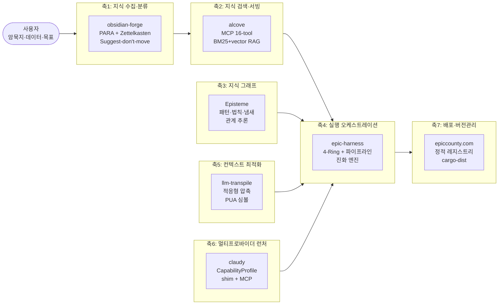
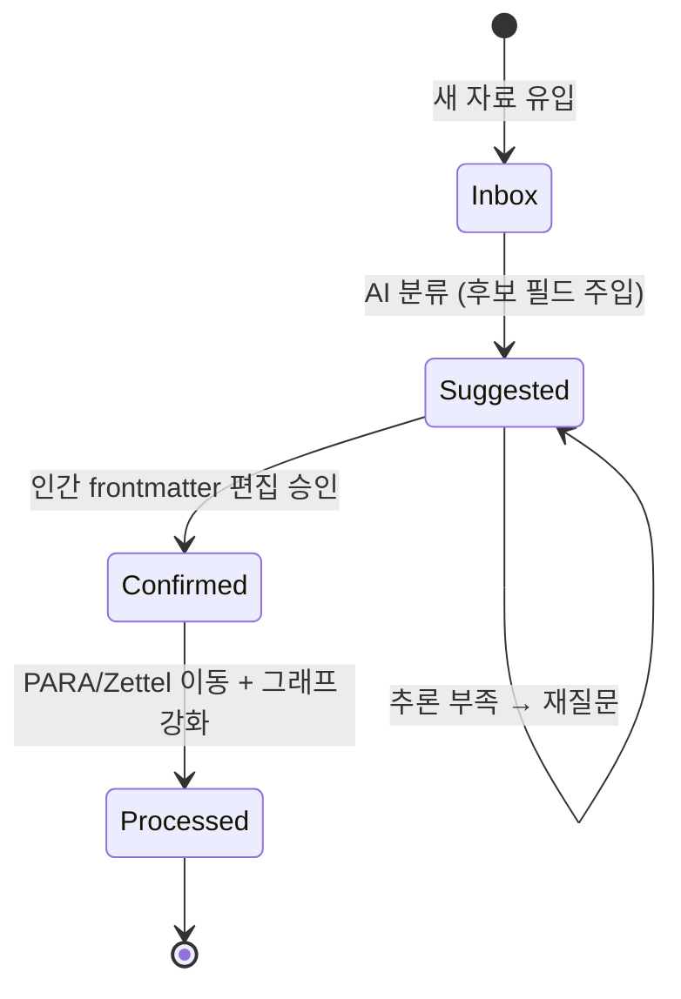
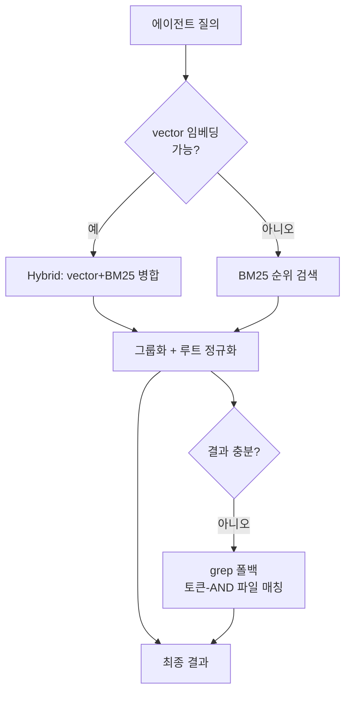
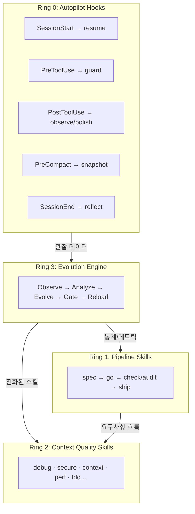
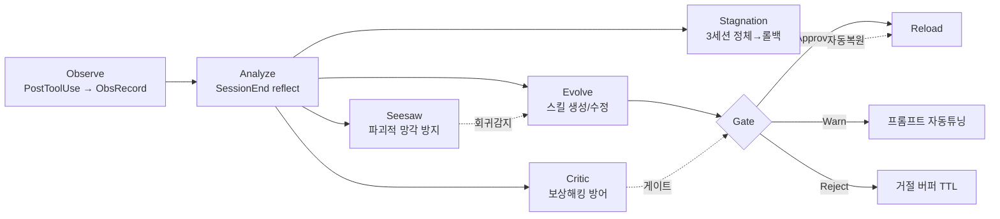
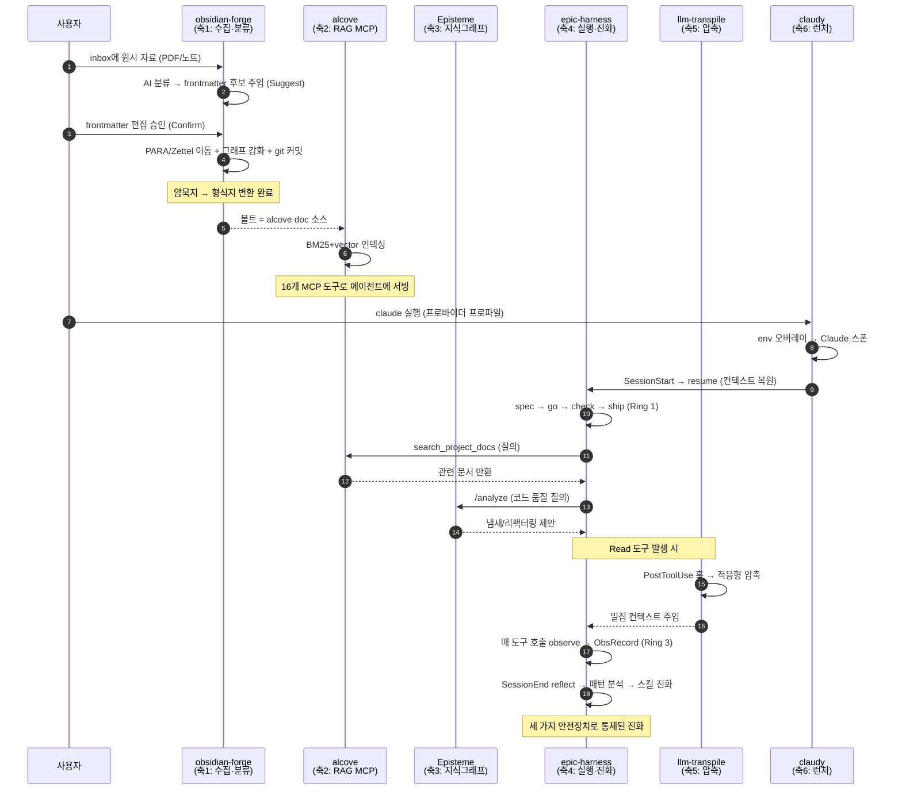
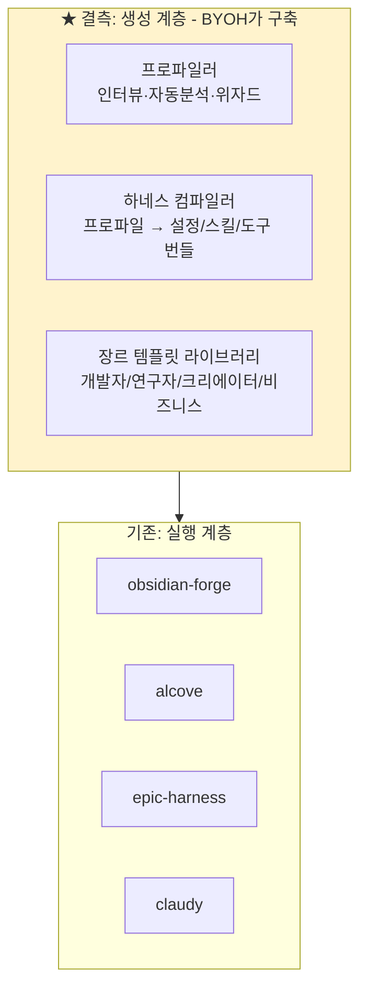

# BuildYourOwnHarness — 리서치 보고서

> **문서 목적**: epiccounty 워크스페이스의 7개 프로젝트에서 하네스 엔지니어링(harness engineering) 패턴을 추출하여, "사용자만의 하네스를 구축하는 서비스"가 재사용할 수 있는 **범용 빌딩 블록 카탈로그**로 재조직한다. 이 문서는 이후 모든 산출물(계획서, 아키텍처, 로드맵, 인터뷰 설계)의 근거가 된다.
>
> **작성일**: 2026-06-24 · **기준 코드베이스**: epiccounty monorepo (epicsagas org)

---

## 0. 요약 (Executive Summary)

epiccounty의 7개 프로젝트는 단편적 도구 모음이 아니라, **"사용자의 지식·데이터·목표를 AI 에이전트가 자율적으로 소화할 수 있는 구조로 변환하고, 그 과정 자체를 학습·진화시키는"** 하나의 완결된 하네스 엔지니어링 스택이다. 본 보고서는 이 스택을 7개의 **기능 축(functional axis)** 으로 분해하고, 각 축에서 검증된 구현 패턴을 추출한다.

**핵심 통찰 3가지:**

1. **암묵지→형식지 변환 파이프라인이 이미 존재한다.** obsidian-forge의 inbox 처리(`status: inbox→suggested→confirmed→processed` + AI 후보 필드)는 "사용자의 암묵지를 AI가 제안하고 인간이 승인하는" 루프의 완성된 구현이다. BuildYourOwnHarness의 "인터랙티브 취합"은 이 패턴의 일반화다.
2. **하네스는 4개의 분리된 계층(수집·검색·실행·진화)으로 구성되며, 각 계층은 독립적으로 교체 가능하다.** alcove(MCP)와 epic-harness(실행)는 프로세스 경계(JSON-RPC)로 느슨하게 결합되어 있다. 이는 사용자가 자신의 장르에 맞춰 부분만 채택할 수 있음을 의미한다.
3. **자기 진화가 비약이 아닌 점진적 누적으로 설계되었다.** epic-harness의 Ring 3(Observe→Analyze→Evolve→Gate→Reload)은 Critic(보상 해킹 방어), Seesaw(파괴적 망각 방지), Stagnation(3세션 정체 시 롤백)이라는 3중 안전장치로 진화를 통제한다. 맞춤형 하네스도 동일한 통제 패턴을 가져야 한다.

---

## 1. 조사 방법론

### 1.1 조사 대상

| # | 프로젝트 | 언어/스택 | 역할 (축 매핑) |
|---|---------|----------|---------------|
| 1 | epic-harness | Rust 2024 | 실행 오케스트레이션 + 자기진화 (축4) |
| 2 | claudy | Rust + Tauri | 멀티프로바이더 런처 (축6) |
| 3 | alcove | Rust | 지식 RAG MCP 서버 (축2) |
| 4 | obsidian-forge | Rust | Obsidian 볼트 자동화 (축1) |
| 5 | Episteme | Rust | SE 지식 그래프 (축3) |
| 6 | llm-transpile | Rust | 토큰 최적화 트랜스파일러 (축5) |
| 7 | epiccounty.com | SvelteKit 5 + Rust CLI | 배포·버전관리 (축7) |

### 1.2 조사 차원

각 프로젝트를 다음 6차원으로 분석했다:
- **핵심 목적** (2문장)
- **주요 추상화** (구체 타입/트레이트명 + 파일 경로)
- **아키텍처 패턴** (헥사고날, 플러그인, 파이프라인 등)
- **AI 통합 지점** (어떻게 LLM/MCP와 연결되는가)
- **재사용 가능한 빌딩 블록** (BuildYourOwnHarness로 이식 가능한 단위)
- **제약/리스크** (이식 시 주의점)

### 1.3 정보 출처 신뢰도

- **1차 출처**: 각 프로젝트의 `AGENTS.md`, `README.md`, `Cargo.toml`, 소스 코드 (`src/` 디렉토리)
- **검증 방법**: 익스플로러 에이전트가 구체 파일 경로와 타입명을 인용하여 추상적 기술이 아닌 코드 수준의 사실을 수집
- **주의**: 본 보고서의 패턴 추출은 코드 구조에 기반하며, 향후 구현 시 각 파일을 재검증해야 함 (API는 버전에 따라 변경됨)

---

## 2. 축별 패턴 카탈로그 (상세)

### 축 1: 지식 수집·분류 — obsidian-forge

#### 2.1.1 핵심 목적
Obsidian 볼트의 전 라이프사이클을 자동화한다: inbox 노트를 AI로 분류해 PARA + Zettelkasten 구조로 라우팅하고, 지식 그래프를 강화하며(백링크·브릿지 노트·자동 태그), git에 커밋한다. macOS LaunchAgent 데몬으로 `00-Inbox/`를 감시한다.

#### 2.1.2 핵심 추상화
- **`Frontmatter`** (`src/notes.rs`) — inbox 파이프라인을 흐르는 중심 데이터 구조. `status` 상태머신 + **AI 후보 필드**: `candidate_type`, `candidate_project`, `candidate_area`, `candidate_concepts`, `recommended_action`, `reasoning`.
- **상태머신**: `inbox → suggested → confirmed → processed`
- **`process_one`/`process_all`** (`src/notes.rs`) — inbox 파이프라인: (1) PDF→Markdown 변환; (2) frontmatter 분할; (3) `status==confirmed` → `move_to_para()` + `processed` 표시; (4) 그 외 → `AiClient` 호출 → frontmatter에 제안 주입 → `status=suggested`. `buffer_unordered(max_concurrent)`로 동시 처리.
- **`strengthen_graph`** (`src/graph/mod.rs`) — `scan_all_projects → detect_bridges → generate_bridge_notes → inject_backlinks → update_related_projects → auto_tag_documents`, 각 단계는 config 불린으로 게이트.
- **`AiClient`** (`src/ai.rs`) — `ollama`(subprocess), `openai`, `openrouter`, `lmstudio`, `openai-compatible` 통합 클라이언트. API 키 해석: `vault.toml → env var`.
- **Karpathy 3-Layer 모델** — Raw(`99-Archives/projects/`, `00-Inbox/`) → Wiki(`10-Zettelkasten/`, 300자+) → Graph(자동 생성 브릿지 노트).

#### 2.1.3 ★ 빌딩 블록: "Suggest-don't-move" 암묵지 발굴 루프

> **BuildYourOwnHarness로의 이식**: 이것이 "인터랙티브 취합"의 핵심 원형이다. AI가 사용자의 암묵지를 *추측하여* 후보 필드에 채우고, 사용자는 *이동시키지 않고* frontmatter만 편집해 승인한다. 비파괴적이며 역추적 가능하다.

#### 2.1.4 제약/리스크
- Obsidian 볼트 구조에 강결합 → 다른 지식 소스(Notion, 로컬 파일, 이메일) 지원 시 추상화 계층 필요
- AI 분류 품질이 prompt 템플릿(`src/prompts.rs`)에 의존 → 장르별 프롬프트 튜닝 필수

---

### 축 2: 지식 검색·서빙 — alcove

#### 2.2.1 핵심 목적
프로젝트 문서와 지식베이스 볼트를 BM25 tantivy 인덱스(+옵션 벡터/하이브리드)로 인덱싱하고, AI 에이전트에게 MCP JSON-RPC 인터페이스(16개 도구)와 병렬 HTTP REST API로 노출한다. 엄격한 doc-repo/project-repo 분리로 비공개 문서가 공개 repo로 누출되지 않게 한다.

#### 2.2.2 핵심 추상화
- **JSON-RPC 2.0 코어** (`src/mcp.rs`) — `RpcRequest`, `RpcResponse`, `RpcError`(코드 `-32000`~`-32002`), `dispatch()`가 `initialize`/`tools/list`/`tools/call` 라우팅. 프로토콜 버전 `2024-11-05`.
- **16 MCP 도구**: `get_project_docs_overview`, `search_project_docs`, `get_doc_file`, `list_projects`, `audit_project`, `configure_project`, `init_project`, `validate_docs`, `rebuild_index`, `check_doc_changes`, `lint_project`, `search_vault`, `list_vaults`, `backup_vault`, `promote_document`, `index_code_structure`.
- **검색 티어링** (`src/tools.rs::tool_search`) — hybrid(vector+BM25) → BM25 순위 → 그룹화 → grep 폴백(토큰-AND 파일 매칭). 루트별 점수 정규화 후 교차 병합.
- **BM25 부스트**: body 1.0, title 3.0, filename 2.0. CJK용 `NgramTokenizer(min=2,max=3)`.
- **`TierClassifier`** (`config.rs`) — doc을 `doc-repo-required`/`supplementary`/`project-repo`/`reference`/`unrecognized`로 분류.
- **경로 순회 가드** — `..` 거부 + canonicalize 후 프로젝트 루트 내부 검증.
- **도구 설명 = 사용 휴리스틱** — 각 도구의 `description`이 다단락으로 "언제 호출할지" 에이전트에게 지시 (예: "사용자가 '모든 프로젝트'라고 말하면 global scope 사용").

#### 2.2.3 ★ 빌딩 블록: "MCP 도구 = 자기-설명적 사용 휴리스틱"

> alcove의 도구 설명은 단순한 기능 명세가 아니라 **에이전트 디스패치 로직을 임베드**한다. BuildYourOwnHarness가 생성하는 맞춤형 하네스의 각 도구도 "이 장르에서 이 도구를 언제 쓰는가"를 설명에 내장해야, 사용자의 암묵적 워크플로가 자동 발현된다.

#### 2.2.4 ★ 빌딩 블록: "하이브리드 검색 티어링 (정확도→포괄성 폴백)"

#### 2.2.5 제약/리스크
- tantivy 인덱스는 `.alcove/`에 gitignore됨 (머신 로컬) → 분산 환경에서 재인덱싱 필요
- 벡터 검색은 feature-gate(`embed`) → 임베딩 모델 의존성 추가 시 무게 증가

---

### 축 3: 지식 그래프 (정규화된 지식) — Episteme

#### 2.3.1 핵심 목적
오프라인 우선 단일 바이너리로, 디자인 패턴·리팩터링·소프트웨어 법칙·코드 냄새를 의미 관계로 연결하는 지식 그래프. "AI 에이전트 우선" 설계 — MCP(stdio/HTTP) + REST API로 노출.

#### 2.3.2 핵심 추상화
- **`KnowledgeGraph`** (`src/domain/graph.rs:58`) — `HashMap<String, Entity>` + `reverse_relations` 인덱스. `from_entities()`로 순수 구성(I/O 없음).
- **`Entity`/`EntityType`** (`src/domain/types.rs:11`) — `Pattern(DP-) | Refactoring(RF-) | Law(LAW-) | Smell(SMELL-) | Insight(TK-)`, 각 ID 접두사 보유.
- **`RelationType`** (`src/domain/types.rs:62`) — `Solves/SolvedBy`, `Enforces/EnforcedBy`, `Violates/ViolatedBy`, `RelatedTo`, `DerivesFrom`, `AppliesTo`, `Supersedes`. `inverse_of()` 보유.
- **★ 역유도 불변량** — `solves`가 단일 진실 소스; `solved_by` 등은 로드 시 `derive_inverse_relations()`로 파생되며 `meta/relations.json`에 저장 금지.
- **`EpistemeMCP`** (`src/server/mcp_handler.rs`) — `KnowledgeGraph` + 옵션 RAG 래핑. `AppState = Arc<EpistemeMCP>`.
- **HTTP API**: `POST /analyze`, `POST /refactor`, `/graph/{id}`, `/graph/path`, `/graph/subgraph`.
- **`epis api env` 해석** — `eval $(epis api env)`로 `EPISTEME_URL`/`EPISTEME_API_KEY` 셸 export 출력 (스킬이 curl로 `/analyze` 호출).
- **`TieredAccum`** (`src/domain/metrics.rs`) — 냄새 감지용 티어드 신뢰도 누적기 ("Golden Path" 패턴).

#### 2.3.3 ★ 빌딩 블록: "역유도 불변량 (단일 진실 소스 + 파생 관계)"

> Episteme는 관계를 직접 저장하지 않고 *방향성 진실*(`solves`)만 저장하고 역방향은 파생한다. BuildYourOwnHarness가 사용자의 지식을 그래프화할 때, 사용자가 입력한 사실(진실)과 AI 추론(파생)을 명확히 분리해야 신뢰할 수 있다. 사용자 승인 전의 AI 추론은 *파생* 표시를 가져야 한다.

#### 2.3.4 제약/리스크
- 현재는 SE 도메인 특화 → 다른 장르(법률, 의료, 비즈니스)용 엔티티 타입 확장 필요
- 헥사고날 구조(domain/ports/adapters) 덕분에 adapter 교체로 다른 도메인 적용 가능

---

### 축 4: 실행 오케스트레이션 + 자기진화 — epic-harness

> 가장 복잡하고 핵심적인 축. 별도 절(§3)에서 4-Ring 모델과 진화 엔진을 상세 분석.

#### 2.4.1 핵심 목적
Claude Code(외 5개 AI 코딩 도구)용 자기진화 에이전트 하네스. 단일 Rust 바이너리로 26개 스킬(9 파이프라인 + 17 품질게이트) + 6훅 자동화 계층을 제공. 정의적 특징은 **4-Ring 모델**: Ring 0(자동훅) → Ring 1(파이프라인 스킬) → Ring 2(컨텍스트 품질 스킬) → Ring 3(도구 결과를 관찰해 새 스킬을 진화시키는 자기개선 엔진).

#### 2.4.2 핵심 추상화 (요약)
- **`HookInput`** (`src/shared/types.rs`) — stdin JSON 계약 (`tool_name`, `tool_input`, `tool_response`, `hook_event_name`, `context_usage`, `pending_tasks`).
- **`ObsRecord`** (`src/shared/obs.rs`) — 도구 호출당 1행, 학습 루프의 원자. `ScoreDimensions { tool_success, output_quality, execution_cost }`.
- **`EditType`** enum (`src/shared/evolution.rs`) — `AddSkill | ModifySkill | AddInstinct | ModifyConfig | AddGuardRule | ModifyPrompt | Unknown`.
- **`HarnessDimension`** (9축: ModelSelection, ContextAssembly, MemoryManagement, ...).
- **`OrchestrationRun`/`AgentDef`/`ControlDirective`** (`src/orchestrate/state.rs`) — 파일 기반 멀티에이전트 상태, generation 기반 무효화, `MAX_CONCURRENT_AGENTS=6`.

---

### 축 5: 컨텍스트 최적화 — llm-transpile

#### 2.5.1 핵심 목적
원시 문서(Markdown, HTML, plain text)를 LLM이 최소 토큰으로 소비하는 구조화 브릿지 포맷(`<D>?<H><B>`)으로 변환하는 고성능 Rust 라이브러리. 토큰 예산 채움에 따라 4단계로 에스컬레이션하는 적응형 압축 + 반복 도메인 용어를 위한 Unicode PUA 심볼 치환.

#### 2.5.2 핵심 추상화
- **`FidelityLevel`** (`ir.rs:16`) — `Lossless | Semantic | Compressed`. `Lossless`에서는 압축 엄격 금지.
- **`DocNode`/`IRDocument`** (`ir.rs:112`) — 타입화된 IR 노드(headings, paragraphs, tables, lists, code blocks), `importance: 0.0..=1.0`, `token_budget: Option<usize>`.
- **`AdaptiveCompressor`** (`compressor.rs`) — 4단계, 예산 사용률 기반 (`lib.rs:386-389`): `<60% StopwordOnly`, `<80% PruneLowImportance`, `<95% DeduplicateAndLinearize`, `≥95% MaxCompression`.
- **`SymbolDict`** (`symbol.rs`) — 문서별(PUA `U+E000–U+F8FF` 치환), 오버플로 시 `SymbolOverflowError`.
- **공개 API**: `transpile(text, format, fidelity, budget) -> String`, `transpile_stream(...)`, `token_count(text)`.

#### 2.5.3 ★ 빌딩 블록: "적응형 토큰 예산 관리 (점진적 손실)"

> LLM 컨텍스트는 한정적이다. llm-transpile은 예산 사용률에 따라 손실 정도를 *자동으로 에스컬레이션*한다. BuildYourOwnHarness가 사용자의 대용량 지식베이스를 하네스에 주입할 때, 장르별 중요도 가중치와 결합해 이 적응형 압축을 재사용하면 토큰 비용을 최적화할 수 있다. 보고된 결과: Markdown 27.4% / HTML 98.7% / 전체 91.8% 압축(99.0% 손실 없는 단어 커버리지).

#### 2.5.4 통합 지점 (PostToolUse 훅)
`.claude-plugin/hooks.json`이 `Read` 도구 발생 후 자동으로 `transpile --fidelity semantic` 실행 → 더 밀집한 컨텍스트를 모델에 주입. epic-harness와 동일한 훅 계약 패턴.

#### 2.5.5 제약/리스크
- PlainText는 −3.5% (오히려 팽창) → 포맷별 실제 압축률 검증 필수
- 심볼 사전은 문서별(스레드 공유 아님) → 동시 처리 시 메모리 증가

---

### 축 6: 멀티프로바이더 런처 — claudy

#### 2.6.1 핵심 목적
Claude CLI용 멀티프로바이더 런처: named provider 프로파일(Anthropic, OpenRouter, ollama 호환)을 해석하고 올바른 env-var 오버레이를 빌드하며 provider별 시크릿을 주입해 `claude`를 스폰. 부가적으로 메시징 채널 서버(Telegram/Slack/Discord), 사용량 분석(SQLite JSONL 수집 + Tauri 대시보드), Claude Code가 로컬 코딩 에이전트에 작업을 위임하는 MCP 서버를 번들.

#### 2.6.2 핵심 추상화
- **`LaunchOrchestrator<P, S, R>`** (`src/application/launch_orchestrator.rs`) — 3개 포트 트레이트에 대해 제네릭인 골든-패스. `dispatch()` = resolve-target → build-env → run-target.
- **포트 트레이트** (`src/ports/launch_ports.rs`): `ProfileGateway`, `SecretGateway`, `RuntimeGateway`. 도메인/애플리케이션은 구체 adapter를 모름.
- **`CapabilityProfile`** 트레이트 (`src/providers/capabilities.rs`) — provider `family` 문자열 매칭을 대체해 auth/model-tier 결정.
- **헥사고날 구조**: `domain/` (순수 타입) → `ports/` (트레이트 경계) → `application/` (오케스트레이션) → `adapters/` (CLI/채널/분석/MCP).
- **shim 모델**: claudy가 자신을 `claude` shim으로 설치 → `claude` 호출을 가로채어 env 오버레이 후 실제 바이너리 exec.
- **`Commands` enum** — `List, Setup, Show, Ping, Doctor, Sync, Update, Uninstall, Mode, Channel, Mcp, Analytics, Session`.
- **MCP 서버** (`src/adapters/mcp/server.rs`) — `ask_agent` 도구 제공, codex/cursor/cline/goose/agy에 위임. `llm-kernel` crate 사용.

#### 2.6.3 ★ 빌딩 블록: "CapabilityProfile (문자열 매칭 없는 프로바이더 추상화)"

> BuildYourOwnHarness가 사용자의 선호 LLM 프로바이더를 지원할 때, claudy의 `CapabilityProfile` 패턴을 재사용하면 "이 프로바이더는 툴호출을 지원하는가? 컨텍스트 윈도우는?" 등의 질문을 문자열 매칭 없이 타입 안전하게 결정할 수 있다. 이는 사용자가 자신의 예산·프라이버시 요구에 맞춰 프로바이더를 선택하는 맞춤형 하네스의 필수 기반이다.

#### 2.6.4 제약/리스크
- shim 모델은 Claude CLI에 강결합 → 다른 에이전트 런타임 지원 시 추상화 확장
- `llm-kernel` crate 의존성 (v0.9) — 공유 커널, 버전 정합성 주의

---

### 축 7: 배포·버전관리 — epiccounty.com

#### 2.7.1 핵심 목적
이중 목적 repo: (1) epiccounty 생태계의 마케팅/랜딩/문서 웹사이트(SvelteKit 5 + Svelte 5, Firebase Hosting 배포); (2) 정적 레지스트리에서 모든 생태계 도구를 설치·업데이트·버전관리하는 Rust CLI(`epiccounty`).

#### 2.7.2 핵심 추상화
- **정적 레지스트리** (`cli/core/src/registry.rs`) — `APPS` 정적 배열; `App { id, repo, bin, description, cargo_crate, homebrew_formula }`. `update_method(bundler)` → `InstallerScript | BrewInstall | CargoBinstall`.
- **설치 로직** — `installer.rs`, `github.rs`(병렬 최신버전 fetch, `join_all`), `cache.rs`, `bundler.rs`, `path.rs`.
- **웹사이트**: SvelteKit 2 + Svelte 5(runes 모드 `$props()`), Tailwind 4, Vite 6, `adapter-static` → `public/`.
- **`Product` 인터페이스** (`src/lib/products.ts`) — `name`, 이중언어 `tagline`/`description` {en, ko}, `tags`, `links`, `category`.
- **Firebase 배포**: `firebase.json`(`hosting.public="public"`, `cleanUrls`, 보안 헤더), `.firebaserc`(프로젝트 `epics-ai`).
- **범용 부트스트래퍼**: `static/install.sh` + `static/install.ps1` → Rust CLI 부트스트랩 → CLI가 GitHub Releases에서 도구 설치.

#### 2.7.3 ★ 빌딩 블록: "정적 레지스트리 + 범용 부트스트래퍼"

> 맞춤형 하네스를 생성한 후 사용자에게 전달하는 배포 메커니즘이다. epiccounty.com의 패턴 — 정적 `APPS` 레지스트리 + `install.sh`/`install.ps1` 부트스트래퍼 + GitHub Releases 소스 + 다중 설치 방법(스크립트/Homebrew/cargo-binstall) — 을 재사용하면, 생성된 하네스를 원클릭 설치 가능하게 패키징할 수 있다.

#### 2.7.4 제약/리스크
- Firebase Hosting 의존 → 자체 호스팅 필요 시 Cloudflare Pages 등 대체
- 이중언어(en/ko) i18n 인프라 이미 구축 → 한국 사용자 타겟에 유리

---

## 3. 심층 분석: epic-harness 4-Ring 모델 & 진화 엔진

> epic-harness는 BuildYourOwnHarness의 "맞춤형 하네스가 스스로 학습·진화한다"는 야심의 기술적 근거다. 별도 심층 분석이 필요하다.

### 3.1 4-Ring 모델

### 3.2 파이프라인 (Ring 1): spec → go → check → ship → evolve

**중요**: 파이프라인은 Rust가 아니라 **프롬프트 기반 스킬**이다. Rust 계층은 상태만 영속(`src/store/orbit_store.rs`, `src/shared/orbit.rs`).

- **spec** — 요구사항 → `SPEC-{timestamp}.md` (번호 `R1/R2…` Requirements + `AC1/AC2…` Acceptance Criteria). frontmatter `status: approved`가 다음 단계 게이트.
- **go** — 3 내부 모드: `go:plan`(Requirement→Task 매핑) → `go:build`(TDD Red→Green→Refactor) → `go:integrate`(병합, 모든 AC 검증).
- **check/audit** — 코드품질+보안+테스트 차원 병렬 리뷰; 차원별 `PASS/WARN/FAIL` + 스펙 커버리지 검증.
- **ship** — 격리 worktree 통합 테스트 → PR(spec+check 보고서 본문) → CI 감시 → 실패 자동수정.
- **evolve** — PR+CI 통과 후 실행; 세션 관찰 분석 → 진화 스킬 생성/개선.

**연결 메커니즘**: 스킬은 `_dispatch`의 전이 신호로 체인됨. `/orbit`은 자율 모드로 모든 단계를 순차 실행, 단계별 `$HARNESS_DIR/orbit/PIPELINE-{timestamp}.json`에 상태 영속. **복구 프로토콜**: orbit 중 매 응답마다 실행 중인 파이프라인 파일 재읽기; 충돌 시 `phase_history`가 `phase`에 우선; `updated_at` > 45분이면 크래시로 간주. 파일 기반 상태는 컨텍스트 압축을 견딘다.

### 3.3 진화 엔진 (Ring 3) — 3중 안전장치

**안전장치 1 — Critic** (`src/evolve/critic.rs`): 결정론적, in-loop(LLM 없음). `verify_against_evidence()` → `Approve | Warn | Reject`. 보상 해킹 의심 시 점수 상승을 주장하는 매니페스트 거부. `should_block_seeding()`은 보상해킹 에포크에 모든 시딩 억제.

**안전장치 2 — Seesaw** (`src/evolve/seesaw.rs`): 파괴적 망각 게이트 — 세션 다이제스트 교차 작업별 회귀 감지.

**안생장치 3 — Stagnation** (`src/evolve/metrics.rs`): `IMPROVEMENT_THRESHOLD=2%` 개선 없이 `STAGNATION_LIMIT=3` 세션 → `evolved_backup/`의 최적 체크포인트로 자동 롤백.

**패턴 감지** (`config.rs PatternConfig`): `repeated_same_error`(≥3 연속), `fix_then_break`(edit→bash-error 사이클), `long_debug_loop`(같은 파일 ≥5 ops), `thrashing`(edit↔error 교대).

**스킬 라이프사이클** (`src/evolve/skills.rs`):
- `seed_smart_skills()` — 감지된 패턴에서 진화 스킬 생성 → `~/.harness/projects/{slug}/evolved/`.
- `gate_skills()` — 검증(frontmatter `---`, 본문 ≥20자, SKILL.md 존재); 무효는 자동 제거; `MAX_EVOLVED_SKILLS=10` 상한. 정적 스킬이 항상 진화 스킬에 우선.
- **거절 버퍼** (SkillOpt): 거절된 제안 → `rejected_buffer.json` + TTL(10세션).
- **속도/메타 업데이트**: 5세션 선형회귀로 에포크 분류(Improving/Regressing/PersistentFailure/StableSuccess); `sessions_active≥3 && avg_with < avg_without − 0.02` 시 자동 퇴출.
- **프롬프트 자동튜닝**: 저성능 진화 스킬에 `<!-- auto-tuned -->` 구분자 후 튜닝 가이드 추가(원본 미수정); 3세션 하락 시 튜닝 제거.
- **속성**: `metrics.json`이 진화 스킬별 `avg_score_with` vs `avg_score_without` 추적(A/B).

### 3.4 메모리 & 컨텍스트

**harness.db** (운영, `src/store/`) — sqlx async pool, 다중 드라이버(sqlite 기본; postgres/mysql via features). 테이블: observations, sessions, evolution_records, metrics_state, orchestrator, orbit_pipelines, evolved_skills, global_patterns.

**memory.db** (지식 그래프, `src/mem/store/`) — "harness-mem" 통합 교차 에이전트 메모리. 노드: `id, type, title, tags, projects, agents, created, updated, body, importance(0-1), access_count, accessed_at`. 본문에 FTS5.

**스마트 리콜** (`src/mem/store/recall.rs`): 복합 점수 `recency(25%) + importance(35%) + access_freq(15%) + FTS_match(25%)`. Recency = 지수 감쇠, 30일 반감기. 중요도 기본값(타입별: decision=0.9, resolution=0.8). 그래프 증강: 리콜은 1-hop 엣지 따름. **감쇠**: 30일+ 미접촉 → 주기당 10% 손실(하한 0.05); `pinned` 태그 방지; 180일+ → `stale` 태그, 제외.

### 3.5 멀티에이전트 오케스트레이션

**Council** (`registry/skills/council/SKILL.md`) — 4음성 병렬 심의: **Architect**(장기 정확성), **Skeptic**(가정 도전), **Pragmatist**(지금 출시), **Critic**(균열 발견). **반-앵커링 규칙**: 각 음성은 독립 subagent로 질문+코드베이스 컨텍스트만 수신(대화나 다른 음성 NOT). 합성 후 → harness-mem에 결정 기록(`type=decision`, `importance=0.9`).

**오케스트레이터** (`src/orchestrate/`) — 파일 기반 멀티에이전트 상태, `EPIC_ORCHESTRATION=enabled`로 게이트. `run_pre`/`run_post`가 모든 Agent 도구 호출을 래핑: Running/Done/Blocked 추적, **제어 지시어**(Pause/Cancel/Redirect/Resume, generation 기반 무효화), 에이전트 간 **inbox 메시지** 전달, 하트비트 유지, **의존 그래프** 평가. `MAX_CONCURRENT_AGENTS=6`. 자동 정리: 30분+ 하트비트 → done; 1시간+ 완료 run 정리.

---

## 4. 통합 패턴: 7개 프로젝트가 협력하는 데이터 흐름

epiccounty 생태계의 end-to-end 데이터 흐름을 재구성하면, 이것이 곧 BuildYourOwnHarness가 구현해야 할 파이프라인의 청사진이다.

### 4.1 느슨한 결합의 비밀: 프로세스 경계 + 표준 계약

7개 프로젝트는 서로 직접 함수 호출하지 않는다. **세 가지 표준 계약**으로 느슨하게 결합된다:

| 계약 | 형식 | 사용 예 |
|------|------|---------|
| **MCP (JSON-RPC)** | stdio / HTTP, 프로토콜 `2024-11-05` | alcove ↔ 에이전트, Episteme ↔ 에이전트, claudy `ask_agent` |
| **Claude Code Hooks** | stdin JSON (`HookInput`) + exit code | epic-harness 6훅, llm-transpile PostToolUse |
| **CLI + env** | `eval $(tool env)` → curl/후속 명령 | `epis api env` → EPISTEME_URL |

> **BuildYourOwnHarness로의 이식**: 맞춤형 하네스는 이 세 계약을 그대로 채택해야 한다. 그러면 사용자가 기존 생태계 도구를 그대로 플러그인할 수 있고, 장르별로 부분만 교체 가능하다.

### 4.2 외부 생태계 교차 검증 (awesome-claude-plugins)

BYOH의 7축 설계가 org 내부 관찰에만 근거한 것이 아님을, 외부 커뮤니티 생태계가 교차 검증한다.

**소스**: [`quemsah/awesome-claude-plugins`](https://github.com/quemsah/awesome-claude-plugins) — "Top 100 Claude Code Plugins", 23,121개 저장소 인덱싱 (2026-06-22 업데이트, 886★). n8n 워크플로로 GitHub 플러그인 채택 메트릭을 자동 수집.

**핵심 발견**: BYOH가 7개 프로젝트에서 추출한 각 기능 축(메모리·압축·지식그래프·파이프라인 상태)이 커뮤니티에서는 **독립된 플러그인**으로 존재하며, 각각 수만 스타를 받았다.

| BYOH 축 (내부) | 외부 검증 플러그인 (별개 존재) | 시사점 |
|---------------|-------------------------------|-------|
| 축4 진화·실행 (epic-harness) | #1 superpowers(234k), #2 ECC(219k "agent harness"), #14 ruflo(60k "meta-harness") | "에이전트 하네스"가 커뮤니티 메인스트림임 |
| 축5 컨텍스트 (llm-transpile) | #9 caveman(75k, −65% 토큰), #24 headroom(45k, −60~95%), #65 context-mode(−98%) | 토큰 압축이 독자적 가치로 입증됨 |
| 축1·2 지식 (obsidian-forge·alcove) | #8 claude-mem(83k), #15 mem0(59k), #12 Understand-Anything(64k), #29 GitNexus(42k) | 메모리·지식그래프가 별개 플러그인으로 폭발 |
| B9 파일기반 상태 | #50 planning-with-files(23k, SKILL.md standard 명시), #59 ralph(20k) | 퍼시스턴트 플래닝이 표준으로 자리잡음 |

**세 가지 논증**:

1. **축의 분해 가능성 입증**: 커뮤니티가 메모리·압축·지식그래프를 *별개 플러그인*으로 제공한다는 것은, BYOH의 "축별 독립 교체 가능" 설계(§4.1)가 실현 가능함을 입증한다.
2. **통합의 가치 역설립**: 커뮤니티 사용자는 메모리 플러그인 + 압축 플러그인 + RAG 플러그인을 *개별 조립*해야 한다. BYOH는 장르에 맞춰 이들을 *통합 생성*한다 — 이것이 §6.1 결측 계층의 시장 타당성이다.
3. **장르 일반화의 외부 근거**: #39 academic-research-skills, #95 claude-for-legal, #40 financial-services, #38 marketingskills 등 장르 특화 스킬이 이미 존재한다. BYOH 장르 템플릿(02 §6)의 "참조 구현"으로 이들을 인용할 수 있다.

> **한계**: 스타 수는 채택의 *근사치*일 뿐 정확한 사용량이 아니다. 또한 awesome-list는 단일 수집자의 메트릭이므로 편향 가능. BYOH는 이를 보조 레퍼런스로만 사용한다.

---

## 5. 재사용 빌딩 블록 요약표

각 블록에 BuildYourOwnHarness에서의 역할과 출처 프로젝트를 매핑한다.

| # | 빌딩 블록 | 출처 | BYOH 역할 | 복잡도 |
|---|----------|------|----------|--------|
| B1 | Suggest-don't-move 암묵지 발굴 루프 | obsidian-forge | 인터랙티브 취합의 핵심 원형 | 중 |
| B2 | PARA + Zettelkasten + Karpathy 3-Layer | obsidian-forge | 수집된 지식의 구조화 | 중 |
| B3 | AI 그래프 강화 (백링크/브릿지/태그/고아연결) | obsidian-forge | 지식 자가 조직화 | 고 |
| B4 | MCP 자기-설명적 도구 설계 | alcove | 맞춤 도구의 에이전트 디스패치 | 중 |
| B5 | 하이브리드 검색 티어링 (vector→BM25→grep) | alcove | 장르 지식 검색 | 고 |
| B6 | 역유도 불변량 (진실 vs 파생 분리) | Episteme | 사용자 사실 vs AI 추론 분리 | 중 |
| B7 | 헥사고날 아키텍처 (domain/ports/adapters) | Episteme, claudy | 장르별 도메인 교체 가능 | 중 |
| B8 | 4-Ring 모델 (hook→파이프라인→품질→진화) | epic-harness | 하네스 전체 골격 | 고 |
| B9 | 파일 기반 파이프라인 상태 (압축 견딤) | epic-harness | 긴 작업 복구 | 중 |
| B10 | 진화 엔진 + 3중 안전장치 (Critic/Seesaw/Stagnation) | epic-harness | 맞춤 하네스 자가개선 | 최고 |
| B11 | 스마트 리콜 (recency/importance/freq/FTS) | epic-harness | 사용자 메모리 그래프 | 고 |
| B12 | Council 4음성 반-앵커링 심의 | epic-harness | 복잡 결정 다각 검증 | 중 |
| B13 | 적응형 토큰 압축 (4단계 에스컬레이션) | llm-transpile | 대용량 지식 토큰 최적화 | 고 |
| B14 | CapabilityProfile (타입 안전 프로바이더 추상화) | claudy | 사용자 LLM 선택 지원 | 중 |
| B15 | shim + MCP 위임 런처 | claudy | 에이전트 실행 통제 | 고 |
| B16 | 정적 레지스트리 + 범용 부트스트래퍼 | epiccounty.com | 생성된 하네스 배포 | 중 |
| B17 | 이중언어(en/ko) i18n 인프라 | epiccounty.com | 한국 사용자 타겟 | 저 |

---

## 6. 갭 분석: BuildYourOwnHarness가 추가로 구축해야 할 것

7개 프로젝트는 "이미 하네스를 가진 고급 사용자"를 위한 도구다. BuildYourOwnHarness가 타겟하는 "하네스가 없는 사용자가 자신만의 하네스를 *생성*"하려면, 아직 존재하지 않는 **결측 계층**이 있다.

### 6.1 결측 계층: 인터랙티브 프로파일링 & 하네스 생성기

| 결측 컴포넌트 | 역할 | 빌딩 블록 재사용 |
|--------------|------|-----------------|
| **프로파일러** | 암묵지/데이터/장르/목표를 하이브리드로 수집 | B1(Suggest-don't-move) + B6(진실/파생 분리) |
| **하네스 컴파일러** | 프로파일을 실행 가능한 하네스 번들로 변환 | B8(4-Ring) + B4(MCP 도구) + B16(레지스트리) |
| **장르 템플릿** | 도메인별 사전 구성된 빌딩 블록 조합 | B2(PARA) + B5(검색) + B11(메모리)의 장르 특화 |
| **검증/평가** | 생성된 하네스가 사용자 목표 달성하는지 측정 | B10(진화 메트릭)의 A/B 속성 재사용 |

### 6.2 기술적 갭

1. **장르 추상화 부재** — Episteme은 SE 특화, alcove는 범용 doc. "법률/의료/크리에이티브" 장르용 엔티티 타입·검색 가중치·프롬프트 템플릿이 없다.
2. **온보딩 부재** — 기존 도구는 전부 CLI 숙련자 가정. 비기술 사용자가 "내 하네스 만들기" 버튼을 누를 수 있는 진입점이 없다.
3. **크로스-프로젝트 템플릿 메커니즘 부재** — epic-harness는 `registry/presets/`(go/node/python/rust cold-start)가 있으나, 이는 스택 프리셋이지 *사용자 장르* 프리셋이 아니다.

---

## 7. 결론 및 권고사항

### 7.1 핵심 결론

epiccounty의 7개 프로젝트는 **"개인용 AI 하네스"의 완결된 구현 부품 세트**다. BuildYourOwnHarness는 이 부품들을 조립하는 **생성 계층(generation layer)** 을 추가하는 프로젝트다. 부품 자체는 이미 검증되었으므로, 핵심 리스크는 부품이 아니라 "사용자의 암묵지를 정확히 포착해 올바른 부품 조합을 생성하는가"에 있다.

### 7.2 아키텍처 권고 (상세는 별도 설계서)

1. **하이브리드 3단계 취합 채택** — 자동분석(베이스라인) → 인터뷰(보완) → 위자드(확정). 자동분석은 B5/B6로, 인터뷰는 B1로, 위자드는 B4의 자기-설명 원칙으로.
2. **생성 계층은 기존 실행 계층과 느슨한 결합 유지** — MCP/Hooks/CLI 세 계약 그대로 사용. 생성기는 설정 파일과 템플릿만 생산, 실행은 기존 도구에 위임.
3. **진화는 3중 안전장치와 함께** — 맞춤 하네스도 스스로 학습해야 하지만, B10의 Critic/Seesaw/Stagnation 없이는 보상 해킹과 파괴적 망각 위험이 있다.

### 7.3 리스크 (상세는 계획서)

| 리스크 | 완화 |
|--------|------|
| 7개 프로젝트 API 버전 정합성 | 정적 레지스트리(B16)로 핀, `epiccounty status`로 검증 |
| 장르 일반화의 어려움 | MVP는 1-2개 장르(개발자+크리에이터)로 좁혀 출발 |
| 암묵지 포착의 주관성 | B1의 Suggest-don't-move + B6의 진실/파생 분리로 인간 통제 유지 |
| 진화 통제 실패 | B10 안전장치 필수 도입 |

### 7.4 다음 산출물로의 연결

- **계획서** (`01_PROJECT_PLAN.md`): 본 보고서의 결측 계층(§6)을 서비스로 정의
- **아키텍처 설계** (`02_ARCHITECTURE.md`): 빌딩 블록 B1-B17을 컴포넌트로 배치
- **인터뷰 설계** (`03_INTERVIEW_DESIGN.md`): B1(Suggest-don't-move)의 구체화
- **로드맵** (`04_ROADMAP.md`): 빌딩 블록별 의존관계 기반 마일스톤

---

## 부록 A: 출처 파일 인덱스

각 빌딩 블록의 구현 위치 (구현 시 재검증 권장).

| 블록 | 핵심 파일 |
|------|----------|
| B1 | `obsidian-forge/src/notes.rs` (Frontmatter, process_one) |
| B2 | `obsidian-forge/AGENTS.md` (Karpathy 3-Layer) |
| B3 | `obsidian-forge/src/graph/mod.rs` (strengthen_graph) |
| B4 | `alcove/src/mcp.rs`, `alcove/src/tools.rs` |
| B5 | `alcove/src/tools.rs::tool_search`, `alcove/src/index/searcher.rs` |
| B6 | `Episteme/src/domain/types.rs`, `Episteme/src/domain/graph.rs` |
| B7 | `Episteme/src/domain/`, `claudy/src/{domain,ports,application}` |
| B8 | `epic-harness/registry/skills/_dispatch/SKILL.md`, `epic-harness/hooks/hooks.json` |
| B9 | `epic-harness/src/store/orbit_store.rs`, `epic-harness/src/shared/orbit.rs` |
| B10 | `epic-harness/src/evolve/{critic,seesaw,metrics,skills,edits}.rs` |
| B11 | `epic-harness/src/mem/store/recall.rs` |
| B12 | `epic-harness/registry/skills/council/SKILL.md` |
| B13 | `llm-transpile/src/{compressor,ir,symbol}.rs` |
| B14 | `claudy/src/providers/capabilities.rs` |
| B15 | `claudy/src/launcher/`, `claudy/src/adapters/mcp/server.rs` |
| B16 | `epiccounty.com/cli/core/src/registry.rs`, `epiccounty.com/static/install.sh` |
| B17 | `epiccounty.com/src/lib/i18n.ts` |

### 부록 A.1: epic-harness 자산 전수 매핑 (B8-B12 확장)

BYOH가 차용하는 epic-harness 구체 자산. 빌딩블록 B8-B12별로 그룹화. (README의 `🔧 epic-harness 레퍼런스` 표와 정합, 구현 시 본 표가 권위적 출처.)

**B8 (4-Ring 모델) 자산**

| 자산 | 경로 | BYOH 적용 |
|------|------|----------|
| `_dispatch` 디스패치 라우터 | `registry/skills/_dispatch/SKILL.md` | 컨텍스트 신호→스킬 라우팅 테이블 (Ring 2) |
| `go:plan/build/integrate` TDD 모드 | `registry/skills/go/SKILL.md` | Ring 1 파이프라인 구현 (Red→Green→Refactor) |
| `spec` 번호 요구사항 (R1/AC1) | `registry/skills/spec/SKILL.md` | 인터뷰 산출 Profile 명세 패턴 |
| `SKILL.md` 4섹션 명세 | `registry/skills/*/SKILL.md` | 컴파일러 스킬 출력 표준 (Process/Anti-Rationalization/Evidence/Red Flags) |
| `hooks/hooks.json` 6훅 | `hooks/hooks.json` | Ring 0 훅 계약 (SessionStart/PreToolUse/PostToolUse/PostEdit/PreCompact/SessionEnd) |
| `install.js` 자동설치 | `registry/scripts/install.js` | 번들 부트스트래퍼 (바이너리 누락 시 SessionStart 훅이 설치) |
| `gen-skills`/`lint-skills` | `Makefile` | 컴파일러 스킬 검증 (frontmatter+name+description, CSO compliance) |
| `orbit` 자율 파이프라인 | `registry/commands/orbit.md` | 긴 취합/컴파일 자동화 |
| 크로스툴 통합 (codex/cursor/cline/...) | `integrations/`, `src/install.rs` | 멀티 에이전트 런타임 지원 |

**B9 (파일 기반 상태) 자산**

| 자산 | 경로 | BYOH 적용 |
|------|------|----------|
| `orbit_store` 파이프라인 영속 | `src/store/orbit_store.rs` | 취합/컴파일 파이프라인 상태 저장 |
| `observed` 복구 프로토콜 | `src/shared/orbit.rs` | 45분 timeout 크래시 감지, `phase_history` 우선 (컨텍스트 압축 견딤) |
| `PIPELINE-{ts}.json` 상태 파일 | `$HARNESS_DIR/orbit/` | BYOH `~/.byoh/pipelines/` 구조 원형 |

**B10 (진화 엔진 + 3중 안전장치) 자산**

| 자산 | 경로 | BYOH 적용 |
|------|------|----------|
| `Critic` (보상해킹 방어) | `src/evolve/critic.rs` | 결정론적 in-loop 검증 (`Approve/Warn/Reject`) |
| `Seesaw` (파괴적 망각 방지) | `src/evolve/seesaw.rs` | 작업별 회귀 감지 |
| `Stagnation` (정체 롤백) | `src/evolve/metrics.rs` | `STAGNATION_LIMIT=3`세션, `IMPROVEMENT_THRESHOLD=2%` |
| `evolved/` 진화 스킬 디렉토리 | `~/.harness/projects/{slug}/evolved/` | `MAX_EVOLVED_SKILLS=10`, 정적 스킬 우선 |
| `EditType` 적응 분류 | `src/shared/evolution.rs` | AddSkill/ModifyInstinct/ModifyConfig/AddGuardRule/ModifyPrompt |
| `SkillOpt` 미니배치 | `src/evolve/skills.rs` | N 관찰→우세에러≥60% & ≥2파일→재사용 스킬 시딩 |
| 거절 버퍼 | `src/evolve/skills.rs` | `rejected_buffer.json` TTL=10세션 |
| `metrics.json` A/B 속성 | `src/store/metrics.rs` | `avg_score_with` vs `avg_score_without` |

**B11 (스마트 리콜 메모리) 자산**

| 자산 | 경로 | BYOH 적용 |
|------|------|----------|
| `harness-mem` 메모리 그래프 | `src/mem/` (+ MCP `registry/mcp.json`) | 사용자 메모리 그래프 구현체 |
| `recall` 복합 점수 | `src/mem/store/recall.rs` | recency(25%)+importance(35%)+freq(15%)+FTS(25%), 30일 반감기 |
| 감쇠/`pinned`/`stale` | `src/mem/store/decay.rs` | 장르 메모리 가중치 (02 §7.2) |

**B12 (Council) 자산**

| 자산 | 경로 | BYOH 적용 |
|------|------|----------|
| 4음성 심의 (Architect/Skeptic/Pragmatist/Critic) | `registry/skills/council/SKILL.md` | 복잡 설정 검증 |
| `anti-anchoring` 독립 컨텍스트 | `registry/skills/council/SKILL.md` | 각 음성이 대화·타 음성 없이 질문만 수신 |

---

*본 보고서는 2026-06-24 기준 코드베이스 분석에 근거한다. API는 버전에 따라 변경될 수 있으므로 구현 시 각 소스 파일을 재검증할 것.*
