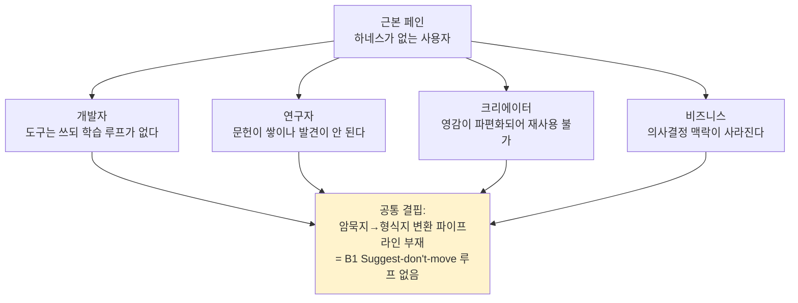
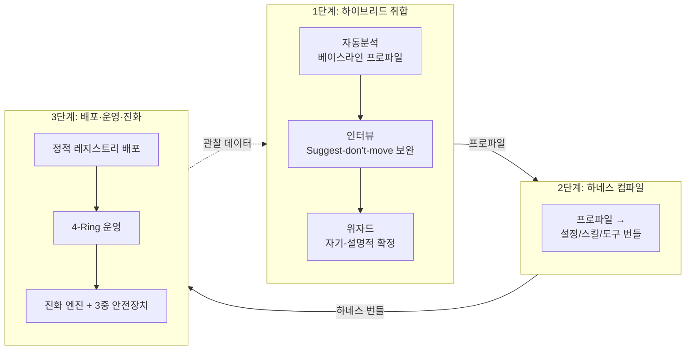
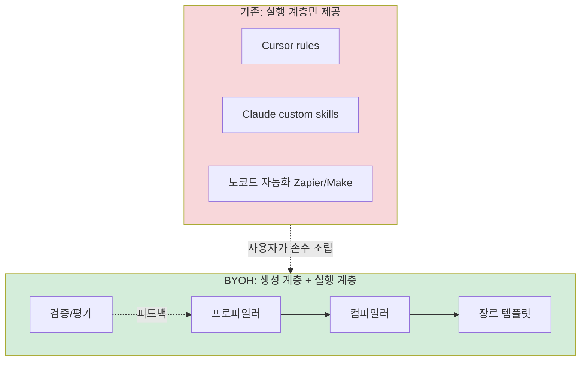
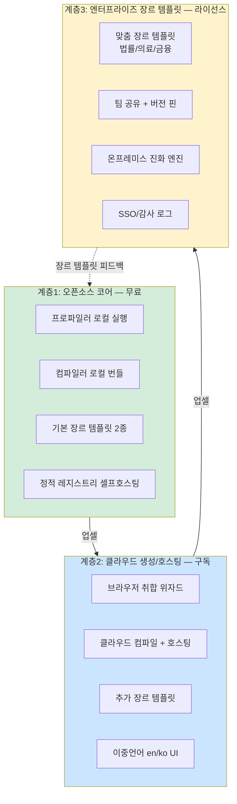
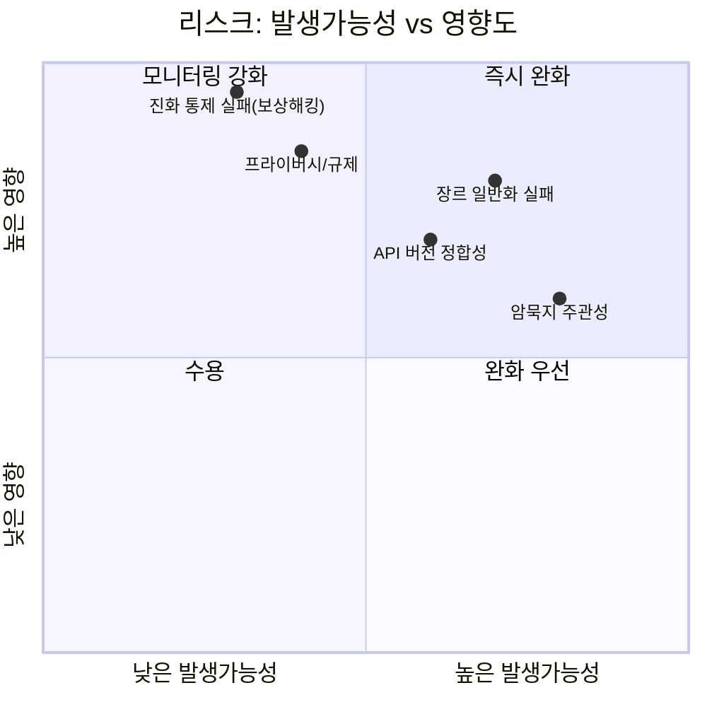
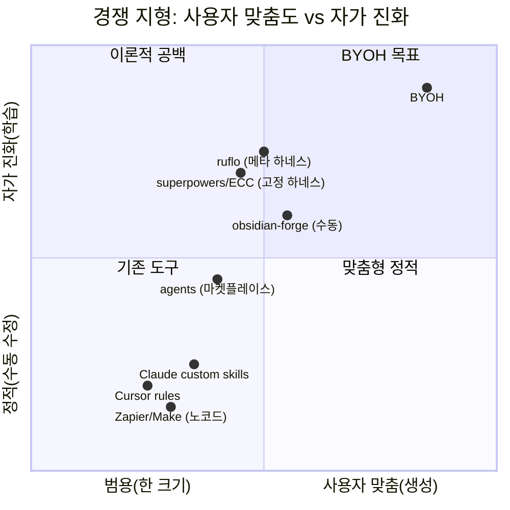

# BuildYourOwnHarness — 프로젝트 계획서

> **문서 목적**: 리서치 보고서(`00_RESEARCH_REPORT.md`)가 식별한 17개 빌딩 블록(B1–B17)과 결측 계층(프로파일러·컴파일러·장르 템플릿·검증)을 기반으로, BYOH 서비스의 비전·문제·해결책·사업모델·성공지표·리스크를 한 장에 정리한다. 이후 아키텍처 설계(`02_ARCHITECTURE.md`)와 인터뷰 설계(`03_INTERVIEW_DESIGN.md`), 로드맵(`04_ROADMAP.md`)의 근거가 된다.
>
> **작성일**: 2026-06-24 · **근거 문서**: `00_RESEARCH_REPORT.md` (§4 통합 데이터 흐름, §5 빌딩 블록 표, §6 결측 계층)

---

## 1. 비전 / 미션

- **비전**: "누구나 자신의 암묵지·데이터·목표에 맞춘 AI 하네스를 하루 만에 부패(up & running)시킨다."
- **미션**: "검증된 하네스 부품(B1–B17)을 조립하는 생성 계층(프로파일러·컴파일러·장르 템플릿·평가)을 제공하여, 사용자의 암묵지를 맞춤형 실행 하네스로 변환·배포·진화시킨다."

> 비전-미션의 핵심 대비: 비전은 "결과(누구나/하루 만에)"를, 미션은 "수단(생성 계층 4컴포넌트)"을 서술한다. 부품 자체는 이미 epiccounty 7개 프로젝트에서 검증되었으므로(리서치 §7.1), BYOH의 차별적 가치는 "생성 계층의 존재"에 있다.

---

## 2. 문제 정의 — "하네스가 없는 다수 사용자"

epiccounty의 7개 프로젝트는 "이미 하네스를 가진 고급 사용자"를 위한 도구다(리서치 §6 서두). 그 바깥에 "하네스의 존재조차 모르는, 혹은 만들 엄두를 못 내는" 압도적 다수가 존재한다. 이 다수가 겪는 페인을 4개 페르소나로 분해한다.

### 2.1 공통 근원: "암묵지→형식지 변환 파이프라인"의 부재

4 페르소나 모두 동일한 근본 결핍을 공유한다 — obsidian-forge의 `inbox → suggested → confirmed → processed` 상태머신(B1, 리서치 §2.1.3)에 해당하는 *비파괴적 암묵지 발굴 루프*가 없다. 결과적으로:

- AI가 사용자의 암묵지를 **추측하여 제안**하는 단계가 없다 → 사용자가 매번 0부터 지시해야 한다.
- AI 제안을 **이동 없이 승인**하는 비파괴 승인이 없다 → 잘못된 분류가 자동 적용되어 역추적 불가하다.
- 승인된 지식이 **PARA/Zettelkasten 구조(B2)** 로 자동 정리되지 않는다 → 지식이 쌓일수록 혼돈이 커진다.

### 2.2 페르소나별 구체 페인

| 페르소나 | 현재 상태 | 일어나는 일 (비용) |
|---------|----------|-------------------|
| **개발자** | Cursor rules / Claude custom skills를 손수 작성 | 룰이 늘어날수록 충돌·중복·망각. 동료가 물려받지 못해 퇴사와 함께 사라짐. |
| **연구자** | Zotero/Notion에 문헌만 쌓임 | "그 논문 어디에 있더라"가 일과. 인용 관계(그래프 B3)가 없어 아이디어가 연결되지 않음. |
| **크리에이터** | 영감 메모가 5개 앱에 파편화 | 과거 아이디어 재발견 불가. 콘텐츠 주기가 닳을 때마다 0에서 시작. |
| **비즈니스** | 회의록·결정이 Slack/이메일에 흩어짐 | "왜 그렇게 결정했는가" 3개월 뒤 복원 불가. 온보딩 비용 증가, 같은 논의 반복. |

> 이 4 페르소나가 공통으로 부르는 것은 "더 좋은 도구"가 아니라 **"내 머릿속과 파일들을 분석해 내 맞춤형 학습 시스템을 만들어달라"**다. 그것이 BYOH가 제공하는 생성 계층이다.

---

## 3. 해결책 개요 — 하이브리드 3단계 취합 → 생성 → 배포/운영/진화

BYOH는 리서치 §6.1의 결측 계층(프로파일러·컴파일러·장르 템플릿·검증)을 서비스로 구현한다. 흐름은 세 단계로, 각 단계가 빌딩 블록을 재사용한다.

### 3.1 1단계 — 하이브리드 3단계 취합 (프로파일러 = 결측 컴포넌트 G1)

리서치 §7.2의 아키텍처 권고 1을 구현한다. 단일 수단(자동분석만, 혹은 인터뷰만)이 아닌 **하이브리드**인 이유는 각 수단의 실패 모드가 상호 보완되기 때문이다.

| 하위 단계 | 역할 | 재사용 빌딩 블록 | 실패 모드 / 보완 |
|----------|------|-----------------|----------------|
| **자동분석** | 사용자의 파일·볼트·레포를 스캔해 베이스라인 프로파일(장르·도구 선호·지식 영역) 생성 | **B5**(하이브리드 검색 티어링: vector→BM25→grep)로 지식 영역 추출, **B6**(역유도 불변량)로 "사용자가 명시한 사실" vs "AI가 추론한 후보" 분리 | 자동분석은 *암묵적 선호*(비밀, 예산, 윤리 경계)를 놓침 → 인터뷰로 보완 |
| **인터뷰** | 자동분석 결과를 바탕으로 AI가 후보 필드에 제안을 채우고, 사용자는 이동 없이 편집 승인 | **B1**(Suggest-don't-move: inbox→suggested→confirmed) — 비파괴·역추적 가능 | 인터뷰는 사용자가 "뭘 물어봐야 할지 모름" → 위자드로 보완 |
| **위자드** | 자기-설명적 옵션(각 선택지가 무엇을 의미하는지 설명)으로 사용자가 확정 | **B4**(MCP 자기-설명적 도구 설계)의 원칙 — 각 옵션이 "이 장르에서 언제 쓰이는가"를 설명에 내장 | 위자드는 표준 경로만 → 자동분석+인터뷰가 비표준 장르 발견 |

> **B6(역유도 불변량)의 역할이 결정적**: 3단계 전체에서 사용자가 승인한 값은 *진실(단일 진실 소스)*로, AI 추론값은 *파생* 표시를 갖는다(리서치 §2.3.3). 이 분리가 없으면 AI의 잘못된 추론이 사용자 사실로 둔갑해 하네스가 신뢰를 잃는다.

### 3.2 2단계 — 하네스 컴파일 (결측 컴포넌트 G2)

확정된 프로파일을 실행 가능한 하네스 번들(설정 파일 + 스킬 + MCP 도구 + 템플릿)로 변환한다.

- 골격은 **B8**(4-Ring 모델: hook→파이프라인→품질→진화)을 그대로 적용 — 생성된 하네스도 동일한 4개 링을 갖는다.
- 맞춤 도구는 **B4**(자기-설명적 MCP 도구) 원칙으로 생성 — 각 도구의 `description`에 장르별 사용 휴리스틱을 내장.
- 컴파일 출력은 느슨한 결합 3계약(MCP JSON-RPC / Claude Code Hooks stdin JSON / CLI+env, 리서치 §4.1)을 준수 → 사용자가 기존 epiccounty 도구를 그대로 플러그인 가능.

> **🔧 epic-harness 레퍼런스 (차용 자산)**
> | 자산 | 소스 경로 | BYOH 적용점 |
> |---|---|---|
> | `_dispatch` 4-Ring 라우터 | `registry/skills/_dispatch/SKILL.md` | 컴파일러가 생성하는 번들의 핵심 구조 (B8) |
> | `SKILL.md` 4섹션 포맷 | `registry/skills/*/SKILL.md` | 생성 스킬 표준 (Process/Anti-Rationalization/Evidence/Red Flags) |
> | `hooks/hooks.json` 6훅 계약 | `hooks/hooks.json` | 번들 Ring 0 — 매처만 장르별 오버라이드 |
> | `gen-skills`/`lint-skills` 검증 | `Makefile` | 컴파일러 검증 게이트 (frontmatter+name+description, CSO compliance) |

### 3.3 3단계 — 배포·운영·진화

- **배포**: **B16**(정적 레지스트리 + 범용 부트스트래퍼)로 생성된 하네스를 원클릭 설치 번들(`install.sh`/`install.ps1` → GitHub Releases)로 패키징.
- **운영**: **B9**(파이프라인 상태 영속, 압축 견딤)로 긴 작업 복구 지원. **B13**(적응형 토큰 압축 4단계)으로 대용량 지식 주입 시 토큰 비용 최적화.
- **진화**: **B10**(진화 엔진 + Critic/Seesaw/Stagnation 3중 안전장치)으로 사용 중 학습 — epic-harness `src/evolve/{critic,seesaw,metrics}.rs`의 3중 안전장치 구조를 그대로 복제. **B11**(스마트 리콜 메모리 그래프, epic-harness `harness-mem`/`src/mem/store/recall.rs`)로 장기 기억.

### 3.4 결측 계층 매핑 요약

> **명명 주의**: 본 계획서는 리서치 §6.1의 4개 결측 계층을 **G1–G4(Generation-layer component)** 로 표기한다. `04_ROADMAP.md`의 M0–M5는 *배포 마일스톤*이므로 G/M은 서로 다른 축이다(G = 생성 계층 부품, M = 시간적 마일스톤). 동일 번호가 충돌하지 않도록 G 접두사를 사용한다.

| 결측 계층 (리서치 §6.1) | BYOH 역할 | 재사용 블록 | 본 계획서 섹션 |
|------------------------|----------|------------|--------------|
| **프로파일러 (G1)** | 하이브리드 3단계 취합 | B1 + B5 + B6 + B4 | §3.1 |
| **하네스 컴파일러 (G2)** | 프로파일 → 번들 변환 | B8 + B4 + B16 | §3.2 |
| **장르 템플릿 (G3)** | 도메인별 사전 구성 블록 조합 | B2 + B5 + B11 장르 특화 | §4, §6 |
| **검증/평가 (G4)** | 생성 하네스의 목표 달성 측정 | B10 A/B 속성 재사용 | §8 |

---

## 4. 타겟 페르소나 4종 상세

각 페르소나가 *어떤 빌딩 블록을 쓰는가*까지 명시한다. 장르 템플릿(G3)은 각 페르소나에 대한 사전 구성 블록 조합이다.

### 4.1 개발자 (Developer)

| 차원 | 내용 |
|------|------|
| **역할** | Cursor/Claude Code를 일상 사용하나, 자신만의 학습 루프가 없는 소프트웨어 엔지니어 |
| **페인** | 작성한 rules/skills가 충돌·중복·망각; 퇴사 시 지식 소멸; 팀 온보딩 비용 |
| **기대효과** | 코드 품질·리팩터링 지식이 자동 축적되어 *개인/팀 SE 지식 그래프* 형성 |
| **사용 블록** | **B6**(역유도 불변량: 패턴·법칙·냄새 진실/파생 분리), **B8**(4-Ring), **B10**(진화 엔진: 반복 에러 → 스킬 자동 생성), **B12**(Council 4음성 심의: 아키텍처 결정 다각 검증) |
| **장르 템플릿** | `genre-developer`: Episteme SE 엔티티 타입(DP-/RF-/LAW-/SMELL-)을 기본 장전, 패턴 감지(`repeated_same_error`, `fix_then_break` 등 리서치 §3.3) 활성화 |

### 4.2 연구자 (Researcher)

| 차원 | 내용 |
|------|------|
| **역할** | 문헌·데이터·가설을 다루지만 발견이 연결되지 않는 학계/산업 연구자 |
| **페인** | "그 논문 어디에"; 인용 관계 부재로 아이디어 단절; 재현 가능한 노트 부족 |
| **기대효과** | 문헌이 *인용 그래프*로 자가 조직화되어, 새 가설이 기존 문헌과 자동 연결 |
| **사용 블록** | **B3**(AI 그래프 강화: 백링크·브릿지 노트·고아 연결), **B5**(하이브리드 검색: 문헌 전문 검색), **B11**(스마트 리콜: recency 25% + importance 35% + access_freq 15% + FTS_match 25% = 100%로 핵심 문헌 부상, 리서치 §3.4), **B2**(Karpathy 3-Layer: Raw 문헌 → Wiki 요약 → Graph 인용망) |
| **장르 템플릿** | `genre-researcher`: 엔티티 타입을 `Paper(P-) | Hypothesis(H-) | Method(M-) | Finding(F-)`로 확장(**B7** 헥사고날 구조로 adapter 교체, 리서치 §2.3.4·§5 매핑표 권고) |

### 4.3 크리에이터 (Creator)

| 차원 | 내용 |
|------|------|
| **역할** | 영감·드래프트·참조가 여러 앱에 파편화된 작가/디자이너/영상 크리에이터 |
| **페인** | 과거 아이디어 재발견 불가; 콘텐츠 주기 닳을 때마다 0에서 시작; 스타일 일관성 유지 어려움 |
| **기대효과** | 영감 메모가 *테마 클러스터*로 자동 군집화, 과거 드래프트가 새 작업의 *시드*로 재등장 |
| **사용 블록** | **B1**(Suggest-don't-move: inbox 영감을 테마 후보로 비파괴 제안), **B13**(적응형 토큰 압축: 긴 드래프트를 스타일 요약으로 압축, PUA 심볼로 반복 모티프 치환), **B3**(그래프 강화: 테마 간 브릿지 발견) |
| **장르 템플릿** | `genre-creator`: PARA에서 `30-Creator/Themes|Drafts|References` 구조, BM25 부스트를 title 3.0(테마명) 우선으로 튜닝(리서치 §2.2.2) |

### 4.4 비즈니스 (Business)

| 차원 | 내용 |
|------|------|
| **역할** | 회의록·결정·메트릭이 흩어진 창업자/PM/운영 리더 |
| **페인** | "왜 그렇게 결정했나" 복원 불가; 온보딩 비용; 같은 논의 반복 |
| **기대효과** | 결정이 *결정 로그*(importance=0.9)로 자동 축적, 맥락 손실 없이 인수인계 |
| **사용 블록** | **B11**(스마트 리콜: `decision` 타입 기본 importance 0.9, 30일 반감기 but `pinned` 방지, 리서치 §3.4), **B9**(파일 기반 상태: 회의록 처리 파이프라인 복구), **B12**(Council: 전략 결정을 Architect/Skeptic/Pragmatist/Critic 4음성으로 사전 검증) |
| **장르 템플릿** | `genre-business`: 엔티티 타입 `Decision(DEC-) | Meeting(MTG-) | Metric(KPI-)`, Stagnation(3세션 정체→롤백)을 결정 품질 회귀 감지에 적용 |

---

## 5. 가치 제안 — "생성 계층"의 존재가 차별점이다

### 5.1 핵심 차별: "조립"을 "생성"으로 대체

기존 도구는 **실행 계층**(rules를 실행하는 엔진, skill을 호출하는 디스패처)만 제공한다. 사용자는 *무엇을* 넣을지 스스로 설계·작성·유지해야 한다. BYOH는 그 상단에 **생성 계층**(프로파일러가 사용자를 분석하고, 컴파일러가 번들을 만드는 계층)을 추가한다.

| 질문 | 기존 도구 | BYOH |
|------|---------|------|
| "내 rules/skills는 뭘 넣어야 하나?" | 사용자가 직감으로 작성 | 프로파일러가 자동분석+인터뷰로 제안(B1) |
| "팀/동료가 물려받을 수 있나?" | 개인 파일로 소멸 | 정적 레지스트리 번들로 배포(B16) |
| "장르(법률/의료/연구) 특화?" | 범용 템플릿만 | 장르 템플릿 라이브러리(G3) |
| "시간이 지나면 개선되나?" | 정적, 사용자 수동 수정 | 진화 엔진이 관찰 데이터로 자가 개선(B10) |
| "AI 추론과 내 사실이 섞이나?" | 구분 없음 | 역유도 불변량으로 진실/파생 분리(B6) |

### 5.2 측정 가능한 가치

- **온보딩 시간**: 기존 "자신만의 rules 완성" 2–4주 → BYOH "하이브리드 취합 1일 + 컴파일 즉시"
- **지식 재발견률**: B5 하이브리드 검색 + B11 스마트 리콜로 과거 지식 적중률 향상 — 구체 목표: 리콜 Top-5 적중률 ≥ 4/5 (§8.1 '지식 재발견 적중률' KPI)
- **진화 안정성**: B10 3중 안전장치로 "학습할수록 망가지는" 보상 해킹·파괴적 망각 차단

---

## 6. 핵심 기능 — MVP / 확장 분리 (빌딩 블록 명시)

### 6.1 MVP 기능

| # | 기능 | 재사용 블록 | 왜 MVP인가 |
|---|------|------------|-----------|
| **F1** | 하이브리드 자동분석 (파일/볼트/레포 스캔 → 베이스라인 프로파일) | **B5**(검색 티어링), **B6**(진실/파생 분리) | 모든 것의 출발점; 자동분석 없으면 인터뷰도 위자드도 시작 불가 |
| **F2** | Suggest-don't-move 인터뷰 (AI 후보 필드 → 사용자 비파괴 승인) | **B1**(상태머신 inbox→suggested→confirmed) | 암묵지 포착의 핵심 원형; 비파괴성이 신뢰의 전제 |
| **F3** | 자기-설명적 위자드 (옵션별 "이 장르에서 언제 쓰이나" 설명) | **B4**(MCP 도구 설명 원칙) | 비기술 사용자 진입점; B4 원칙이 없으면 옵션이 외계어 |
| **F4** | 하네스 컴파일러 (프로파일 → 4-Ring 골격 + MCP 도구 번들) | **B8**(4-Ring), **B4**(자기-설명 도구), **B16**(레지스트리) | 결측 계층 G2의 핵심; 없으면 "생성 계층"이 아님 |
| **F5** | 장르 템플릿 2종: `genre-developer`, `genre-creator` | **B2**(PARA 구조), **B5**(장르 검색 튜닝), **B11**(장르 메모리 가중) | 리서치 §6.1 장르 템플릿 정의 + §7.3 권고: "MVP는 1-2개 장르로 좁혀 출발" |
| **F6** | 결정론적 검증 게이트 (Critic only) | **B10**(Critic, in-loop LLM 없음) | 최소 안전장치; 보상 해킹 즉각 차단 |

> **🔧 epic-harness 레퍼런스 (F4/F6 차용 자산)**
> | 자산 | 소스 경로 | BYOH 적용점 |
> |---|---|---|
> | `_dispatch` + `hooks/hooks.json` | `registry/skills/_dispatch/SKILL.md`, `hooks/hooks.json` | F4 컴파일러 출력의 4-Ring 골격 + 6훅 계약 |
> | `registry/scripts/install.js` | `registry/scripts/install.js` (SessionStart 훅이 호출) | F4 번들 부트스트래퍼 — 바이너리 누락 시 자동 설치 |
> | Critic 결정론적 검증 | `src/evolve/critic.rs` | F6 검증 게이트 — in-loop LLM 없는 `Approve/Warn/Reject` |

### 6.2 확장 기능

| # | 기능 | 재사용 블록 | 트리거 |
|---|------|------------|--------|
| **F7** | 클라우드 생성/호스팅 (브라우저에서 취합 → 번들 다운로드) | **B16**(정적 레지스트리), **B17**(en/ko i18n) | 비기술 사용자 확대, 한국 시장 진입 |
| **F8** | 추가 장르 템플릿: `genre-researcher`, `genre-business`, 법률/의료 | **B7**(헥사고날 adapter 교체로 도메인 확장), **B6**(엔티티 타입 확장) | F5 검증 후 장르 커버리지 확대 |
| **F9** | 진화 엔진 풀탑재 (Seesaw 파괴적 망각 감지 + Stagnation 자동 롤백) | **B10**(3중 안전장치 전체), **B11**(스마트 리콜) | 사용 데이터 축적 후 자가 개선 활성화 |
| **F10** | Council 4음성 반-앵커링 심의 (복잡 결정 사전 검증) | **B12**(4음성 반-앵커링) | 비즈니스/전략 장르 수요 |

> **🔧 epic-harness 레퍼런스 (F9/F10 차용 자산)**
> | 자산 | 소스 경로 | BYOH 적용점 |
> |---|---|---|
> | Seesaw + Stagnation | `src/evolve/{seesaw,metrics}.rs` | F9 3중 안전장치 — `evolved/` 디렉토리 + `MAX_EVOLVED_SKILLS=10` 상한 |
> | `EditType` 6종 (AddSkill/ModifyInstinct/...) | `src/shared/evolution.rs` | F9 진화 에디터 분류 |
> | `anti-anchoring` 독립컨텍스트 | `registry/skills/council/SKILL.md` | F10 Council — 각 음성이 대화·타 음성 없이 질문만 수신 |
| **F11** | 팀/조직 공유 (생성된 하네스 버전관리·상속) | **B16**(레지스트리 버전 핀), **B9**(상태 영속) | 엔터프라이즈 진입 |
| **F12** | 토큰 비용 최적화 (대용량 지식 적응형 압축) | **B13**(4단계 에스컬레이션, PUA 심볼) | 지식베이스가 커진 사용자 |

---

## 7. 비즈니스 모델

### 7.1 3계층 모델 (오픈소스 코어 + 클라우드 + 엔터프라이즈)

### 7.2 비즈니스 모델 캔버스

| 블록 | 내용 |
|------|------|
| **고객 세그먼트** | (1) 파워 유저 개발자/크리에이터(오픈소스 코어), (2) 비기술 지식 노동자(클라우드 구독), (3) 법률/의료/금융 조직(엔터프라이즈 라이선스) |
| **가치 제안** | "내 암묵지 → 맞춤 AI 하네스, 하루 만에" (§5) |
| **채널** | GitHub(오픈소스) + BYOH 웹사이트(클라우드, **B17** 이중언어) + 직접 영업(엔터프라이즈) |
| **고객 관계** | 오픈소스 커뮤니티(이슈/PR) → 클라우드 셀프서비스 → 엔터프라이즈 CSM |
| **수입 흐름** | (1) 클라우드 구독($X/월, 생성+호스팅), (2) 엔터프라이즈 장르 템플릿 라이선스($Y/년), (3) 맞춤 컨설팅(건별) |
| **핵심 자원** | 17개 빌딩 블록(B1–B17) 구현체, 장르 템플릿 라이브러리(G3), 검증 데이터셋 |
| **핵심 활동** | 생성 계층 개발(G1/G2), 장르 템플릿 큐레이션(G3), 진화 안정성 유지(B10) |
| **핵심 파트너** | epiccounty 생태계(7 프로젝트 상위 호환성), LLM 프로바이더(B14 CapabilityProfile 추상화로 lock-in 회피) |
| **비용 구조** | (1) 클라우드 컴퓨팅(생성/인덱싱), (2) LLM API(취합·인터뷰), (3) 장르 전문가(법률/의료 템플릿 검수) |

### 7.3 배포 메커니즘 (B16 정적 레지스트리 기반)

생성된 하네스는 **B16** 패턴(리서치 §2.7.3)으로 배포된다:
- 컴파일러 출력 → 정적 `APPS` 레지스트리 항목 생성(`id, repo, bin, description, cargo_crate, homebrew_formula`)
- `install.sh`/`install.ps1` 부트스트래퍼 → GitHub Releases 소스 → 다중 설치 방법(스크립트/Homebrew/cargo-binstall)
- 클라우드 계층은 이 레지스트리를 호스팅하여 "원클릭 설치" 제공

> B16의 장점: 생성된 하네스가 *사용자 소유* 번들이므로 벤더 lock-in이 없다. 클라우드가 사라져도 로컬 설치본은 계속 동작한다. 이것이 오픈소스 코어 모델과 양립하는 이유다.

---

## 8. 성공 지표 (KPI / OKR)

### 8.1 핵심 KPI (4차원 — 결측 계층 G1–G4에 대응)

> **라벨 정합**: 각 KPI 행의 괄호 표기(G1–G4)는 *근거가 되는 결측 컴포넌트*이며, '차원' 컬럼과는 별개다(혼동 방지). 자동분석/후보 승인률은 `04_ROADMAP.md` §7.2 M1 게이트(≥ 60%)와 단일 값으로 정합 — M1 출시 시점 60% 목표, 연간(데이터 누적 후) 70%로 상향.

| 차원 | KPI | 정의 | 목표 | 근거 블록 |
|------|-----|------|------|----------|
| **취합 정확도** | 자동 후보 승인률 | 사용자가 자동분석 후보를 수정 없이 승인한 비율 | M1 출시 ≥ 60% → 연 1 ≥ 70% (G1) | B1 + B6 |
| **취합 정확도** | 인터뷰 추론 적중률 | AI 후보 필드가 최종 확정 프로파일에 남은 비율 | ≥ 60% (G1) | B1 |
| **취합 정확도** | 지식 재발견 적중률 | 사용자가 "이거 어디 있더라" 질의 시 리콜 Top-5에 정답 포함 비율 | Top-5 적중률 ≥ 4/5 (G1) | B5 + B11 |
| **생성 채택률** | 생성 하네스 7일 활성 | 생성 후 7일 내 ≥1회 실행한 사용자 비율 | ≥ 50% (G2) | B8 + B16 |
| **생성 채택률** | 30일 유지율 | 30일 후에도 사용 중인 비율 | ≥ 30% (G2) | B11 |
| **진화 안정성** | 보상 해킹 차단률 | Critic가 보상 해킹 의심 매니페스트를 거부한 비율 중 실제 해킹 비율 | 100% (false negative 0) (G4) | B10 Critic |
| **진화 안정성** | 파괴적 망각 회귀 감지 | Seesaw가 작업별 회귀를 감지한 세션 비율 (모니터링 지표) | 추적만 (임계치는 회귀 후 정의) (G4) | B10 Seesaw |
| **진화 안정성** | 자동 롤백 발생률 | Stagnation(3세션 정체) 트리거 비율 | < 5% (높으면 진화 품질 문제) (G4) | B10 Stagnation |
| **장르 커버리지** | 장르 템플릿 수 | 출시된 사전 구성 장르 템플릿 수 | MVP 2 → 6 (G3) | B2/B5/B11 조합 |

### 8.2 OKR (분기 목표 예시)

- **O1 (Q1): MVP 생성 계층 증명**
  - KR1.1: `genre-developer` 템플릿으로 10명 베타 사용자 하네스 생성, 자동 후보 승인률 출시 60% → 베타 누적 70% (§8.1 KPI 정합)
  - KR1.2: 결정론적 Critic 게이트 false negative 0 (보상 해킹 0건 통과)
- **O2 (Q2): 크리에이터 장르 확장 + 클라우드**
  - KR2.1: `genre-creator` 템플릿 출시, 생성 하네스 7일 활성 ≥ 50%
  - KR2.2: 클라우드 위자드(en/ko, B17) 베타 오픈
- **O3 (Q3): 진화 엔진 풀탑재**
  - KR3.1: Seesaw + Stagnation 활성화, 자동 롤백 발생률 < 5%
  - KR3.2: 진화 스킬 A/B(`avg_score_with` vs `avg_score_without`, 리서치 §3.3)에서 진화 스킬 우위 ≥ 2%

---

## 9. 리스크 매트릭스

### 9.1 리스크 상세표 (기술 / 사업 / 법리적)

| 카테고리 | 리스크 | 발생 | 영향 | 완화책 (빌딩 블록 연계) |
|---------|--------|------|------|----------------------|
| **기술** | 7개 epiccounty 프로젝트 API 버전 정합성 붕괴 | 중 | 고 | **B16** 정적 레지스트리로 버전 핀; `epiccounty status`로 매 세션 검증(리서치 §7.3) |
| **기술** | 장르 일반화 실패 (SE 특화 블록이 타 도메인에 안 맞음) | 고 | 고 | **B7** 헥사고날 구조로 adapter만 교체(리서치 §2.3.4); MVP는 1-2 장르로 좁혀 검증(§7.3 권고) |
| **기술** | 진화 통제 실패 — 보상 해킹 / 파괴적 망각 | 저 | 최고 | **B10** 3중 안전장치 *필수 도입*: Critic(결정론적 in-loop), Seesaw(회귀 감지), Stagnation(자동 롤백); MVP도 최소 Critic 탑재(F6) |
| **기술** | 암묵지 포착의 주관성 — AI 추론이 사용자 사실로 둔갑 | 고 | 중 | **B1** Suggest-don't-move(비파괴 승인) + **B6** 역유도 불변량(진실 vs 파생 분리, 리서치 §2.3.3); 인간 통제 항시 유지 |
| **기술** | 토큰 비용 폭발 (대용량 지식 주입) | 중 | 중 | **B13** 적응형 4단계 압축(예산 사용률 기반 에스컬레이션); PlainText 팽창(-3.5%) 사전 검증(리서치 §2.5.5) |
| **사업** | 오픈소스 코어가 수익을 잠식 | 중 | 중 | 코어는 *생성 능력*만; 클라우드는 호스팅·편의·추가 장르; 엔터프라이즈는 맞춤 장르·온프레미스 진화(§7 계층 분리) |
| **사업** | 장르 전문가(법률/의료) 확보 곤란 | 고 | 중 | 커뮤니티 기여 모델(오픈소스); 검수된 장르만 프리미엄 라이선스; MVP는 비전문 장르(개발/크리에이터) 우선 |
| **법리적** | 사용자 지식에 민감 정보(PII/비밀) 포함 | 중 | 고 | 자동분석 단계에서 **B6** 진실/파생 분리 + 민감 정보 감지 게이트; 로컬 우선(오픈소스 코어)로 클라우드 미전송 옵션 |
| **법리적** | 장르 템플릿의 도메인 오용 (법률 자문으로 오인) | 중 | 고 | 각 장르 템플릿에 면책 고지; 의료/법률은 "지식 정리 도구" 명시, 전문가 검토 권고 |
| **법리적** | LLM 프로바이더 lock-in / data residency | 중 | 중 | **B14** CapabilityProfile 추상화로 프로바이더 교체 가능(리서치 §2.6.3); 로컬 프로바이더(ollama) 지원으로 residency 확보 |
| **법리적** | 삭제권·이동권·번들 폐기 절차 부재 (개인정보보호법 §36, GDPR §17·§20) | 중 | 고 | BYOH는 사용자 암묵지를 취합·인덱싱·진화시키므로 생애주기 관리가 법적 의무. ① **삭제(right to erasure)**: `byoh purge <slug>`가 프로파일·`UserTruth`·진화 데이터(`memory.db`/`metrics.json`)·`.alcove/` 인덱스를 일괄 폐기(번들은 사용자 소유이므로 별도 확인). ② **이동(portability)**: `byoh export <slug>`가 프로파일을 표준 JSON+`provenance`로 내보내고, `derived_*` 값은 마스킹 게이트 통과. ③ **언인스톨 시 폐기**: `byoh uninstall`이 생성 번들의 백업·메모리 그래프를 함께 정리. 상세 아키텍처는 `02_ARCHITECTURE.md` §11.5(삭제권)·§11.6(이동권) 참조. MVP(M0)부터 최소 삭제·내보내기 명령 구현을 로드맵 게이트로 편입 권장 |

> 리스크 우선순위: **진화 통제 실패**(영향 최고)를 B10 3중 안전장치로 *사전* 차단하는 것이 기술적 생존 조건이다. 이것이 없으면 "학습할수록 망가지는" 하네스가 되어 신뢰가 붕괴한다(리서치 §7.3). **삭제권·이동권**은 규제 의무사항으로, MVP 설계 단계부터 폐기·내보내기 경로를 확보해야 사후 대응 비용을 피한다.

---

## 10. 경쟁 분석

### 10.1 경쟁 지형

> **🌐 커뮤니티 경쟁 지형 (awesome-claude-plugins, 2026-06)**: 위 차트의 "고정 하네스"군은 외부 생태계에서 검증된다 — #1 `superpowers`(234k★), #2 `ECC` "agent harness"(219k★), #14 `ruflo` "meta-harness + adaptive memory"(60k★), #33 `agents` 멀티하네스 마켓플레이스(37k★, 84 플러그인). 이들은 *하나의 고정된 하네스/스킬셋*을 제공하며, BYOH의 "사용자 맞춤 생성"은 우상단 사분면(맞춤+진화)을 점유한다.

### 10.2 경쟁자 대비 위치

| 경쟁자 | 강점 | 한계 | BYOH 차별 |
|--------|------|------|----------|
| **Cursor rules** | IDE 통합, 빠른 도입 | 사용자 직접 작성, 정적, 팀 공유 곤란, 장르 무관 | 프로파일러가 자동분석(B1), 장르 템플릿(G3), 진화 엔진(B10), 정적 레지스트리 배포(B16) |
| **Claude Code custom skills** | 강력한 실행 계층, 생태계 | *실행 계층만* — 뭘 넣을지는 사용자 몫 | BYOH는 그 상단의 *생성 계층* 추가(§5.1); epiccounty 7 프로젝트 자체가 Claude Code custom skills의 검증된 구현이므로 BYOH는 이를 *재료*로 사용 |
| **노코드 자동화 (Zapier/Make)** | 비기술자 접근성, 통합 폭 | 규칙 기반 정적, 학습 없음, 지식 구조화 없음 | B1 암묵지 발굴 루프 + B2 PARA 구조화 + B10 진화; "자동화"가 아닌 "학습 시스템" |
| **범용 Obsidian 플러그인** | 로컬 우선, 그래프 | 수동 분류, AI 발굴 없음 | B1 Suggest-don't-move AI 발굴 + B3 그래프 강화(obsidian-forge가 이미 구현, BYOH는 장르 일반화) |
| **RAG-as-a-Service (각종)** | 검색 품질 | 검색만, 실행·진화 없음 | B5 검색은 BYOH의 한 부품; B8 4-Ring 실행 + B10 진화로 완결 |
| **고정 에이전트 하네스** (`superpowers`/`ECC`/`ruflo`) | 강력한 기본 스킬셋, adaptive memory, 멀티에이전트 swarm, 검증된 진화(커뮤니티 60-234k★) | *하나의 고정된 하네스* — 장르 무관, 사용자가 구성하지 않음 | BYOH는 사용자 인터뷰로 **장르에 맞춰 하네스를 생성**; 커뮤니티 플러그인(mem0/claude-mem/taste-skill 등)은 BYOH 장르 템플릿의 *참조 구현*으로 흡수 (리서치 §4.2) |
| **플러그인 마켓플레이스** (`agents`, `claude-plugins-official`) | 풍부한 선택, 커뮤니티 | 사용자가 *개별 조립* 부담, 장르 무관 매칭 | BYOH는 장르 분석 기반 *통합 생성* — 조립 부담 제거 |

### 10.3 지속가능한 우위 (Moat)

1. **생성 계층의 데이터 네트워크 효과**: 생성된 하네스가 진화할수록 장르 템플릿(G3)이 풍부해지고, 새 사용자의 자동분석 정확도가 올라간다(B5 검색 + B11 리콜이 익명화된 패턴으로 환류).
2. **진화 안정성의 누적**: B10 3중 안전장치의 튜닝 데이터(Critic 거부 사례, Seesaw 회귀 패턴)는 시간이 지날수록 복제 곤란한 자산이 된다.
3. **17개 검증 블록의 선점**: B1–B17은 이미 epiccounty 7 프로젝트에서 구현·검증된 부품이다(리서치 §5). 경쟁자가 동등한 부품을 처음부터 구축하려면 수년이 소요된다.
4. **느슨한 결합 3계약의 표준화**: MCP/Hooks/CLI 계약 준수로 사용자가 부품만 교체하며 BYOH 생태계에 머무는 lock-in 효과(리서치 §4.1).
5. **"단일 플러그인이 아닌 생성 계층"**: 커뮤니티 생태계(awesome-claude-plugins)는 메모리·압축·RAG·플래닝을 *각각 별개 플러그인*으로 제공해 사용자가 조립하게 만든다. BYOH는 장르에 맞춰 이들을 *통합 생성*하는 접근으로, "조립 부담" 자체를 제거한다(리서치 §4.2 논증 2).

---

## 부록: 빌딩 블록별 산출물 교차 참조

| 블록 | 본 계획서에서의 역할 | 상세 설계 산출물 |
|------|---------------------|-----------------|
| B1 | §3.1 인터뷰, F2, 암묵지 주관성 완화(§9) | `03_INTERVIEW_DESIGN.md` (B1 구체화, 리서치 §7.4) |
| B2/B3 | §4 장르 템플릿 구조화 | `02_ARCHITECTURE.md` |
| B4 | §3.1 위자드, F3, 맞춤 도구 설계 | `02_ARCHITECTURE.md` |
| B5 | §3.1 자동분석, F1, 취합 정확도 KPI | `02_ARCHITECTURE.md` |
| B6 | §3.1 전 단계 진실/파생 분리, §9 주관성 완화 | `02_ARCHITECTURE.md` |
| B7 | §9 장르 일반화( adapter 교체), F8 | `02_ARCHITECTURE.md` |
| B8 | §3.2 컴파일러 골격, F4 | `02_ARCHITECTURE.md` |
| B9 | §3.3 운영 복구, 장르 템플릿 비즈니스 | `02_ARCHITECTURE.md` |
| B10 | §3.3 진화, F6/F9, §8 진화 안정성 KPI, §9 최우선 리스크 완화 | `02_ARCHITECTURE.md`, `04_ROADMAP.md` |
| B11 | §3.3 장기 기억, 비즈니스 페르소나 | `02_ARCHITECTURE.md` |
| B12 | §4 비즈니스/개발자 결정 심의, F10 | `02_ARCHITECTURE.md` |
| B13 | §3.3 토큰 최적화, F12, §9 비용 리스크 | `02_ARCHITECTURE.md` |
| B14 | §9 LLM lock-in 완화, 프로바이더 추상화 | `02_ARCHITECTURE.md` |
| B15 | 프로바이더 런타임 위임 (본 계획서에는 미전개) | `02_ARCHITECTURE.md` §9.2 (claudy shim+MCP 위임) |
| B16 | §3.3 배포, F4, §7 비즈니스 모델 | `02_ARCHITECTURE.md` |
| B17 | §7 한국 시장, F7 클라우드 | `04_ROADMAP.md` |

---

*본 계획서는 `00_RESEARCH_REPORT.md`(2026-06-24)의 빌딩 블록 B1–B17과 결측 계층 §6에 근거한다. 구현 단계에서는 각 소스 파일(리서치 부록 A)을 재검증할 것.*
