# BuildYourOwnHarness — 아키텍처 설계서

> **문서 목적**: 리서치 보고서(`00_RESEARCH_REPORT.md`)가 추출한 빌딩 블록 B1–B17을 컴포넌트에 배치하고, BYOH가 추가해야 할 **결측 계층(생성 계층)** 을 기존 **실행 계층(7개 프로젝트)** 위에 어떻게 올리는지를 구조·흐름·상태·데이터 모델로 설계한다. 본 문서는 이후 산출물(인터뷰 설계 `03_INTERVIEW_DESIGN.md`, 로드맵 `04_ROADMAP.md`)의 기술적 근거가 된다.
>
> **작성일**: 2026-06-24 · **기준 문서**: `00_RESEARCH_REPORT.md` §2–§6 · **대상 시스템**: BYOH(BuildYourOwnHarness)
>
> **어휘 합의**: 본 문서에서 B1–B17은 리서치 보고서 §5의 빌딩 블록 정의를 그대로 인용한다.

---

## 1. 설계 원칙

BYOH는 "하네스가 없는 사용자가 자신만의 하네스를 *생성*"하는 서비스다. 이 야심을 5개의 설계 원칙으로 통제한다. 각 원칙은 추상적 선언이 아니라 구체적 컴포넌트·계약·지표로 환원된다.

### 1.1 느슨한 결합 3계약 준수 (Loose-Coupling Triple Contract)

리서치 보고서 §4.1이 증명한 바: 7개 프로젝트는 서로 직접 함수 호출하지 않고 **3개의 표준 계약**으로 결합된다. BYOH의 생성 계층도 동일 계약을 사용한다. 그래야 사용자가 생성된 하네스의 부품만 교체할 수 있다.

| 계약 | 형식 | BYOH 생성 계층에서의 사용 |
|------|------|--------------------------|
| **MCP (JSON-RPC)** | stdio/HTTP, 프로토콜 `2024-11-05` | 프로파일러/컴파일러가 장르 MCP 도구를 생성 → 에이전트가 호출 |
| **Claude Code Hooks** | stdin JSON(`HookInput`) + exit code | 컴파일러가 생성한 `hooks/hooks.json` → Ring 0 자동훅 |
| **CLI + env** | `eval $(tool env)` → 후속 명령 | `byoh build <profile>` → `byoh install <bundle>` 체이닝 |

**강제 지점**: 컴파일러(§5)는 이 3계약 밖의 형태(예: 직접 FFI, 공유 메모리)로 번들을 생성할 수 없다. `byoh validate` 단계(§5.4)가 계약 위반을 정적으로 거부한다.

### 1.2 헥사고날 아키텍처 (Hexagonal — B7)

B7(Episteme `domain/`, claudy `domain/ports/application/adapters`)의 구조를 생성 계층 전체에 적용한다. **장르(domain)는 순수 타입**이고, **포트(traits)** 를 통해 인터뷰엔진·위자드엔진·컴파일러가 adapter를 모른 채 동작한다.

```
domain/      — GenreProfile, UserTruth(진실), DerivedFact(파생), HarnessSpec (순수, I/O 없음)
ports/       — ProfileSource, InterviewPort, TemplateRegistry, BundleSink (trait 경계)
application/ — ProfileOrchestrator(3단계 취합), HarnessCompiler(번들 생성), EvalRunner(평가)
adapters/    — CliInterview, WebWizard, FileTemplateRegistry, McpToolGenerator, StaticRegistryPublisher
```

**효과**: 장르(법률/의료/크리에이티브) 교체는 `domain/` + `adapters/` 교체만으로 끝난다. `application/`은 불변.

### 1.3 생성 계층–실행 계층 분리 (Generation ≠ Execution)

리서치 보고서 §6.1이 식별한 결측 계층을 물리적으로 분리한다. 생성 계층은 **설정 파일과 템플릿만 생산**하고, 실행은 기존 7개 프로젝트에 위임한다.

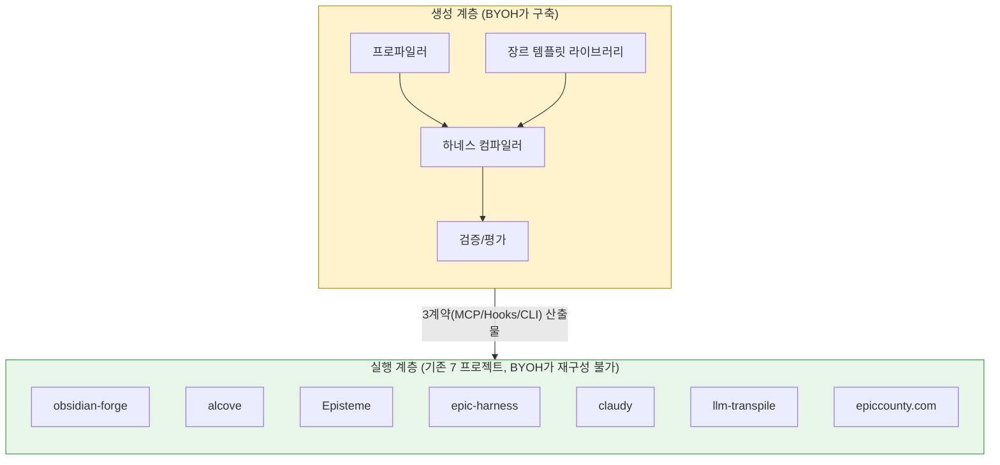

생성 계층이 실행 계층의 소스를 수정하지 않는다. 대신 **번들(`HarnessBundle`)** 이라는 산출물을 통해 실행 계층의 *구성*(config/skill/tool/hook)만 주입한다.

### 1.4 진화 통제 (Controlled Evolution)

맞춤 하네스도 학습해야 하지만, 진화는 B10의 **3중 안전장치** 없이 허용하지 않는다(§7). 원칙: "진화가 가능하되, 거부된 진화는 복구 가능하고, 정체 시 자동 롤백된다."

### 1.5 비파괴와 인간 통제 우선 (Non-Destructive, Human-in-Loop)

B1(Suggest-don't-move)과 B6(역유도 불변량)의 결합 원칙. 사용자의 암묵지 데이터를 **이동·삭제하지 않고** 제안만 하며, 사용자가 승인한 사실(진실)과 AI 추론(파생)을 frontmatter 메타데이터로 분리 표시한다.

---

## 2. 전체 시스템 아키텍처 (C4 컨테이너 다이어그램)

C4 모델의 컨테이너 레벨에서 시스템 전체를 그린다. 생성 계층(노란색)과 실행 계층(녹색)을 3개 계약 선으로 연결하고, 각 컨테이너에 빌딩 블록 B1–B17을 매핑한다.

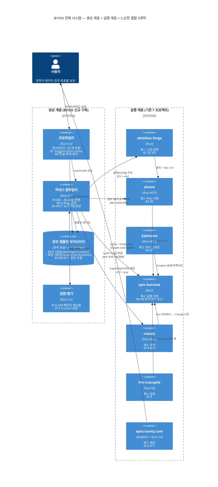

### 2.1 컨테이너별 빌딩 블록 매핑 (정적 매핑표)

| 컨테이너 | 계층 | 매핑된 빌딩 블록 | 비고 |
|----------|------|------------------|------|
| **프로파일러** | 생성 | B1, B6 | 인터뷰엔진=B1, 자동분석엔진=B6 |
| **하네스 컴파일러** | 생성 | B8, B4, B16 | 골격=B8, 도구생성=B4, 배포 메타/레지스트리 항목 생성=B16 (§5.1 Bundle, §9.1 참조) |
| **장르 템플릿 라이브러리** | 생성 | B2, B5, B11, B17 | 장르별 조합 |
| **검증/평가** | 생성 | B10, B12 | A/B 메트릭, Council |
| obsidian-forge | 실행 | B1, B2, B3 | 그대로 재사용 |
| alcove | 실행 | B4, B5 | 그대로 재사용 |
| Episteme | 실행 | B6, B7 | 그대로 재사용 |
| epic-harness | 실행 | B8, B9, B10, B11, B12 | 그대로 재사용 |
| claudy | 실행 | B14, B15 | 그대로 재사용 |
| llm-transpile | 실행 | B13 | 그대로 재사용 |
| epiccounty.com | 실행 | B16, B17 | 번들 배포로 확장 |

### 2.2 컨테이너 간 느슨한 결합 선 (3계약 시각화)

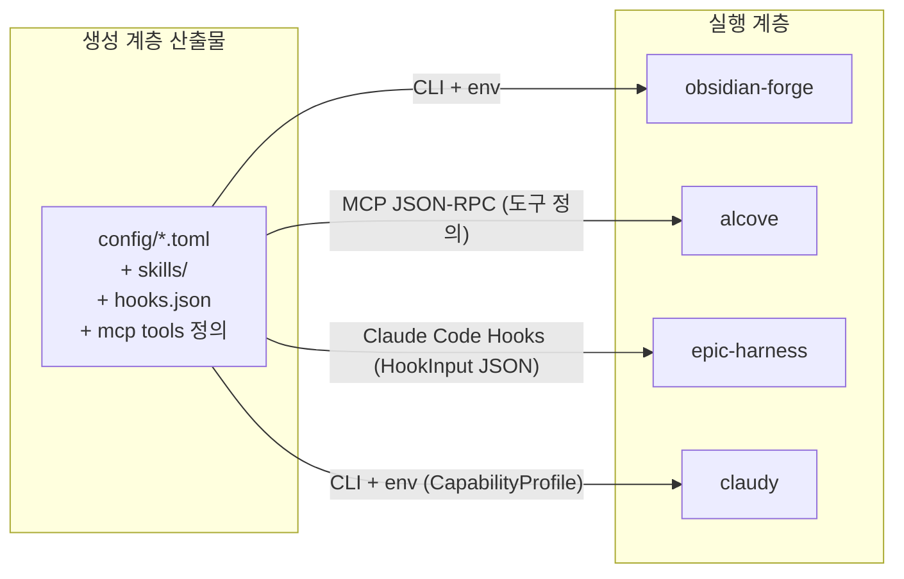

---

## 3. 하이브리드 3단계 취합 파이프라인 상세

리서치 보고서 §7.2 권고 1을 구체화한다. **자동분석(베이스라인) → 인터뷰(보완) → 위자드(확정)** 3단계로 사용자의 암묵지·데이터·장르·목표를 취합한다.

### 3.1 단계별 입출력·빌딩블록·성공조건

| 단계 | 목적 | 입력 | 출력 | 사용 빌딩블록 | 종료 조건 |
|------|------|------|------|---------------|-----------|
| **S1 자동분석** | 사용자 개입 없이 베이스라인 프로파일 생성 | 로컬 볼트/디렉토리 스캔, git 히스토리, 기존 config 파일 | `DraftProfile` (후보 필드만 채움, status=`scan`→`suggested`) | **B1** Suggest-don't-move, **B5** 하이브리드 검색(자료에서 키워드 추출), **B6** 진실/파생 분리(추출값=파생 표시) | 스캔 완료 + 후보 필드 ≥ 1개 |
| **S2 인터뷰** | 베이스라인의 빈칸·모순을 B1 루프로 보완 | `DraftProfile`(status=`suggested`), 자동분석이 낸 "불확실 질문" 큐 | `InterviewedProfile` (status=`suggested` 유지, 인터뷰 메타 갱신) | **B1** Suggest-don't-move(답을 제안하지 추측 강요 X), **B12** Council(장르 애매 시 4음성 질문 생성) | 모든 `required` 필드 충족 또는 사용자 "건너뛰기" 3회 |
| **S3 위자드** | 결정적 선택지로 확정·검증 | `InterviewedProfile`, 장르 템플릿(§6) | `ConfirmedProfile` (status=`confirmed`, 진실/파생 분리 완료) | **B4** 자기-설명 원칙(각 옵션에 "왜 이 장르에 맞는지" 설명 내장), **B6** 진실/파생 분리 최종 승인 | 사용자 `Confirm` 액션 → 컴파일 후 status=`processed` |

### 3.2 상태머신 — 프로파일 라이프사이클 (B1 상태머신 확장)

B1의 `inbox → suggested → confirmed → processed` 상태머신을 프로파일 전체로 일반화한다. **명명은 `03_INTERVIEW_DESIGN.md` §6–§7과 단일 통일**한다: `scan → suggested → confirmed → processed`에 설치 후 진화 단계 `evolving`을 확장. 핵심: **사용자 데이터는 이동하지 않고 상태(frontmatter)만 바뀐다.**

> **명명 통일 근거**: 본 문서 초안이 `draft/interviewed`를 사용했으나, 03 인터뷰 설계가 B1 원형(`inbox→suggested→confirmed→processed`)에 가장 근접하게 `scan/suggested/confirmed/processed`를 채택했으므로, 4개 산출물 전체의 단일 어휘를 위해 본 문서를 03에 맞춘다. `scan`은 "자동분석 스캔 중", `suggested`는 "후보 주입·인터뷰 진행 중", `processed`는 "하네스 번들 생성 완료"를 각각 의미한다(03 §6 상태 전이표 참조).

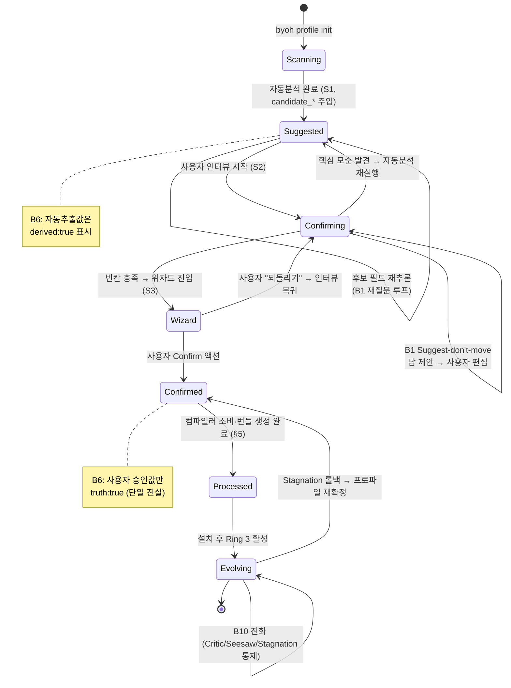

### 3.3 취합 시퀀스 — 자동분석부터 번들 생성까지

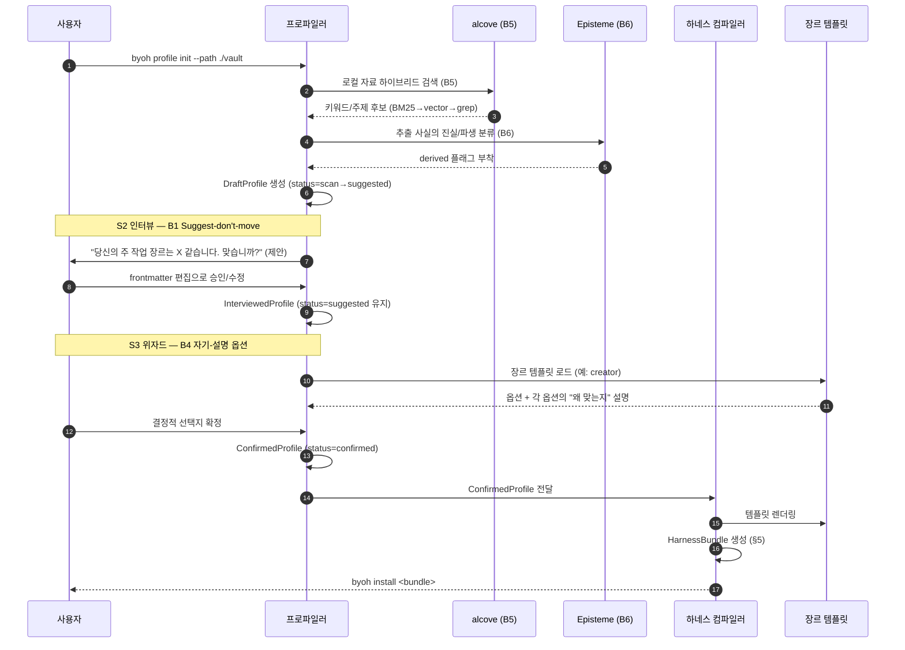

---

## 4. 프로파일러 컴포넌트 설계

프로파일러는 3개 엔진으로 구성된다. 각 엔진은 헥사고날 포트(B7)로 분리되어 장르별 adapter 교체가 가능하다.

### 4.1 엔진 구조

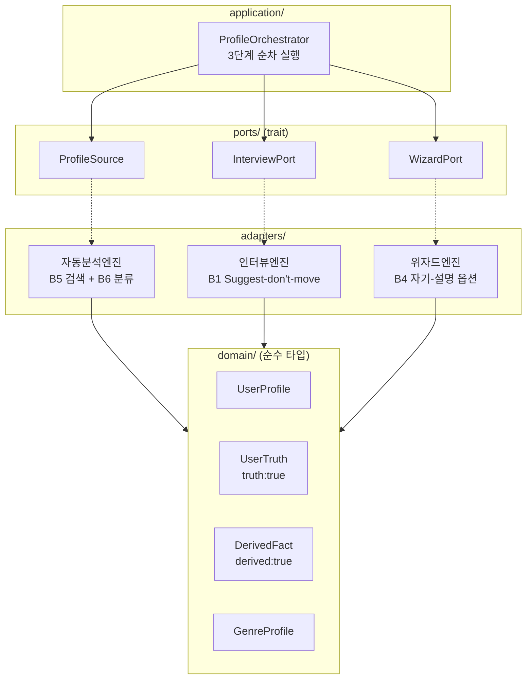

### 4.2 데이터 스키마 — UserProfile frontmatter (B1 후보필드 패턴 확장)

리서치 보고서 §2.1.2의 obsidian-forge `Frontmatter`(후보 필드 `candidate_*`) 패턴을 사용자 프로파일로 확장한다. **핵심: 모든 자동 추출값은 `candidate_*` + `derived:true`, 사용자 확정값만 `truth:true`** (B6 역유도 불변량).

```yaml
# ~/.byoh/profiles/<slug>.md
---
# === 메타 상태머신 (B1, 03_INTERVIEW_DESIGN §6과 통일) ===
profile_status: confirmed          # scan | suggested | confirmed | processed | evolving
profile_version: 3                 # Stagnation 롤백 시 참조
updated_at: 2026-06-24T12:00:00Z

# === 장르 (S3 위자드 확정) ===
genre: creator                     # developer | researcher | creator | business
genre_confidence: 0.82             # 자동분석 신뢰도
# --- 진실/파생 분리 (B6) ---
genre_source: truth                # truth(사용자확정) | derived(AI추론)

# === 핵심 목표 (S2 인터뷰, B1 Suggest-don't-move) ===
primary_goal: "월 2회 뉴스레터 + 1권 출간 준비"
primary_goal_source: truth

# === 작업 데이터 소스 (S1 자동분석) ===
data_sources:
  - path: ~/Documents/vault
    kind: obsidian
    candidate_tags: [writing, research]   # B1 후보필드
    tags_source: derived                  # B6: AI 추론
  - path: ~/projects/novel-draft
    kind: git_repo
    candidate_tags: [fiction]
    tags_source: derived

# === 자동분석이 낸 불확실 질문 큐 (S2 입력) ===
open_questions:
  - id: Q1
    question: "선호하는 글쓰기 툴은? (Scrubs vs Obsidian vs 기타)"
    suggested_answer: "Obsidian"          # B1: 답을 제안, 강요 X
    confidence: 0.6
    resolved: false

# === LLM 프로바이더 선호 (B14) ===
provider_preference:
  candidate_family: anthropic             # 자동분석 추론 (derived)
  capability_constraints:
    tool_use: required
    context_window_min: 200000
  source: derived

# === 진화 정책 (B10, 설치 후 활성) ===
evolution_policy:
  enabled: true
  safety_gates: [critic, seesaw, stagnation]   # 3중 안전장치 필수
  stagnation_limit: 3
  improvement_threshold: 0.02
---

# 본문: 사용자가 자유롭게 적는 보충 설명 (비파괴)
월요일과 목요일에 집필합니다. 아침형 인간...
```

### 4.3 엔진별 동작 명세

**자동분석엔진 (S1)** — 포트 `ProfileSource`
- 입력: 로컬 경로 목록
- B5(하이브리드 검색)로 자료에서 키워드/주제 후보 추출: vector(가능 시) → BM25 → grep 폴백
- B6(역유도 불변량): 추출값은 전부 `derived:true`로 표시. 진실은 사용자만 부여
- 출력: `DraftProfile` (후보 필드만, status=`scan`→`suggested` 전이)
- **비파괴**: 자료를 읽기만 하고 이동/수정 금지 (B1)

**인터뷰엔진 (S2)** — 포트 `InterviewPort`
- 입력: `DraftProfile`(status=`suggested`) + `open_questions` 큐
- B1 Suggest-don't-move: 각 질문에 `suggested_answer`를 채우되, 사용자가 이동·삭제 없이 frontmatter만 편집해 승인
- B12(Council): 장르가 애매할 때 4음성(Architect/Skeptic/Pragmatist/Critic)이 독립 컨텍스트에서 질문을 생성 → 반-앵커링
- 출력: `InterviewedProfile` (status=`suggested` 유지, 인터뷰 메타 갱신)
- 종료: `required` 필드 충족 또는 건너뛰기 3회

**위자드엔진 (S3)** — 포트 `WizardPort`
- 입력: `InterviewedProfile` + 장르 템플릿(§6)
- B4(자기-설명): 각 옵션에 "왜 이 장르에 맞는지" 다단락 설명 내장 (에이전트가 아닌 *사람*이 선택하는 위자드이지만, 설명 원칙은 동일)
- B6 최종 승인: 사용자가 `Confirm`한 값만 `truth:true`로 전환
- 출력: `ConfirmedProfile` (status=`confirmed`)

---

## 5. 하네스 컴파일러 설계

`ConfirmedProfile`을 실행 가능한 `HarnessBundle`(설정/스킬/도구/훅)로 변환한다.

### 5.1 컴파일 파이프라인

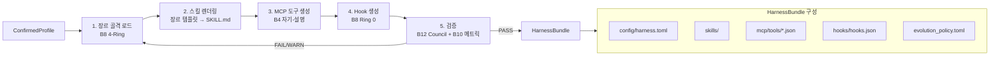

> **🔧 epic-harness 레퍼런스 (컴파일 파이프라인 차용 자산)**
> | 자산 | 소스 경로 | BYOH 적용점 |
> |---|---|---|
> | `SKILL.md` 4섹션 명세 | `registry/skills/*/SKILL.md` | 단계 2(스킬 렌더링) — Process/Anti-Rationalization/Evidence/Red Flags 포맷 강제 |
> | `gen-skills`/`lint-skills` 검증 | `Makefile` | 단계 5(검증) — frontmatter+name+description 필수, CSO compliance 규칙을 컴파일러 게이트로 차용 |
> | `go:plan`/`go:build`/`go:integrate` | `registry/skills/go/SKILL.md` | 단계 2 — 장르별 plan/build/integrate 커스터마이즈 기반 (Ring 1) |
> | `hooks/hooks.json` + `install.js` | `hooks/hooks.json`, `registry/scripts/install.js` | 번들 구조(B4b) Ring 0 계약 + SessionStart 자동설치 부트스트래퍼 |

### 5.2 B8 4-Ring 골격 자동 생성

컴파일러는 프로파일의 장르에 따라 Ring 0–3 골격을 생성한다. 장르별 Ring 강도는 템플릿(§6)이 결정한다.

| Ring | 컴파일러 산출물 | 빌딩 블록 | 장르별 차이 예 |
|------|----------------|-----------|----------------|
| Ring 0 (자동훅) | `hooks/hooks.json` (SessionStart/PreToolUse/PostToolUse/SessionEnd) | B8, B13(Read→압축 훅) | 크리에이터: PostToolUse에 철자/톤 체크 |
| Ring 1 (파이프라인) | `skills/{spec,go,check,ship}.md` | B8, B9(파일기반상태) | 연구자: spec에 문헌 리뷰 단계 추가 |
| Ring 2 (품질) | `skills/{debug,secure,...}.md` | B8, B5(검색으로 장르 품질 기준 RAG) | 비즈니스: ROI 평가 스킬 |
| Ring 3 (진화) | `evolution_policy.toml` + Critic/Seesaw/Stagnation config | B8, B10, B11 | 공통 (3중 안전장치 강제) |

### 5.3 B4 MCP 도구 자동생성

프로파일의 `data_sources`와 `genre`를 기반으로 alcove 스타일 MCP 도구를 자동 생성한다. **각 도구의 `description`은 단순 명세가 아니라 에이전트 디스패치 로직을 임베드** (B4).

예(creator 장르, `data_sources`에 소설 초안 포함):
```json
{
  "name": "search_draft_continuity",
  "description": "소설 초안에서 캐릭터·설정·플롯 연속성을 검색합니다. 사용자가 '이 장면 앞의 복선'이나 '캐릭터 A의 성격 변화'를 물을 때 호출하세요. 결과는 장르 RAG(creator 벡터 인덱스)에서 옵니다.",
  "inputSchema": { "type": "object", "properties": { "query": {"type":"string"} } }
}
```

컴파일러는 장르 템플릿(§6)의 `tool_blueprints`를 렌더링해 이 JSON을 생산한다.

> **B3(AI 그래프 강화) 위임 메모**: 본 문서는 B3(백링크·브릿지 노트·고아연결 자동 보강)를 직접 설계하지 않는다. B3는 **실행 계층인 obsidian-forge**(`of strengthen-graph`)의 기능이며, 장르 템플릿(§6.2 researcher/creator)이 지정한 도메인 엔티티 타입(인용 엔티티·캐릭터/플롯 엔티티)에 맞춰 obsidian-forge가 그래프를 강화한다. BYOH는 엔티티 타입 정의만 생성 계층에서 제공하고, 강화 실행은 04_ROADMAP M2가 obsidian-forge에 위임한다.

### 5.4 검증 게이트 (B12 Council + B10 메트릭)

번들이 사용자 목표를 달성 가능한지 컴파일 종료 시 검증한다.

- **정적 검증**: 3계약 위반 탐지. (1) MCP 스키마 정합성(`inputSchema` JSON Schema 준수, `name`/`description` 필수), (2) **HookInput 필수 필드**(`tool_name`, `tool_input`, `hook_event_name`, `context_usage` — 리서치 §2.4.2) 누락 시 컴파일 거부, (3) CLI 인자(필수 플래그·타입 정합). 위반 시 컴파일 거부.
- **B12 Council 검증**: 복잡한 장르 조합(예: developer+business 혼종)은 4음성이 각각 "이 번들이 사용자의 primary_goal을 위협하는가?"를 독립 평가. WARN 이상 시 사용자에게 되돌림.
- **B10 메트릭 시드**: 번들에 빈 `metrics.json`(A/B 슬롯 `avg_score_with/without`)을 심어 설치 후 진화가 측정 가능하게.

### 5.5 업데이트/재컴파일/마이그레이션 — 프로파일 diff 기반 증분 컴파일

`profile_version`이 변경되거나 의존 실행 계층 도구가 업그레이드될 때 기존 번들의 breaking change 처리·마이그레이션·롤백 경로 (완결성 비평 "롤백/언인스톨/마이그레이션 부재" 대응). 컴파일러는 **전체 재컴파일이 아닌 프로파일 diff 기반 증분 재컴파일**을 수행한다.

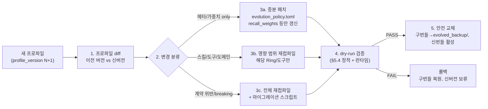

- **diff 단위**: `truth_*` 필드 변경은 일반적으로 증분 패치(3a). `genre` 자체 변경·`data_sources` 경로 변경·도메인 엔티티 타입 추가는 영향 범위 재컴파일(3b). 3계약 스키마 변경(MCP `inputSchema` 구조 변경·HookInput 필수 필드 변동)은 breaking → 전체 재컴파일 + 마이그레이션(3c).
- **dry-run 게이트**: 컴파일 후 설치 전 런타임 검증 단계(완결성 비평 "dry-run/시뮬레이션 부재" 대응). 샘플 인터뷰 응답·대표 도구 호출 시나리오를 번들에 주입해 스킬/훅/MCP 도구가 정상 동작하는지 샌드박스 검증 후 PASS 시만 교체.
- **안전 교체**: 구번들은 `~/.byoh/backups/<slug>/<version>/`에 보존(`evolved_backup/` 패턴, B9/B10 확장). 신번들 1세션 관측 후 `avg_score_with`가 `without` 대비 열화 시 자동 롤백(Stagnation 메커니즘과 동일 게이트).
- **실행 계층 도구 업그레이드**: 의존 도구(obsidian-forge/alcove/epic-harness)가 `min_version`을 넘어 업그레이드될 때, 번들의 `depends_on` 핀과 로컬 설치 버전을 `byoh doctor`가 비교(`epiccounty status` 패턴). 호환 창 내면 증분 재컴파일, breaking이면 마이그레이션 노트와 함께 사용자 확인 유도(04_ROADMAP M2 호환성 매트릭스와 연동).
- **다중 프로파일/다중 장르**: 한 사용자가 복수 프로파일(slug별)을 보유할 수 있으며(ER `User 1:N Profile`), 각 프로파일은 독립된 진화 데이터·메모리 그래프 분할·장르 인덱스를 가진다. 충돌(예: 동일 볼트를 두 장르가 인덱싱)은 slug 접두사로 네임스페이스 분리.

---

## 6. 장르 템플릿 라이브러리

리서치 보고서 §6.2가 지적한 "장르 추상화 부재"를 해결하는 계층. **MVP는 2장르(developer + creator)로 좁혀 출발**한다(`01_PROJECT_PLAN.md` F5, `04_ROADMAP.md` M0 기준 — 리서치 §7.3 권고). researcher·business는 동일 상속 메커니즘으로 MVP 이후 확장한다. 본 절은 메커니즘(상속/오버라이드)은 4장르 공통으로 설계하되, MVP 구현 범위를 명시한다.

### 6.1 템플릿 메커니즘 — 상속/오버라이드

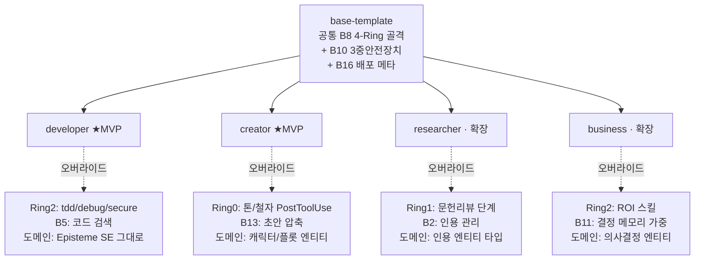

**상속 규칙**: 자식 템플릿은 `base-template`의 Ring 0–3 골격 + B10 안전장치를 **상속**(제거 불가). 오버라이드는 스킬 본문·도구 블루프린트·도메인 엔티티 타입에만 허용.

### 6.2 장르 템플릿 구성 (B블록 조합 명시) — MVP 2종 + 확장 2종

| 장르 | 범위 | 상속 | Ring 0 (훅) | Ring 1 (파이프라인) | Ring 2 (품질) | 도메인/검색 | 비고 |
|------|------|------|-------------|---------------------|---------------|-------------|------|
| **developer** | ★MVP | base | SessionStart resume, PostToolUse Read→압축 (**B13**), PreToolUse guard | spec→go→check→ship (**B8,B9**) | tdd/debug/secure/perf | **B5** 코드 검색, **B6** Episteme SE 그대로 | 기존 epic-harness와 거의 동일 (가장 낮은 구현 리스크) |
| **creator** | ★MVP | base | + 톤/철자 PostToolUse, **B13** 초안 압축 | 초안→편집→교정→출판 4단계 파이프라인 (epiccounty 워크스페이스 외부, velith 출판 파이프라인 패턴 참조) | 연속성/캐릭터 일관성 | **B5** 초안 RAG, 캐릭터/플롯 엔티티 | 장르 특화 가장 강도 높음 |
| **researcher** | 확장 | base | + 인용 수집 PostToolUse | + 문헌 리뷰 단계 (spec 내) | 인출 정확도/출처 검증 | **B5** 학술 검색, **B2** 인용 PARA, 인용 엔티티 타입 신규 | 도메인 엔티티 타입 확장 필요 (§7) |
| **business** | 확장 | base | + 의사결정 로그 PostToolUse | 목표→분석→결정→실행 | ROI/리스크 평가 | **B11** 결정 메모리 가중치 상향, 의사결정 엔티티 | **B12** Council을 의사결정 게이트로 활용 |

> **MVP 범위 근거**: developer는 기존 epic-harness 재사용으로 구현 리스크 최소, creator는 장르 특화가 가장 강해 "장르 일반화" 검증에 적합. 이 둘로 상속 메커니즘을 증명한 뒤 researcher·business를 동일 메커니즘으로 확장(`01_PROJECT_PLAN.md` F5·F9, `04_ROADMAP.md` M0/M3 참조).

### 6.3 템플릿 파일 구조

```
templates/
├── base/
│   ├── rings.toml              # Ring 0-3 골격 (B8) + 3중안전장치 (B10)
│   ├── contracts/              # 3계약 스펙 (MCP/Hooks/CLI)
│   └── deploy.toml             # B16 배포 메타
├── developer/
│   ├── template.yaml           # extends: base, overrides...
│   ├── skills/                 # Ring2 스킬 본문
│   └── tools/                  # MCP 도구 블루프린트 (B4)
├── researcher/ ...
├── creator/ ...
└── business/ ...
```

> **🔧 epic-harness 레퍼런스 (장르 템플릿 차용 자산)**
> | 자산 | 소스 경로 | BYOH 적용점 |
> |---|---|---|
> | `registry/presets/{go,node,python,rust,...}` | `registry/presets/` | base-template 원형 — 언어/스택 cold-start 프리셋 패턴을 `templates/genres/`로 이식 (위 developer 행이 `rust` preset과 거의 동일) |
> | base 상속 규칙 (Ring 골격 + B10 불변) | `registry/skills/_dispatch/SKILL.md`, `src/evolve/` | 자식 템플릿이 상속받는 불변 Ring 0-3 + 3중 안전장치 (제거 불가, §6.1) |

> **🌐 커뮤니티 레퍼런스 (장르별 참조 구현)** — 각 장르 템플릿은 awesome-claude-plugins(2026-06)의 검증된 스킬을 도메인 스키마로 재구성한다:
> | 장르 | 참조 플러그인 | 재구성 방식 |
> |------|-------------|------------|
> | developer | #13 agent-skills(64k★), #5 anthropics/skills, #23 last30days, #25 ponytail | 코딩 스킬을 Ring 2(tdd/debug/secure/perf)로 통합 |
> | creator | #7 ui-ux-pro-max(94k★), #21 taste-skill(47k★), #32 impeccable(39k★), #11 open-design(68k★) | 디자인 지능 스킬을 Ring 2(연속성/일관성) + Ring 0(톤 체크)로 매핑 |
> | researcher | #39 academic-research-skills(33k★, research→write→review→revise), #69 deepeval(16k★) | 문헌 파이프라인을 Ring 1에 추가, 평가를 Ring 2로 |
> | business | #18 career-ops(54k★), #38 marketingskills(34k★), #60 pm-skills(20k★) | ROI/의사결정 스킬을 Ring 2, B12 Council을 의사결정 게이트로 |

---

## 7. 진화/운영 서브시스템

맞춤 하네스가 설치된 후 스스로 학습·진화하는 서브시스템. B10의 3중 안전장치를 장르 무관하게 강제한다.

### 7.1 B10 3중 안전장치 — 맞춤 하네스 적용

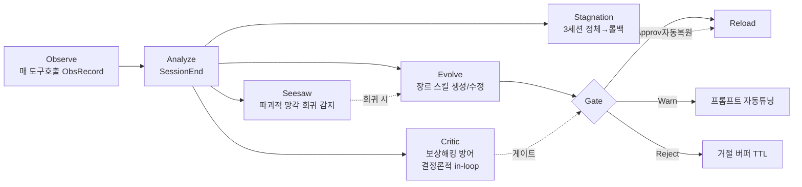

**장르별 차이점 (동일 구조, 다른 임계값)**:
- developer: `IMPROVEMENT_THRESHOLD=2%`, `STAGNATION_LIMIT=3` (기존 epic-harness 값 유지)
- creator: `STAGNATION_LIMIT=5` (창작은 진전이 느리므로 Stagnation 롤백 지연)
- business: Critic 가중치 상향 (잘못된 의사결정 진화의 비용이 큼)

**강제 지점**: 컴파일러(§5)는 `evolution_policy.safety_gates`에 `[critic, seesaw, stagnation]` 세 개가 모두 있는지 검증. 하나라도 빠지면 컴파일 거부 (§1.4 원칙).

### 7.2 B11 스마트 리콜 — 장르별 메모리 가중

epic-harness의 `recall.rs` 복합 점수 `recency(25%) + importance(35%) + access_freq(15%) + FTS_match(25%)`를 장르에 맞춰 재가중.

| 장르 | importance 기본값 (타입별) | recency 반감기 | 비고 |
|------|---------------------------|----------------|------|
| developer | decision=0.9, resolution=0.8 (기존) | 30일 | 기존 유지 |
| researcher | citation=0.95 (신규 타입) | 90일 | 학술은 오래된 인용도 유효 |
| creator | character_bible=0.95, plot_point=0.9 | 180일 | 세계관은 장기 기억 |
| business | decision=0.95 (상향) | 14일 | 시장 변화 빠름 → 최신 결정 우선 |

### 7.3 B9 파일 기반 상태 — 긴 취합/컴파일 복구

3단계 취합(S1–S3)과 컴파일(§5)은 컨텍스트 압축을 견디도록 파일 기반 상태를 사용한다 (B9의 `PIPELINE-*.json` 패턴).

- `~/.byoh/profiles/<slug>.md` 자체가 상태 (frontmatter `profile_status`: `scan→suggested→confirmed→processed→evolving`)
- 컴파일 진행: `~/.byoh/builds/<slug>/BUILD-<timestamp>.json`에 phase 영속
- **복구 프로토콜** (epic-harness orbit 패턴 재사용): 매 단계마다 빌드 파일 재읽기; `updated_at` > 45분이면 크래시로 간주 → 마지막 안전 단계로 복귀

### 7.4 B12 Council — 복잡 설정 검증

Council(4음성 반-앵커링)을 3곳에 적용:
1. **S2 인터뷰**(§3): 장르 애매 시 질문 생성
2. **컴파일 검증**(§5.4): 번들이 목표 위협 탐지
3. **진화 게이트**(선택): 고위험 진화(의사결정 스킬 수정 등) 시 4음성 심의

> **🔧 epic-harness 레퍼런스 (진화/운영 서브시스템 — 모듈 구조 그대로 복제)**
> | 자산 | 소스 경로 | BYOH 적용점 |
> |---|---|---|
> | Critic/Seesaw/Metrics/Skills | `src/evolve/{critic,seesaw,metrics,skills,edits}.rs` | §7.1 3중 안전장치 + 라이프사이클 — 모듈 분리 구조 복제 |
> | `EditType` 6종 | `src/shared/evolution.rs` | 진화 에디터 타입 (AddSkill/ModifyInstinct/ModifyConfig/AddGuardRule/ModifyPrompt), 장르별 서브셋 |
> | `SkillOpt` 미니배치 | `src/evolve/skills.rs` | 패턴 마이닝 알고리즘 (우세에러≥60% & ≥2파일 → 재사용 스킬 시딩) |
> | `evolved/` 디렉토리 | `~/.harness/projects/{slug}/evolved/` | `~/.byoh/<slug>/evolved/` 경로 패턴 + `MAX_EVOLVED_SKILLS=10` 상한 |
> | orbit 복구 (45분) | `src/store/orbit_store.rs`, `src/shared/orbit.rs` | §7.3 `BUILD-*.json` 복구 프로토콜 (위 라인 588) |
> | 게이트 상수 | `src/config.rs`, `src/evolve/metrics.rs` | `STAGNATION_LIMIT=3`, `IMPROVEMENT_THRESHOLD=2%`, 거절버퍼 TTL=10세션 — 장르별 오버라이드 기본값 |
> | `anti-anchoring` | `registry/skills/council/SKILL.md` | §7.4 Council 4음성 독립컨텍스트 — 3 적용 지점 |
> | `harness-mem` 스마트 리콜 | `src/mem/store/recall.rs` | §7.2 장르별 메모리 가중의 원형 (recency/importance/freq/FTS 복합 점수) |
> | `MAX_CONCURRENT_AGENTS=6` | `src/orchestrate/state.rs` | Council 병렬 심의 동시성 상한 |

---

## 8. 컨텍스트 최적화

### 8.1 B13 적응형 압축 — 장르 지식 주입

사용자의 대용량 지식베이스(볼트/문서)를 하네스에 주입할 때, B13의 4단계 적응형 압축을 장르별 중요도 가중과 결합.

| 예산 사용률 | 압축 단계 | 장르별 동작 |
|------------|-----------|-------------|
| < 60% | StopwordOnly | 전체 유지 |
| < 80% | PruneLowImportance | developer: 주석/로그 제거; creator: 부설명 축약, 대사 유지 |
| < 95% | DeduplicateAndLinearize | researcher: 중복 인용 제거, 인용 체인 선형화 |
| ≥ 95% | MaxCompression | business: 숫자/결정만 남김 |

**중요도 가중치** (`DocNode.importance`)를 장르가 결정:
- developer: 코드 블록 0.9, 주석 0.2
- creator: 대사 0.95, 묘사 0.6, 무대지시 0.4
- researcher: 인용/데이터 0.95, 방법론 0.8, 배경 0.4
- business: 숫자/ROI/결정 0.95, 서사 0.3

### 8.2 B5 하이브리드 검색 — 장르 RAG

alcove의 검색 티어링(vector→BM25→grep)을 장르별 인덱스로 분리. 각 장르는 별도 tantivy 인덱스 + BM25 부스트 가중치.

| 장르 | body 가중치 | title 가중치 | filename 가중치 | CJK 토크나이저 |
|------|------------|-------------|-----------------|----------------|
| developer | 1.0 | 3.0 | 2.0 | Ngram(2,3) 기본 |
| researcher | 1.2 (본문 인용 중요) | 2.5 | 1.5 | Ngram(2,3) |
| creator | 1.0 | 2.0 (챕터명) | 1.0 | 형태소 분석 권장 |
| business | 1.0 | 3.5 (결정 제목) | 2.0 | Ngram(2,3) |

---

## 9. 배포 아키텍처

### 9.1 B16 정적 레지스트리 + 부트스트래퍼로 번들 패키징

epiccounty.com의 패턴을 BYOH 번들에 적용. 컴파일러가 생성한 `HarnessBundle`을 정적 레지스트리 항목으로 변환.

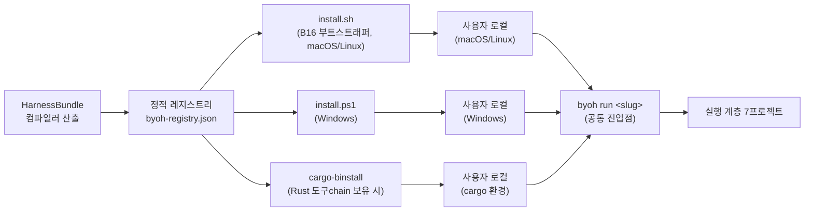

> **분기 이유**: 동일 번들이 OS/환경 차이를 흡수하도록 3종 설치 경로를 제공한다. `install.sh`는 POSIX 셸 스크립트(macOS/Linux 기본), `install.ps1`은 PowerShell(Windows 기본), `cargo-binstall`은 Rust 툴체인이 있는 환경의 빠른 경로. 세 경로 모두 `byoh run <slug>`라는 단일 공통 진입점으로 합류하므로, 설치 방식이 런타임 동작을 분기시키지는 않는다.

**레지스트리 항목 구조** (B16 `App` 구조 확장):
```json
{
  "id": "byoh-creator-jane",
  "slug": "creator-jane",
  "genre": "creator",
  "bundle_version": "1.2.0",
  "source_profile_hash": "sha256:...",
  "install_methods": ["script", "cargo-binstall"],
  "depends_on": [
    {"id": "obsidian-forge", "min_version": "0.x"},
    {"id": "alcove", "min_version": "0.x"},
    {"id": "epic-harness", "min_version": "0.x"}
  ]
}
```

**부트스트래퍼 역할**: `install.sh`가 `byoh` CLI를 설치 → CLI가 `byoh-registry.json`에서 번들 조회 → 의존 실행 계층 도구 버전 검증(`epiccounty status` 패턴) → 번들 config 주입.

### 9.2 B14 CapabilityProfile — 프로바이더 선택

프로파일의 `provider_preference`(§4.2)를 claudy의 `CapabilityProfile`로 매칭. 문자열 매칭 없이 타입 안전하게 프로바이더를 선택.

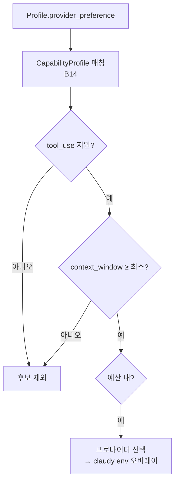

**B15 shim 모델**: 선택된 프로바이더로 claudy가 env 오버레이를 빌드해 Claude(또는 호환 에이전트)를 스폰. BYOH는 런타임을 직접 통제하지 않고 claudy에 위임 (§1.3 원칙).

### 9.3 B17 이중언어 i18n

epiccounty.com의 en/ko i18n 인프라를 BYOH 인터페이스에 적용. 인터뷰 질문·위자드 옵션·설명은 모두 `{en, ko}` 쌍으로 저장. 한국 사용자 타겟 MVP 우선.

---

## 10. 데이터 모델 (ER 다이어그램)

```mermaid
erDiagram
    User ||--o{ Profile : "보유"
    Profile ||--|| GenreTemplate : "기반"
    Profile ||--|| HarnessBundle : "컴파일 생성"
    HarnessBundle ||--o{ EvolutionMetrics : "측정"
    Profile ||--o{ UserTruth : "진실(확정)"
    Profile ||--o{ DerivedFact : "파생(AI추론)"
    GenreTemplate ||--o{ GenreTemplate : "상속(extends)"

    User {
        string id PK
        string locale "en|ko (B17)"
        timestamp created_at
    }

    Profile {
        string slug PK "예: creator-jane"
        string user_id FK
        string genre "developer|researcher|creator|business"
        enum profile_status "scan|suggested|confirmed|processed|evolving"
        int profile_version "Stagnation 롤백 참조"
        string primary_goal
        json data_sources
        json provider_preference "B14"
        json evolution_policy "B10"
        timestamp updated_at
    }

    UserTruth {
        string id PK
        string profile_id FK
        string field_path "예: genre"
        string value
        boolean truth_true "B6: 항상 true"
        timestamp confirmed_at
    }

    DerivedFact {
        string id PK
        string profile_id FK
        string field_path
        string value
        float confidence
        boolean derived_true "B6: 항상 true"
        string source "auto|interview_suggest"
    }

    GenreTemplate {
        string name PK "base|developer|..."
        string extends FK "부모 템플릿 (자기참조)"
        json rings_config "B8"
        json tool_blueprints "B4"
        json domain_entities "장르 엔티티 타입"
        json recall_weights "B11"
    }

    HarnessBundle {
        string id PK
        string profile_slug FK
        string bundle_version "semver"
        string genre
        string source_profile_hash "sha256"
        json config "harness.toml"
        json skills_manifest
        json mcp_tools "B4 생성 도구"
        json hooks "B8 Ring0"
        timestamp built_at
    }

    EvolutionMetrics {
        string id PK
        string bundle_id FK
        string skill_name
        float avg_score_with "B10 A/B"
        float avg_score_without
        enum epoch "Improving|Regressing|StableSuccess|PersistentFailure"
        int sessions_active
        timestamp measured_at
    }
```

### 10.1 진실/파생 분리 (B6)의 데이터 모델 구현

ER의 `UserTruth` vs `DerivedFact` 이분법이 B6의 핵심. 역유도 불변량: **`UserTruth`가 단일 진실 소스**이며, `DerivedFact`는 표시·추론용 파생값. 둘을 같은 테이블에 섞지 않는다 (Episteme가 `solves` vs `solved_by`를 분리 저장 금지한 것과 동일).

---

## 11. 보안/프라이버시

### 11.1 사용자 암묵지 보호 — 비파괴 (B1)

- 프로파일러(자동분석엔진)는 사용자 자료를 **읽기 전용**으로 스캔. 이동·삭제·수정 금지 (B1 Suggest-don't-move).
- 인터뷰엔진은 답을 `suggested_answer`로 *제안*만 하고, 사용자가 frontmatter를 편집해 승인. 시스템이 사용자 데이터를 덮어쓰지 않는다.
- 위반 탐지: `byoh validate`가 자동분석엔진 adapter의 쓰기 연산을 정적으로 거부 (포트 `ProfileSource`가 읽기 전용 trait).

### 11.2 진실/파생 분리로 신뢰 확보 (B6)

- AI가 추론한 값은 전부 `derived:true`. 사용자가 확정한 값만 `truth:true`.
- 진화(Ring 3)가 `derived` 값을 기반으로 중요 결정을 내리는 것을 Critic(B10)이 차단.
- 프라이버시: 외부 전송 시 `derived` 값은 마스킹 대상(사용자 의도 없이 추론된 정보).

### 11.3 로컬 우선 처리

- 3단계 취합(S1–S3)과 컴파일은 **로컬에서 실행**. 외부 LLM 호출은 프로바이더 선택(B14) 후에만, 그리고 사용자가 명시적으로 승인한 경우만.
- 사용자 볼트/데이터는 외부 레지스트리(B16)에 업로드되지 않는다. 업로드되는 것은 `HarnessBundle`(설정/스킬/도구 정의)만이며, `source_profile_hash`는 해시만 저장(원본 프로파일 미전송).
- OSN 보안 정책 준수: 본 서비스가 OSN 범위에서 운영될 경우, 프로덕션 코드의 직접 외부 LLM 호출 금지, AWS `ap-northeast-2` 리전 고정, Secrets Manager 사용 (글로벌 AGENTS.md/osn-security.md 참조).

### 11.4 위협 모델 요약

| 위협 | 자산 | 완화 |
|------|------|------|
| 암묵지 무단 이동/삭제 | 사용자 볼트 | B1 비파괴 + `ProfileSource` 읽기전용 포트 |
| AI 추론을 진실로 오인 | 의사결정 | B6 진실/파생 분리 + B10 Critic |
| 진화 보상해킹 | 맞춤 스킬 | B10 Critic(in-loop 결정론적) |
| 파괴적 망각 | 사용자 지식 | B10 Seesaw 회귀 감지 + Stagnation 롤백 |
| 외부 데이터 유출 | 사용자 프로파일 | 로컬 우선 + 해시만 업로드 |
| 번들 공급망 변조 | 번들 무결성 | 정적 레지스트리 항목의 `source_profile_hash` 검증 + 서명/SBOM(§11.7) |

### 11.5 삭제권 (Right to Erasure) — 개인정보보호법/GDPR 대응

사용자 암묵지를 취합·인덱싱·진화시키는 서비스 특성상, 삭제권·이동권·번들 폐기 경로를 아키텍처에 명시한다(한국 개인정보보호법 제36조, GDPR 제17조·제20조).

```mermaid
stateDiagram-v2
    [*] --> Active: 하네스 설치·운영 중
    Active --> ErasureRequested: byoh profile erase --slug &lt;slug&gt;
    ErasureRequested --> Verifying: 사용자 재확인 (2-factor 의사)
    Verifying --> Purging: 확인 완료
    Purging --> Purged: 모든 파생 데이터 폐기
    Purged --> [*]

    state Purging {
        [*] --> P1
        P1: 프로파일 폐기<br/>~/.byoh/profiles/&lt;slug&gt;.md
        P2: 빌드 상태 폐기<br/>~/.byoh/builds/&lt;slug&gt;/
        P3: 진화 데이터 폐기<br/>harness.db + evolved_backup/
        P4: 메모리 그래프 폐기<br/>memory.db (해당 slug 분할)
        P5: 인덱스 폐기<br/>.alcove/ 장르 인덱스
        P6: 레지스트리 항목 철회<br/>byoh-registry.json (해시만 남김)
        P1 --> P2 --> P3 --> P4 --> P5 --> P6
    }
```

- **범위**: `byoh profile erase`는 해당 slug의 프로파일·빌드 상태·진화 관찰 데이터(ObsRecord/metrics.json)·메모리 그래프 분할·장르 RAG 인덱스·레지스트리 항목을 모두 폐기한다. 단, **사용자 원본 볼트/자료는 BYOH가 생성한 것이 아니므로 삭제 대상에서 제외** (사용자가 직접 관리).
- **번들 언인스톨**: `byoh uninstall <slug>`는 설치된 config/skill/tool/hook을 제거하고, `--purge` 플래그 시 진화 데이터까지 폐기(`erase`와 동일).
- **감사 로그**: 삭제 실행 시 `~/.byoh/audit/erase-<timestamp>.json`에 "무엇을 언제 폐기했는지"를 기록(원본 값 아닌 경로·해시만). 규제 대응 증빙.
- **되돌림 불가 명시**: 삭제는 비파괴 원칙(B1)의 예외. 사용자 2단계 확인 후에만 실행.

### 11.6 데이터 이동권 (Data Portability)

`byoh profile export --slug <slug> --format bundle`이 프로파일 전체(`truth_*`/`candidate_*`/`derived_*` + 진화 정책)를 이식 가능한 단일 아카이브로 내보낸다.

- **출력**: `profile-<slug>-<version>.tar.zst` (프론트매터 YAML + 진화 메타 + `tool_blueprints` JSON). 외부 서비스(다른 BYOH 인스턴스, 호환 하네스)로 재설치 가능.
- **개인정보 최소화**: 내보내기 전 선택적 마스킹 게이트가 `derived_*` 값의 PII/민감정보 탐지(§11.2 마스킹 규칙 확장) 후, 사용자 승인된 필드만 포함.
- **역추적성 보존**: `provenance` 필드(03 인터뷰 설계 스키마)를 내보내기에 포함해, 이동 후에도 "이 진실이 어디서 왔는지" 추적 가능.

### 11.7 번들 무결성·공급망 보안

정적 레지스트리가 변조되거나 의존 실행 계층 도구가 악의적으로 교체될 때의 방어 (완결성 비평 "번들 무결성/서명 부재" 대응).

- **서명**: 컴파일러가 `HarnessBundle` 생성 시 번들 전체 해시(`sha256`)를 서명 키로 서명. `byoh install`이 서명 검증 후 설치 (Cosign/sigstore 패턴, B16 확장).
- **SBOM**: 번들에 `sbom.spdx.json`을 포함해 의존 실행 계층 도구(obsidian-forge/alcove/epic-harness/claudy)의 정확한 버전·출처를 명시.
- **레지스트리 무결성**: `byoh-registry.json` 자체도 서명·체인 검증. 핀된 `min_version` 외에 각 도구의 공식 서명 지문을 저장해 교체 탐지.
- **롤백 연동**: 서명 검증 실패 시 §5.5 마이그레이션 경로의 "직전 안정 번들"로 자동 폴백.

---

## 부록 A: 빌딩 블록 → 컴포넌트/섹션 교차 매핑

| 블록 | 이름 | 본 문서 적용 섹션 | 핵심 컴포넌트 |
|------|------|-------------------|---------------|
| B1 | Suggest-don't-move | §1.5, §3.2, §4.2, §11.1 | 인터뷰엔진, 프로파일 상태머신 |
| B2 | PARA+Zettel+Karpathy | §6.2 | researcher 템플릿 |
| B3 | AI 그래프 강화 | 본 문서에서 직접 설계하지 않음 (실행 계층 obsidian-forge에 위임, §5.3 메모·04_ROADMAP M2 참조) | obsidian-forge 실행 계층 |
| B4 | MCP 자기-설명 도구 | §4.3, §5.3, §6.3 | 위자드엔진, 컴파일러 도구생성 |
| B5 | 하이브리드 검색 티어링 | §3.1, §4.3, §8.2 | 자동분석엔진, 장르 RAG |
| B6 | 역유도 불변량 | §1.5, §3.2, §4.2, §10.1, §11.2 | UserTruth/DerivedFact 분리 |
| B7 | 헥사고날 아키텍처 | §1.2, §4.1 | 도메인/포트/어댑터 전면 |
| B8 | 4-Ring 모델 | §5.2, §6.1 | 컴파일러 골격 생성 |
| B9 | 파일 기반 상태 | §5.5, §7.3 | 프로파일/빌드 상태 영속, 번들 백업·복구 |
| B10 | 진화 엔진 + 3중안전장치 | §1.4, §5.4, §5.5, §7.1, §11.4, §11.5 | evolution_policy, Critic/Seesaw/Stagnation, 롤백·삭제 |
| B11 | 스마트 리콜 | §7.2 | 장르별 메모리 가중 |
| B12 | Council 4음성 | §3.1, §4.3, §5.4, §7.4 | 인터뷰 질문, 컴파일 검증 |
| B13 | 적응형 압축 | §8.1 | 장르 지식 주입 |
| B14 | CapabilityProfile | §4.2, §9.2 | 프로바이더 선택 |
| B15 | shim+MCP 위임 런처 | §9.2 | claudy 실행 위임 |
| B16 | 정적 레지스트리+부트스트래퍼 | §5.5, §9.1, §11.7 | 번들 패키징/배포, 마이그레이션, 서명/SBOM |
| B17 | 이중언어 i18n | §6, §9.3 | 인터페이스/템플릿 |

## 부록 B: 다른 산출물로의 참조

- `00_RESEARCH_REPORT.md` — 본 문서의 모든 B1–B17 정의, §2.4.2 HookInput 필수 필드, §6 결측 계층 식별의 근거
- `01_PROJECT_PLAN.md` (별도) — 본 설계를 서비스 범위·마일스톤으로 전개. MVP 장르 2종(developer+creator, F5)은 본 문서 §6과 일치. §11.5–§11.6(삭제/포팅)은 계획서 §9 리스크와 쌍방향 연동 필요.
- `03_INTERVIEW_DESIGN.md` (별도) — §3 S2 인터뷰 단계, §4.2 `open_questions` 스키마, **§6–§7 프로파일 상태머신(`scan→suggested→confirmed→processed`)** 의 구체화. 본 문서 §3.2·§4.2·ER enum은 이 명명에 단일 통일함.
- `04_ROADMAP.md` (별도) — 부록 A 매핑표의 의존관계 기반 마일스톤. M2(obsidian-forge B3 그래프 강화 위임, 본 문서 §5.3 메모), M3(진화 3중 안전장치, 본 문서 §7.1). §5.5 마이그레이션·§11.5 삭제는 로드맵에 별도 마일스톤 추가 권고(완결성 비평 반영).

---

*본 설계는 2026-06-24 기준 `00_RESEARCH_REPORT.md` 분석에 근거한다. 각 빌딩 블록의 구현 API는 버전에 따라 변경될 수 있으므로 구현 시 부록 A의 소스 파일을 재검증할 것.*
