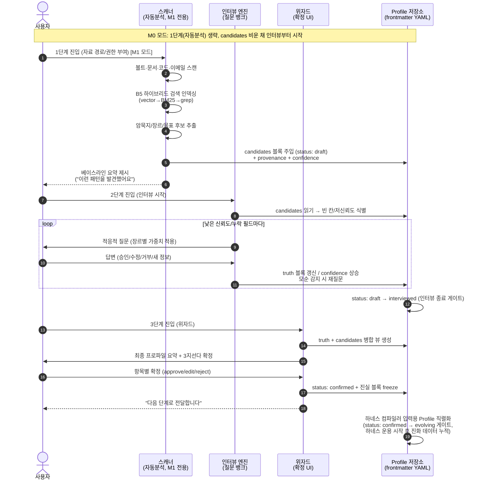
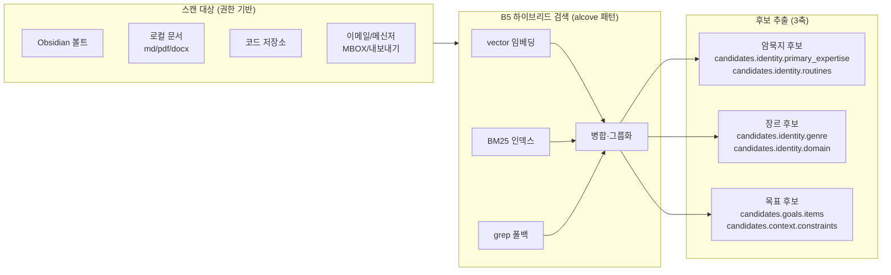
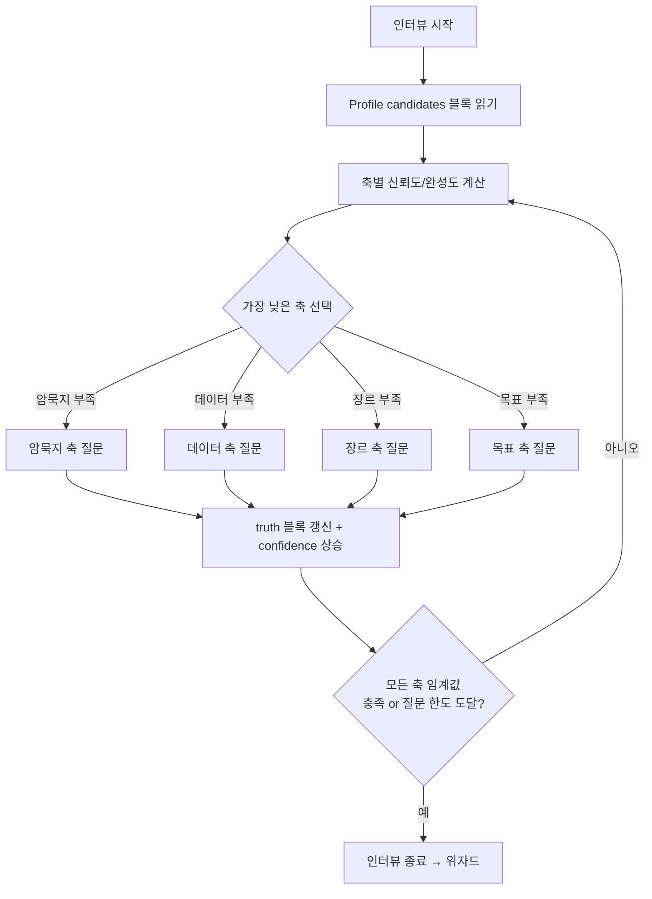
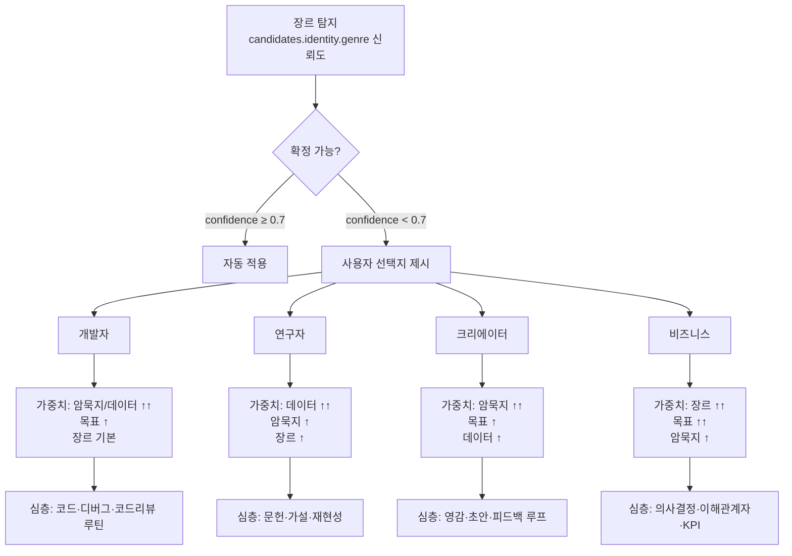
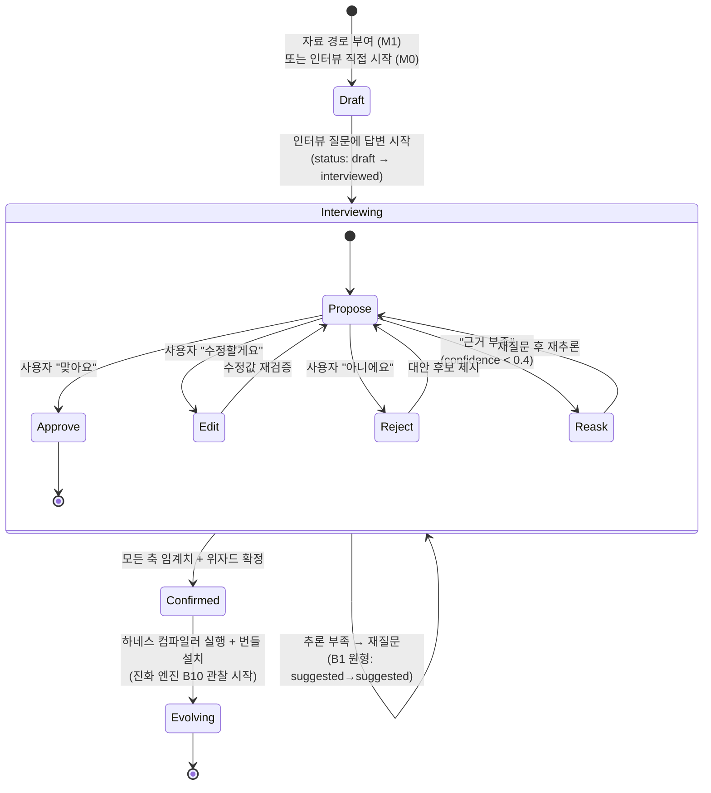

# BYOH 인터랙티브 인터뷰 설계서

> **문서 위치**: `BuildYourOwnHarness/docs/03_INTERVIEW_DESIGN.md`
> **역할**: BYOH "프로파일러" 계층의 핵심 명세. 사용자의 암묵지·데이터·비즈니스 장르·목표를 하이브리드(자동분석 + 인터뷰 + 위자드)로 취합하여 하네스 컴파일러로 전달되는 Profile을 생성한다.
> **차별성**: 이 문서는 리서치 보고서 빌딩 블록 **B1(Suggest-don't-move 암묵지 발굴 루프)**의 일반화이자 구체적 구현이다. 동시에 **B6(역유도 불변량: 진실 vs 파생 분리)**를 준수하여 사용자가 승인한 사실과 AI 추론을 분리한다.
> **참조**: `00_RESEARCH_REPORT.md` §2.1.3(B1), §2.3.3(B6), §2.2.4(B5 하이브리드 검색), §2.7.3(B16), §2.7(B17 이중언어).

---

## 1. 설계 철학

### 1.1 왜 암묵지는 "질문"으로만 끌어낼 수 없는가

암묵지(tacit knowledge)는 정의상 "언어로 표현하기 어려운 지식"이다. 사용자에게 "당신의 핵심 역량은?"이라고 직접 물으면 세 가지 실패 모드가 발생한다.

| 실패 모드 | 증상 | 원인 |
|---|---|---|
| **재구성 오류** | "정리된" 답변이 실제 행동과 다름 | 메타인지의 한계 — 자신이 무엇을 잘하는지 정확히 모름 |
| **앵커링** | 첫 질문에 끌려 답변이 편향 | 사용자가 AI의 질문 틀에 맞춰 자신을 재단 |
| **망각** | 매일 하는 판단은 "특별할 것 없다"고 느껴 생략 | 익숙함 = 비가시성 (Polanyi의 역설) |

**결론**: 질문은 *보완 수단*이어야 한다. **자동분석이 먼저** 실제 자료(볼트/문서/코드/이메일)에서 행동 패턴을 발견하고, 그 발견을 *검증용 후보*로 제시해야 한다. 사용자는 "맞다/틀리다/수정"의 3지선다에서 시작하며, 이는 무에서 유를 창조하는 부담보다 인지 부하가 훨씬 낮다.

### 1.2 왜 Suggest-don't-move 인가

리서치 보고서 B1(`00_RESEARCH_REPORT.md:101-113`)이 정의한 핵심 원형:

> "AI가 사용자의 암묵지를 *추측하여* 후보 필드에 채우고, 사용자는 *이동시키지 않고* frontmatter만 편집해 승인한다. 비파괴적이며 역추적 가능하다."

이 원칙이 인터뷰 설계에 미치는 강제 사항:

| 원칙 | 인터뷰 설계에의 적용 |
|---|---|
| **비파괴성** | AI 후보는 `candidate_*` 필드에만 존재. 사용자 원본 자료는 절대 수정·이동하지 않는다. |
| **역추적성** | 모든 후보는 근거(provenance: 어느 파일·어느 줄에서 추론)를 가진다. "왜 이 후보를 제안했나?"에 답할 수 있어야 한다. |
| **승인 게이트** | `status: interviewed → confirmed` 전이는 인간의 명시적 행동(frontmatter 편집 또는 UI 승인)만으로만 발생. AI가 자동 확정 금지. (B1 원형의 `suggested → confirmed`에 대응) |
| **재질문 안전망** | 추론 근거가 부족하면 `interviewed → interviewed` 루프로 재질문(B1 stateDiagram의 `Suggested --> Suggested: 추론 부족 → 재질문` 원형을 BYOH 명명으로 계승). |

### 1.3 진실 vs 파생 분리 (B6 준수)

리서치 보고서 B6(`00_RESEARCH_REPORT.md:175-178`):

> "사용자가 입력한 사실(진실)과 AI 추론(파생)을 명확히 분리해야 신뢰할 수 있다. 사용자 승인 전의 AI 추론은 *파생* 표시를 가져야 한다."

Profile 스키마는 두 종류의 출처를 엄격히 구분한다. 본 문서는 02_ARCHITECTURE.md(§4.2 데이터 스키마, §10 ER 모델 `UserTruth`/`DerivedFact` 테이블)와 단일 계약으로 정렬한다:

- **`truth:` 블록** — 사용자가 인터뷰/위자드에서 직접 입력하거나 명시적으로 승인한 값. 단일 진실 소스. 02의 `UserTruth` 엔티티에 대응.
- **`derived:` 블록 / `candidates:` 블록** — 자동분석이 추론한 후보·보조값. 신뢰도 점수(`confidence: 0.0-1.0`)와 근거(`provenance`)를 필수로 가짐. 02의 `DerivedFact` 엔티티에 대응. `truth:`가 존재하면 항상 우선.

하네스 컴파일러는 `truth.*`만을 불변 1차 소스로 사용하고, `derived.*`는 보조/디폴트 값으로만 참조한다(§10 하네스 컴파일러 계약 참조). 평면 접두사(`truth_expertise`/`candidate_expertise`)는 본 문서 전체에서 중첩 블록 표기로 통일한다.

---

## 2. 하이브리드 3단계 흐름

> **상태머신 명명**: 본 문서는 02_ARCHITECTURE.md(§3.2, §4.2 라인298, ER 라인661)가 정의한 프로파일 라이프사이클 상태 `draft → interviewed → confirmed → evolving`에 정렬한다. 이는 B1의 `inbox → suggested → confirmed → processed` 4상태 원형을 BYOH로 일반화한 것이며, 02가 ER 데이터모델까지 정의하므로 권위적 기준이다.

### 2.1 M0/M1 두 동작 모드 (04_ROADMAP 단계 합치)

04_ROADMAP.md(§3.1 M0, §3.2 M1)는 MVP(M0)를 "자동분석 없이 인터뷰+위자드 먼저"로 명시하고, M1에서 자동분석을 통합한다. 따라서 본 설계는 두 모드로 동작한다:

| 모드 | 단계 | `candidates:` 채움 | 비고 |
|---|---|---|---|
| **M0 모드** (수동 프로파일링) | 인터뷰(2) → 위자드(3) | 빈 채로 시작 — `candidates` 블록이 비어있는 상태에서 인터뷰가 첫 번째 단계 | 1단계(자동분석) 스킵. `status: draft → interviewed → confirmed` 경로. 인터뷰 엔진은 모든 축을 "완성도 0"에서 시작해 질문으로 채운다. |
| **M1 모드** (하이브리드 3단계) | 자동분석(1) → 인터뷰(2) → 위자드(3) | 1단계에서 `candidates` 채움 — 후보를 검증용으로 제시 | 아래 시퀀스의 전체 흐름. `status: draft → interviewed → confirmed → evolving` 전체 경로. |

두 모드 모두 동일한 인터뷰 질문 뱅크(§4)·위자드(§7)·스키마(§6)를 공유하며, M1은 자동분석 후보를 "이미 채워진 candidates"로 인터뷰에 주입할 뿐이다.



**단계별 목표**:

| 단계 | 입력 | 출력 | 평균 소요 | 사용자 인지 부하 |
|---|---|---|---|---|
| 1. 자동분석 (M1) | 자료 경로/권한 | `candidates` 후보 + `provenance` | 자동(사용자 대기만) | 최저 |
| 2. 인터뷰 | 후보(M1) 또는 빈 칸(M0) | `truth` 블록 일부 + 신뢰도 상승 | 8-15분 | 중 (적응적 조절) |
| 3. 위자드 | 병합 뷰 | `status: confirmed` Profile | 3-5분 | 저 (검토만) |

---

## 3. 자동분석 단계 (1단계)

### 3.1 스캔 대상 및 추출 항목



| 소스 | 추출 시그널 | 매핑되는 후보 필드 |
|---|---|---|
| Obsidian 볼트 | 폴더 구조(PARA), 태그 빈도, 최근 편집 노트 | `candidates.identity.areas`, `candidates.identity.primary_expertise` |
| 코드 저장소 | 커밋 메시지, 디렉토리 구조, 언어 분포, TODO/FIXME 밀도 | `candidates.identity.genre`(개발자 확률), `candidates.identity.routines` |
| 로컬 문서 | 문서 유형(논문/기획서/회의록), 용어 빈도 | `candidates.identity.domain`, `candidates.identity.primary_expertise` |
| 이메일/메신저 | 발신자 클러스터, 키워드, 시간대 분포 | `candidates.context.collaborators`, `candidates.context.decision_style` |

### 3.2 frontmatter 후보 주입 (B1 패턴 적용)

자동분석이 끝나면 Profile의 `candidates` 블록에 후보를 주입한다. obsidian-forge의 `process_all`(`src/notes.rs`)이 inbox 노트의 frontmatter에 AI 제안을 주입하는 것과 동일한 패턴이다.

**주입 시 규칙**:
1. 모든 후보는 `confidence: 0.0-1.0` 점수와 `provenance: [파일 경로:줄, ...]` 근거를 동반.
2. 단일 진실 소스에 해당하는 사용자 입력이 없으므로 이 시점의 모든 값은 `candidates`(파생)이다. `truth` 블록은 비어 있다.
3. `status`는 `draft` 상태를 유지하며, 자동분석 완료 후 인터뷰 진입 시 `interviewed`로 전이한다(02_ARCHITECTURE.md §3.2 상태머신 정렬).

---

## 4. 인터뷰 단계 (2단계) — 질문 뱅크 설계

### 4.1 질문 뱅크의 4축 구조

인터뷰 엔진은 자동분석 결과(`candidates` 블록)와 누락 필드를 비교하여, **가장 신뢰도가 낮거나 비어 있는 축**부터 질문을 선택한다(적응적 순서).



### 4.2 (a) 암묵지 축 질문군

**의도**: 사용자가 *하는 일*에서 숙련도·반복 판단·선호 워크플로우를 끌어낸다. 자동분석의 `candidates.identity.primary_expertise`/`candidates.identity.routines`를 검증·보완한다.

> **필드 표기 규칙**: 본 절 이하 "추출 대상" 열은 §6/§10 스키마의 중첩 경로(`truth.*` / `candidates.*`)로 표기한다.

| # | 질문 (ko / en) | 추출 대상 | 분기 규칙 |
|---|---|---|---|
| A1 | "최근 한 달 동안, **무엇을 할 때 시간이 가장 빨리 갔나요?**" / "In the last month, what were you doing when time flew by the fastest?" | `truth.identity.primary_expertise` (몰입 영역) | 답변이 2개 이상 → A2로 분기(우선순위) |
| A2 | "그중 **가장 자주, 가장 오래** 한 일은?" / "Of those, which did you do most often and longest?" | `truth.identity.primary_expertise` 우선순위 정렬 | — |
| A3 | "당신이 **반복적으로 내리는 판단**은 무엇인가요? (예: 이 코드 리뷰에서 항상 보는 것, 이 보고서에서 항상 수정하는 것)" / "What judgments do you make repeatedly?" | `truth.identity.routines` | 루틴 3개+ → A4(자동화 가능성) |
| A4 | "그 반복 판단 중 **기계가 대신할 수 있다고 생각하는 것**은?" / "Which of those repeated judgments could a machine take over?" | `truth.identity.automation_targets` | — |
| A5 | "동료나 후배가 **당신에게 가장 자주 묻는 것**은?" / "What do colleagues ask you about most often?" | `truth.identity.primary_expertise` (외부 검증된 역량) | — |
| A6 | "당신이 **'당연하다고 생각하지만 남들은 어려워하는 것'**은?" / "What seems obvious to you but hard for others?" | `truth.identity.blind_spot_expertise` (B1 망각 시그널) | 답변 있으면 신뢰도 큰 폭 상승 |
| A7 | "최근 **실패했거나 다시 하고 싶은 결정**이 있나요? 무엇을 배웠나요?" / "A recent decision you'd redo — what did you learn?" | `truth.identity.lessons` (회고 지식) | — |

### 4.3 (b) 데이터 축 질문군

**의도**: 하네스가 인덱싱·검색할 지식의 소스·포맷·규모·갱신 주기를 파악한다. 자동분석의 `candidates.data.sources`를 확인·보완.

> **번호 정정**: 본 질문군은 리서치 보고서 빌딩 블록 B1-B6(`00_RESEARCH_REPORT.md`)과 번호 충돌을 피하고, 축 접두사의 규칙성(암묵지=A, 데이터=D, 장르=C, 목표=G)을 맞추기 위해 **D1-D6**으로 번호를 매긴다(구 B1-B6).

| # | 질문 | 추출 대상 | 분기 규칙 |
|---|---|---|---|
| D1 | "업무/학습에서 **가장 자주 참조하는 지식 소스** 3곳은? (볼트, 노션, 위키, 논문 DB, 이메일 등)" | `truth.data.sources` | 자동분석과 교집합 → confidence 상승 |
| D2 | "각 소스의 **주요 포맷**은? (Markdown, PDF, 코드, 스프레드시트, 이미지)" | `truth.data.formats` | 포맷별 llm-transpile 티어 매핑 |
| D3 | "전체 지식의 **대략적 규모**는? (노트 수, 문서 수, GB)" | `truth.data.scale_estimate` | 규모 → B13 토큰 압축 단계 결정 |
| D4 | "지식이 **얼마나 자주 갱신**되나요? (실시간/일간/주간/월간)" | `truth.data.update_frequency` | 갱신 빈도 → 인덱스 재빌드 주기 |
| D5 | "**검색할 때 가장 짜증 나는 것**은? (안 나옴, 너무 많이 나옴, 오래됨, 정리 안 됨)" | `truth.data.search_pain` | pain → B5 검색 티어 튜닝 |
| D6 | "**남에게 절대 보이면 안 되는 자료**가 있나요? (프라이버시/보안 등급)" | `truth.data.privacy_tier` | RED 분류 → 로컬 전용 프로바이더 강제 |

### 4.4 (c) 비즈니스 장르 축 질문군

**의도**: 도메인·의사결정 방식·규제·협업 구조를 파악하여 장르 템플릿 선택의 근거로 쓴다.

| # | 질문 | 추출 대상 | 분기 규칙 |
|---|---|---|---|
| C1 | "당신의 **주된 도메인**은? (예: 백엔드 개발, 임상 의학, 콘텐츠 제작, B2B 영업)" | `truth.identity.domain` | 도메인 → 장르 템플릿 후보 |
| C2 | "주요 **의사결정 방식**은? (직관 우선, 데이터 우선, 합의 기반, 상향식)" | `truth.context.decision_style` | 데이터 우선 → B6 불변량 강조 |
| C3 | "적용받는 **규제/제약**이 있나요? (HIPAA, GDPR, FSS, 사내 보안, 없음)" | `truth.context.constraints` | 규제 있음 → 로컬 전용/감사로그 강제 |
| C4 | "**협업 구조**는? (단독, 소규모 팀, 부서 간, 외부 고객)" | `truth.context.collaboration` | 팀 → 공유 볼트/권한 모델 |
| C5 | "현재 **가장 큰 비즈니스/업무 과제**는?" | `truth.context.primary_challenge` | — |
| C6 | "당신 분야에서 **AI가 절대 하면 안 되는 일**은?" | `truth.context.red_lines` | red line → 하네스 제약으로 코딩 |

### 4.5 (d) 목표 축 질문군

**의도**: 30일/90일/1년 목표와 성공 기준, 자원 제약을 명확히 하여 하네스의 진화 목표(B10)를 정의.

> **번호 정정**: 목표 축은 데이터 축(D1-D6)과 접두사 충돌을 피해 **G1-G6**(goal)으로 번호를 매긴다(구 D1-D6).

| # | 질문 | 추출 대상 | 분기 규칙 |
|---|---|---|---|
| G1 | "**30일 안에** 하네스가 해줬으면 하는 가장 구체적인 일 1가지?" | `truth.goals.goal_30d` | 구체적일수록 검증 지표 설정 용이 |
| G2 | "**90일 뒤** 성공이라고 느끼는 기준은?" | `truth.goals.success_90d` | 측정 가능 → B10 메트릭 후보, 04_ROADMAP §8.3 평가 지표와 연결 |
| G3 | "**1년 뒤** 이르고 싶은 상태는?" | `truth.goals.goal_1y` | — |
| G4 | "**월 예산** 한도는? (LLM 비용, $0-20/20-100/100+)" | `truth.resources.budget` | 예산 → B14 CapabilityProfile 필터 |
| G5 | "**하루 허용 시간** (하네스 설정·운영)은? (10분/30분/1시간+)" | `truth.resources.time_budget` | 시간 부족 → 자동화 가중치 상승 |
| G6 | "하네스가 **따르면 좋을 것 같은 가치/원칙**이 있나요?" | `truth.values` | 가치 → 진화 엔진의 보상 함수 |

---

## 5. 장르별 인터뷰 분기

자동분석(C1) 또는 사용자 선택에 따라 4개 장르 템플릿 중 하나가 활성화된다. 각 장르는 **질문 가중치**(어떤 축을 깊이 파는가)와 **심층 질문**(장르 특화)이 다르다.



### 5.1 개발자(Developer) 장르

**질문 가중치**: 암묵지/데이터 축 심층화, 장르·목표는 표준.

**심층 질문 (추가 5개)**:
1. "가장 자주 쓰는 **언어/프레임워크**와, 그것에서 자주 발생하는 **버그 패턴**은?"
2. "코드 리뷰에서 **당신이 항상 지적하는 것** 3가지는?" (→ `truth.identity.review_checklist`, 코드 리뷰 스킬의 기준)
3. "디버깅할 때 **따르는 개인적 절차**가 있나요?" (→ `truth.identity.debug_workflow`)
4. "어떤 **반복적인 코딩 작업**을 자동화하고 싶나요?" (→ `truth.identity.automation_targets`, 스캐폴딩 스킬)
5. "당신의 **코드 베이스에서 가장 중요한 불변량(invariant)**은?" (→ `truth.identity.invariants`, B6 그래프의 진실 노드)

### 5.2 연구자(Researcher) 장르

**질문 가중치**: 데이터 축 심층화(문헌 관리·재현성).

**심층 질문 (추가 5개)**:
1. "주로 **어떤 유형의 문헌**을 읽고 정리하나요? (논문, 책, 프리프린트, 데이터셋 문서)"
2. "문헌에서 **당신이 발췌하는 정보의 종류**는? (방법론, 결과, 한계, 인용)" (→ `truth.identity.extraction_schema`)
3. "연구 **가설/질문을 어떻게 관리**하나요?" (→ `truth.identity.hypothesis_tracking`)
4. "**재현성**을 위해 반드시 기록하는 것은?" (→ `truth.identity.repro_requirements`)
5. "인용 그래프에서 **당신이 중요하게 보는 연결**은?" (→ `truth.identity.citation_strategy`, B6 그래프 설계)

### 5.3 크리에이터(Creator) 장르

**질문 가중치**: 암묵지 축 심층화(영감·취향·초안 루프).

**심층 질문 (추가 5개)**:
1. "**영감이 자주 떠오르는 상황/환경**은?" (→ `truth.identity.inspiration_triggers`)
2. "초안을 **어떻게 시작**하나요? (아웃라인, 자유 연상, 이미지, 레퍼런스)" (→ `truth.identity.drafting_method`)
3. "**당신만의 스타일/톤**을 한 문장으로?" (→ `truth.identity.style_signature`)
4. "피드백을 **어떻게 처리**하나요? (즉시 반영, 숙성, 거부 기준)" (→ `truth.identity.feedback_loop`)
5. "**절대 흉내 내고 싶지 않은** 스타일/클리셰는?" (→ `truth.identity.anti_patterns`, 안티 앵커)

### 5.4 비즈니스(Business) 장르

**질문 가중치**: 장르·목표 축 심층화(이해관계자·KPI·의사결정).

**심층 질문 (추가 5개)**:
1. "주요 **이해관계자**(상사, 팀, 고객, 규제기관)와 각각의 **정보 요구**는?" (→ `truth.context.stakeholders`)
2. "당신이 **보고하는 핵심 KPI/지표**는?" (→ `truth.context.kpis`, 대시보드 스킬)
3. "의사결정 시 **필수로 확인하는 데이터**는?" (→ `truth.context.decision_inputs`)
4. "회의/커뮤니케이션에서 **당신의 역할**은? (발표, 조율, 기록, 결정)" (→ `truth.context.meeting_role`)
5. "리스크/기회를 **어떻게 포착**하나요?" (→ `truth.context.risk_signals`)

---

## 6. 사용자 프로파일 스키마

B1의 `Frontmatter` 구조(`status` 상태머신 + AI 후보 필드)를 BYOH Profile로 일반화·확장한다. obsidian-forge의 `inbox → suggested → confirmed → processed` 4상태 원형을 계승하되, **02_ARCHITECTURE.md §3.2(라인179-211)·§4.2(라인298)·ER(라인661)이 확정한 `draft → interviewed → confirmed → evolving` 4상태로 명명을 정렬**한다(02가 ER 데이터모델까지 정의하므로 권위적 기준).

> **스키마 표준**: 본 절과 §10 산출물 예시는 동일한 중첩 블록 구조(`truth:` / `candidates:` / `derived:`)를 사용한다. 하네스 컴파일러 계약(§10)은 이 중첩 스키마를 표준으로 삼는다. 평면 접두사(`truth_expertise`)는 본 문서 전체에서 사용하지 않는다(02의 `UserTruth`/`DerivedFact` ER 엔티티에 1:1 대응).

> **🔧 epic-harness 레퍼런스 (Profile 스키마 차용 자산)**
> | 자산 | 소스 경로 | BYOH 적용점 |
> |---|---|---|
> | `SPEC-{ts}.md` 번호 요구사항 (R1/AC1) | `registry/skills/spec/SKILL.md` | 인터뷰 산출 `truth:` 블록이 이 번호 요구사항 패턴을 계승 — 컴파일러가 `truth` 필드를 R1/AC1 검증 가능한 명세로 변환 |
> | frontmatter status 전이 신호 | `registry/skills/_dispatch/SKILL.md` (전이 패턴), `src/store/orbit_store.rs` (phase 영속) | `profile_status` 4상태(`draft→interviewed→confirmed→evolving`)는 `_dispatch` 전이 + orbit phase 패턴 차용 |
> | orbit 45분 복구 | `src/store/orbit_store.rs` | 인터뷰 중단 복구 — `updated_at`>45분 크래시 감지 (02 §7.3) |

```yaml
# Profile: 사용자 프론트매터 (YAML)
# 경로: ~/.byoh/profile.yaml
# 상태머신: draft → interviewed → confirmed → evolving (02_ARCHITECTURE.md §3.2 정렬)

profile_version: "1.0"
status: interviewed          # draft | interviewed | confirmed | evolving
updated_at: 2026-06-24T12:00:00+09:00
language: ko                # ko | en (B17 인터뷰 언어)

# ──────────────────────────────────────────────
# truth: 진실 블록 — 사용자가 입력/승인한 단일 진실 소스 (B6)
# 하네스 컴파일러는 이 블록만 불변 1차 소스로 취급 (02의 UserTruth 엔티티)
# ──────────────────────────────────────────────
truth:
  identity:                        # A1, A2, A5, C1에서 확정
    domain: "백엔드 개발 / 분산 시스템"
    primary_expertise:
      - { value: "백엔드 아키텍처", confidence_user: 0.9 }
      - { value: "분산 시스템 트레이드오프 분석", confidence_user: 0.85 }
    routines:                      # A3에서 확정
      - "코드 리뷰 시 에러 처리 경로 먼저 확인"
      - "API 설계 시 idempotency 우선 검토"
    automation_targets:            # A4에서 확정
      - "반복적인 스캐폴딩"
  context:                         # C1, C3에서 확정
    constraints: ["사내 보안 정책"]
  goals:
    goal_30d: "매일 아침 15분 안에 어제 변경사항 요약받기"   # G1
    success_90d: "코드 리뷰 시간 30% 단축"                    # G2
  resources:
    budget: { monthly_usd: 50 }          # G4
    time_budget: { daily_minutes: 20 }   # G5
  values: ["정확성 > 속도", "재현 가능성"]  # G6
  data:                            # D1, D6에서 확정
    sources: ["Obsidian 볼트", "사내 GitLab"]
    privacy_tier: confidential     # internal | confidential | restricted

# ──────────────────────────────────────────────
# candidates: 후보 블록 — 자동분석 추론 (B6: 파생 표시)
# 02의 DerivedFact 엔티티에 대응. 신뢰도 0.6 미만은 재질문 대상.
# ──────────────────────────────────────────────
candidates:
  identity:
    primary_expertise:
      - value: "Kubernetes 운영"
        confidence: 0.72
        provenance: ["vault/10-Zettelkasten/k8s-*.md:12", "repo/infra/k8s/"]
      - value: "관측가능성(Observability)"
        confidence: 0.58          # ← 임계치 미만 → 인터뷰에서 재검증
        provenance: ["vault/00-Inbox/metrics-note.md:3"]
    genre:
      value: developer
      confidence: 0.81
      provenance: ["repo 언어 분포: Rust 60%, Python 25%"]
  goals:
    items:
      - value: "인프라 자동화"
        confidence: 0.64
        provenance: ["repo CI/ 디렉토리 빈도"]

# ──────────────────────────────────────────────
# derived: 보조 블록 — truth에서 역추론된 값 (B6 derive_inverse_relations)
# 하네스 컴파일러가 truth 누락 시에만 참조
# ──────────────────────────────────────────────
derived:
  review_checklist:                # 개발자 심층 질문에서 파생
    value: ["에러 처리", "idempotency", "로깅 레벨"]
    confidence: 0.7
    provenance: ["truth.identity.routines에서 역추론 (B6 derive_inverse_relations 패턴)"]

# ──────────────────────────────────────────────
# 인터뷰 메타데이터
# ──────────────────────────────────────────────
interview_meta:
  started_at: 2026-06-24T12:05:00+09:00
  questions_asked: 14
  questions_remaining: 6          # 가중치 기반 남은 질문 수
  fatigue_score: 0.3              # 0.0-1.0, 0.7 초과 시 인터뷰 중단
  contradictions_detected: 0      # 모순 감지 카운터
  axis_completion:               # 축별 완성도 (임계치 0.7)
    tacit: 0.85
    data: 0.6                     # ← 미달 → 데이터 축 질문 우선
    genre: 0.9
    goals: 0.75
```

**상태 전이 의미** (02_ARCHITECTURE.md §3.2 정렬):

| 상태 | 의미 | 다음 전이 조건 |
|---|---|---|
| `draft` | 자동분석 후보 주입됨(또는 M0 모드에서 빈 candidates). 인터뷰 대기 | 인터뷰 시작 → `interviewed` |
| `interviewed` | 인터뷰 진행·완료. truth 블록 점진적 충전 | 모든 축 임계치 충족 + 위자드 확정 → `confirmed` |
| `confirmed` | 사용자가 위자드에서 확정. 진실 블록 freeze | 하네스 컴파일러 호출, 번들 설치 → `evolving` |
| `evolving` | 하네스 운용 시작. 진화 엔진(B10)이 관찰 데이터 누적 | (종단 상태, 하네스 라이프사이클 진행 중) |

---

## 7. Suggest-Confirm 루프 UX

B1의 stateDiagram(`00_RESEARCH_REPORT.md:103-110`)을 인터뷰 컨텍스트로 구체화한다. 상태 명명은 02_ARCHITECTURE.md §3.2(`draft → interviewed → confirmed → evolving`)에 정렬한다.



> **B1 원형과의 대응**: B1의 `inbox → suggested → confirmed → processed`는 본 설계에서 `draft(=inbox+suggested 병합) → interviewed → confirmed → evolving(=processed의 BYOH 확장)`로 대응된다. `Suggested --> Suggested: 추론 부족 → 재질문` 루프는 `Interviewing --> Interviewing`으로 계승된다.

**UX 원칙**:

| 상황 | 시스템 행동 | 근거 |
|---|---|---|
| 후보 제시 | "이런 역량이 있으신 것 같아요: [Kubernetes 운영(신뢰도 72%)] — 맞나요?" | B1: 추측해서 채우고 검증 받기 |
| 사용자 승인 | `candidates` 값 → `truth` 블록으로 승격, provenance 유지 | B6: 승인된 값이 진실 소스 |
| 사용자 수정 | 수정값을 새 `truth` 값으로 저장, 원 후보는 `candidates`/`derived`에 보존 | 역추적성 |
| 사용자 거부 | 후보를 `rejected: true` 표시, 동일 근거 재제안 금지 | 학습 |
| 근거 부족(`confidence < 0.4`) | 후보를撤回하고 **재질문**으로 전환 | B1: `Suggested --> Suggested: 추론 부족 → 재질문` |

---

## 8. 품질 관리

### 8.1 인터뷰 피로도 관리

| 지표 | 임계치 | 조치 |
|---|---|---|
| `questions_asked` | 25 초과 | 인터뷰 강제 종료, 위자드로 이동 |
| `fatigue_score` | 0.7 초과 | 종료 (답변 지연 시간·짧은 답변 비율로 산출) |
| 연속 "모름/거부" | 3회 | 해당 축 중단, 다른 축으로 전환 |
| 세션 시간 | 20분 초과 | 나눠서 진행 제안 |

**적응적 깊이**: 축별 완성도가 이미 임계치(0.7)를 넘으면 해당 축의 질문을 생략한다. 예: 자동분석이 장르를 `confidence 0.85`로 잡았으면 C1-C6 중 C1만 확인하고 스킵.

### 8.2 모순 감지

인터뷰 엔진은 답변 간 논리적 모순을 실시간 감지한다.

| 모순 유형 | 예 | 조치 |
|---|---|---|
| 역량 vs 제약 | "임상 의학이 주된 도메인"(C1) + "규제 없음"(C3) | "의학 분야는 보통 규제가 있는데, 어떤 상황인가요?" 재확인 |
| 목표 vs 예산 | "1년 내 대규모 RAG"(D3) + "월 $0 예산"(D4) | "예산 한도 내에서 가능한 목표로 조정할까요?" |
| 암묵지 vs 자동화 | "이 판단은 절대 기계가 못 해"(A4) + "자동화 타깃에 포함"(A4) | 어느 쪽인지 재질문 |

모순은 `interview_meta.contradictions_detected`에 카운트되고, 3회 초과 시 사용자에게 "답변이 서로 충돌하는 부분이 있어요" 요약 제시.

### 8.3 신뢰도 역전

자동분석의 `candidates` 중 `confidence < 0.6`인 후보는 자동으로 인터뷰 재질문 대상이 된다. 사용자가 후보를 *거부*하면 해당 파생값은 폐기되고 `truth` 블록만 남는다(B6: 진실이 파생을 덮어쓴다).

### 8.4 엣지케이스 — 빈 입력·권한 거부·모순 미해결·이탈

위 세 절(피로도/모순/신뢰도)이 정상 경로를 다룬다면, 본 절은 **인터뷰가 비정상 종료되거나 입력이 부족한 엣지케이스**를 정의한다. 이 경로들이 없으면 부분 프로파일의 운명이 정의되지 않아 컴파일러 계약이 모호해진다.

| 엣지케이스 | 트리거 | 시스템 행동 | 부분 프로파일 운명 |
|---|---|---|---|
| **빈 볼트 / 자료 없음** (M1) | 1단계 스캔이 `candidates` 0개 반환 | 자동분석을 스킵하고 **M0 모드로 강제 전환**(§2.1). 사용자에게 "발견된 자료가 없어 인터뷰부터 시작합니다" 안내 | `candidates` 블록은 빈 채로 `status: draft` 유지, 인터뷰가 모든 축을 "완성도 0"에서 채움 |
| **스캔 권한 거부** | 사용자가 볼트/이메일/코드 디렉토리 접근 권한 거부 | 해당 소스는 스킵 표시(`candidates.<src>.skipped: permission_denied`), 나머지 소스로 계속. 전체 권한 거부 시 M0 모드 전환 | 권한 거부 사실은 `audit`에 기록, 재시도 시 재동의 프롬프트 |
| **모순 3회 초과 후 미해결** | §8.2 모순 카운터 3회 초과 + 사용자가 충돌 해소 거부/포기 | "충돌 요약" 제시 후 모순 필드를 `unresolved: true`로 표시하고 위자드로 강제 진행. 미해결 필드는 하네스 컴파일러가 `truth`에서 **제외**(디폴트 미사용) | 무결성 보장: `truth`에 `unresolved` 필드가 섞이지 않도록 컴파일러 게이트가 필터링(§10 계약). 위자드에서 "이 항목은 확정되지 않아 하네스에 반영되지 않습니다" 명시 |
| **피로도 임계치 도달 강제 종료** | `fatigue_score > 0.7` 또는 `questions_asked > 25` (§8.1) | 인터뷰 즉시 중단, 현재까지의 `truth`/`candidates`를 **보존**(폐기 아님). 부분 하네스 생성 여부는 사용자 선택 | 기본 정책: **부분 프로파일 보존**(`status: interviewed`, `partial: true`). 사용자에게 (a) 지금 부분 하네스 생성 또는 (b) 다음에 이어서 진행 중 택일. 폐기 옵션은 사용자 명시 요청 시에만 |
| **이탈 사용자 재진입** | 세션 종료 후 재접속 | `status`와 `interview_meta.axis_completion`을 읽어 중단 지점 복원. M0 모드면 빈 칸부터, M1이면 candidates 검증 미완료 축부터 재개 | 재진입 시 이전 답변 손실 없음(B1 역추적성). 30일 경과 미재접속 시 `status: draft` 부분 프로파일은 사용자에게 보존/삭제 선택 프롬프트 |

**기본 원칙**: 부분 프로파일은 기본적으로 **보존**한다(폐기 아님). 사용자가 명시적으로 삭제를 선택하지 않는 한, 수집된 `truth` 값은 재진입·부분 하네스 생성 모두에 활용 가능하다. 이는 인터뷰 8-15분의 사용자 노력을 존중하고, 04_ROADMAP.md M0 온보딩 이탈 시나리오(01_PROJECT_PLAN이 누락한 항목)의 복구 경로를 제공한다.

> **프라이버시 연동**: 이탈 사용자의 30일 보존 정책과 사용자 탈퇴 시 전체 폐기는 개인정보보호법 의무사항이며, 04_ROADMAP.md에 "사용자 탈퇴/데이터 삭제" 마일스톤 추가가 필요하다(본 문서 범위 외이나 부록에서 04로 참조).

---

## 9. 다국어 — 한국어/영어 질문 템플릿 (B17)

**근거**: 암묵지는 모국어에서 더 잘 끌어난다(Polanyi 역설의 언어적 측면). BYOH는 인터뷰를 사용자 모국어로 진행하여 추출 품질을 높인다. 리서치 보고서 B17(`00_RESEARCH_REPORT.md` §2.7)의 이중언어 인프라를 인터뷰 레이어로 확장한다.

**언어 선택 규칙**:
1. `profile.language`는 자동분석이 볼트/시스템 로케일에서 추정(`candidates.language`).
2. **명시적 확인 강제**: 자동 추정값은 *후보*로만 취급하고, 첫 질문 전 "인터뷰를 한국어로 진행할까요? / English?" 확인 프롬프트를 **강제**한다. 다국어 사용자(한국 거주 영어 사용자) 오추정이 암묵지 추출 품질을 저하시키는 위험을 차단한다.
3. 사용자가 첫 질문에서 언어 전환 가능.
4. 질문 템플릿은 ko/en 쌍으로 관리, 후보 필드 값은 원문 유지(번역 금지 — 뉘앙스 손실 방지).

**템플릿 예 (A1, A3, C1, G1)**:

```yaml
question_templates:
  A1:
    ko: "최근 한 달 동안, 무엇을 할 때 시간이 가장 빨리 갔나요?"
    en: "In the last month, what were you doing when time flew by the fastest?"
    intent: truth.identity.primary_expertise
  A3:
    ko: "당신이 반복적으로 내리는 판단은 무엇인가요?"
    en: "What judgments do you make repeatedly?"
    intent: truth.identity.routines
  C1:
    ko: "당신의 주된 도메인은?"
    en: "What is your primary domain?"
    intent: truth.identity.domain
  G1:
    ko: "30일 안에 하네스가 해줬으면 하는 가장 구체적인 일 1가지?"
    en: "What's one concrete thing the harness should do for you within 30 days?"
    intent: truth.goals.goal_30d
```

**혼용 허용**: 사용자가 한국어로 답하고 영어 용어를 섞어 쓰는 것을 허용한다. 예: "주로 Kubernetes 운영을 해요". 용어는 원문 그대로 `truth` 블록에 저장.

---

## 10. 산출물 — 하네스 컴파일러 입력 Profile 예시

인터뷰가 위자드 확정으로 `status: confirmed`에 도달하면, 아래 형태의 Profile이 하네스 컴파일러(**02_ARCHITECTURE.md §5 하네스 컴파일러 설계**의 입력)로 전달된다. `truth` 블록만 1차 소스이며, `derived`/`candidates`는 디폴트/보조 값이다(B6 준수). 번들 설치 후 `status`는 `evolving`으로 전이한다.

> **epic-harness 패턴 계승**: 이 Profile은 epic-harness `SPEC-{timestamp}.md`(`registry/skills/spec/SKILL.md`)의 번호 요구사항(R1/AC1) 패턴을 사용자 프로파일로 일반화한 것이다. `truth` 블록의 각 필드는 컴파일 시 검증 가능한 요구사항(R)으로, 위자드에서 확정된 값은 수락 기준(AC)으로 변환된다 — 즉 인터뷰 산출물이 곧 하네스의 *요구사항 명세*가 된다.

```yaml
# ~/.byoh/profile.yaml — confirmed 상태 (위자드 확정 직후)
profile_version: "1.0"
status: confirmed               # 번들 설치 후 → evolving (02 §3.2 정렬)
language: ko
genre: developer

# === 하네스 컴파일러가 1차로 읽는 진실 블록 ===
truth:
  identity:
    domain: "백엔드 개발 / 분산 시스템"
    primary_expertise:
      - "백엔드 아키텍처"
      - "분산 시스템 트레이드오프 분석"
      - "Kubernetes 운영"            # 인터뷰에서 candidates → truth 승격
    secondary_expertise:
      - "관측가능성(Observability)"   # 재질문 후 신뢰도 0.58 → 0.8 상승하여 확정
    routines:
      - "코드 리뷰 시 에러 처리 경로 먼저 확인"
      - "API 설계 시 idempotency 우선 검토"
      - "코드 리뷰 시 항상 지적: 에러 처리, idempotency, 로깅 레벨"
    automation_targets:
      - "반복적인 스캐폴딩"
    invariants:                      # B6 그래프의 진실 노드 후보
      - "모든 결제 API는 idempotent해야 한다"

  data:
    sources:
      - { type: obsidian_vault, path: "<REDACTED>", format: markdown }
      - { type: git_repo, path: "<REDACTED>", format: code }
    scale_estimate: { notes: 1200, repos: 8 }
    update_frequency: daily
    privacy_tier: confidential
    search_pain: "오래된 노트가 상단에 나옴"

  context:
    constraints: ["사내 보안 정책"]
    collaboration: "소규모 팀 (5인)"
    red_lines: ["프로덕션 비밀값을 AI에 입력 금지"]
    decision_style: "데이터 우선"

  goals:
    goal_30d: "매일 아침 15분 안에 어제 변경사항 요약받기"
    success_90d: "코드 리뷰 시간 30% 단축"
    goal_1y: "팀 전용 하네스로 확장"
    success_metric: { name: "review_time_reduction", target_pct: 30 }

  resources:
    budget: { monthly_usd: 50 }
    time_budget: { daily_minutes: 20 }

  values: ["정확성 > 속도", "재현 가능성"]

# === 보조/디폴트 블록 (컴파일러가 truth 누락 시 참조) ===
derived:
  recommended_blocks:                # 어떤 빌딩 블록 조합을 제안할지
    - B8                             # 4-Ring (기본)
    - B11                            # 스마트 리콜 (리뷰 기록)
    - B6                             # 진실/파생 분리 (invariants용)
    - B5                             # 하이브리드 검색 (search_pain 해소)
  recommended_search_tier: hybrid    # search_pain 기반
  recommended_token_budget: tier_2   # scale_estimate 기반 (B13)
  llm_provider_filter:               # budget + privacy_tier 기반 (B14)
    - { provider: local_first, reason: "confidential" }
    - { provider: cloud_secondary, max_monthly_usd: 30 }

# === 추적 메타데이터 ===
audit:
  confirmed_at: 2026-06-24T12:22:00+09:00
  interview_duration_sec: 1020
  contradictions_resolved: 1
  reask_count: 3
  provenance_index: ".byoh/provenance.jsonl"  # 모든 candidate 근거 보존
```

**하네스 컴파일러로의 계약** (02_ARCHITECTURE.md §5 정렬):
- 컴파일러는 `truth.*`만 불변 입력으로 취급. `truth.*` 내 `unresolved: true` 필드(§8.4 모순 미해결)는 컴파일 시 자동 제외 — 무결성 보장.
- `derived.*`는 제안이며, 컴파일러가 사용자에게 다시 확인할 수 있다(위자드와 동일한 Suggest-Confirm 원칙).
- `audit.provenance_index`는 모든 파생값의 근거를 보존하여, 생성된 하네스의 행동을 역추적할 수 있게 한다(B1 역추적성 + B6 신뢰).

**성공 지표 → 평가 계획 매핑** (04_ROADMAP.md §8.3):

Profile의 `truth.goals.success_metric`은 04_ROADMAP.md §8 벤치마크/평가 계획의 측정 항목과 직접 연결된다. 본 인터뷰가 생성한 success_metric이 평가 지표의 시드가 된다:

| 본 문서(§10) Profile 필드 | 04_ROADMAP.md §8.3 평가 지표 | 매핑 |
|---|---|---|
| `truth.goals.success_90d` ("코드 리뷰 시간 30% 단축") | — | 사용자 주관 목표로, 정량화는 아래 지표로 환원 |
| `truth.goals.success_metric.target_pct: 30` | "A/B 진화 효과: `avg_score_with − avg_score_without ≥ +0.10`" | success_metric이 A/B 벤치마크의 측정 대상이 됨 |
| 인터뷰 전체 결과(`truth` 블록) | "암묵지 표현 커버리지 ≥ 75%" (사용자 설문) | G2(`truth.goals.success_90d`) 확정 후 사용자가 "내 의도가 정확히 반영되었다" 평가한 항목 비율 |
| `truth`/`derived` 분리 결과 | "진실/파생 분리 정확도 ≥ 95%" (B6) | §1.3·§6·§10의 중첩 스키마 분리가 이 지표의 측정 대상 |

즉, 04_ROADMAP.md §8.3의 지표들은 본 문서가 생성하는 Profile의 무결성(진실/파생 분리 정확도)과 사용자 만족(암묵지 표현 커버리지)을 측정하며, `success_metric`은 진화 엔진(B10)의 A/B 효과 측정에 시드로 사용된다.

---

## 부록: 다른 산출물과의 관계

BYOH 산출물은 00-04의 5개 문서로 구성된다(00 리서치, 01 계획, 02 아키텍처, 03 인터뷰, 04 로드맵). 본 부록은 본 문서의 산출물이 실제 존재하는 산출물의 어느 섹션과 계약을 맺는지 명시한다. (본 문서 이전 초안이 참조한 `04_HARNESS_COMPILER.md`/`05_*`/`06_GENRE_TEMPLATES.md`/`07_EVALUATION.md`는 실제 산출물에 존재하지 않는 허구 참조이므로, 아래와 같이 실제 산출물로 재매핑한다.)

| 이 문서의 산출물 | 수신 산출물 (섹션) | 계약 |
|---|---|---|
| `profile.yaml (status: confirmed)` | `02_ARCHITECTURE.md` §5 하네스 컴파일러 설계 | YAML Profile, `truth.*` 1차 소스. 컴파일러는 §5.1 파이프라인으로 Profile → 번들 변환 |
| 자동분석 인덱스 (B5 하이브리드 검색) | `02_ARCHITECTURE.md` §8.2 B5 하이브리드 검색 — 장르 RAG | alcove 패턴의 vector→BM25→grep 인덱스 재사용. 인터뷰 1단계 스캐너가 §8.2 인덱서와 동일 패턴 |
| 장르 템플릿 선택 (`genre` + `truth.identity.invariants`) | `02_ARCHITECTURE.md` §6 장르 템플릿 라이브러리 | §6.2의 4장르 기본 템플릿이 본 문서 §5 장르 분기의 대상. 개발자·크리에이터는 04_ROADMAP M0 인스콥 |
| 진화 연동 (candidates → evolving 상태) | `02_ARCHITECTURE.md` §7 진화/운영 서브시스템 | `status: evolving` 진입 후 §7.1 B10 3중 안전장치(Critic/Seesaw/Stagnation)가 본 문서의 하네스를 통제 |
| 검증 지표 (`success_metric`, 진실/파생 분리 정확도) | `04_ROADMAP.md` §8 벤치마크/평가 계획 (§8.3 평가 지표 정의) | 본 문서 §10의 성공 지표 → 평가 계획 매핑표 참조. §8.3의 "암묵지 표현 커버리지 ≥ 75%"/"진실/파생 분리 정확도 ≥ 95%"가 본 문서 출력물을 측정 |

**빌딩 블록 매핑 요약**:

| 본 문서 섹션 | 사용된 빌딩 블록 |
|---|---|
| §1.2 Suggest-don't-move | B1 |
| §1.3 진실/파생 분리 | B6 |
| §3.2 인덱싱 | B5 |
| §6 스키마 상태머신 | B1 (4상태 원형 → 02 §3.2 명명으로 정렬) |
| §9 다국어 | B17 |
| §10 derived.recommended_blocks | B8, B11, B13, B14 |

**정합성 노트 (02/04와의 일치화)**:
- **상태머신**: 본 문서 `draft → interviewed → confirmed → evolving` = 02 §3.2/§4.2/ER과 동일. 00 리서치 보고서의 `inbox → suggested → confirmed → processed` 원형(B1)을 BYOH로 일반화한 것이다(§7 B1 원형 대응 노트 참조).
- **스키마 명명**: 본 문서 `truth:`/`candidates:`/`derived:` 중첩 블록 = 02 §4.2(`truth:true`/`derived:true`)·ER(`UserTruth`/`DerivedFact`)과 의미 동일. 표현 방식은 중첩 YAML(03/02 공통)으로 통일.
- **MVP 장르 범위**: 본 문서 §5는 4장르(개발자/연구자/크리에이터/비즈니스)를 기술하나, MVP 범위는 01_PROJECT_PLAN F5(2종: 개발자+크리에이터)와 04_ROADMAP M0(2종)을 따른다. 연구자·비즈니스는 04 M5 이후 확장 대상이다.
- **진화 안전장치**: 본 문서는 `evolving` 상태까지만 정의하고, 안전장치 세부는 02 §7.1·04 M3에 위임한다(02/04는 3중 안전장치 동시 출시를 명시).
