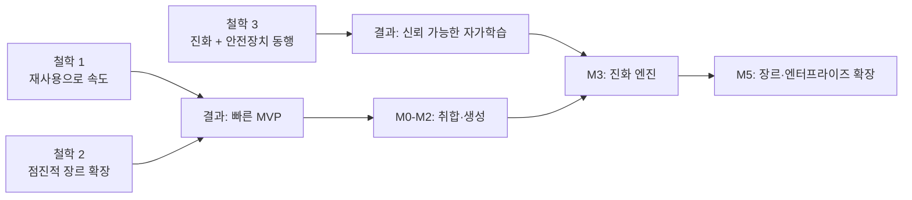
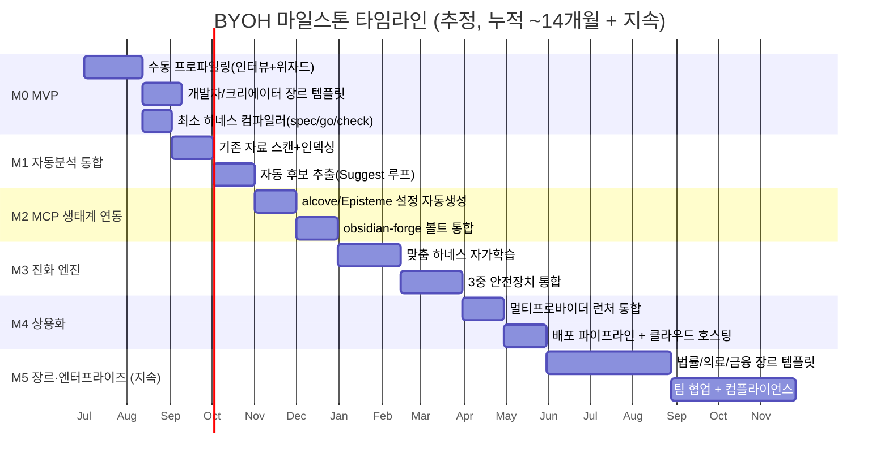
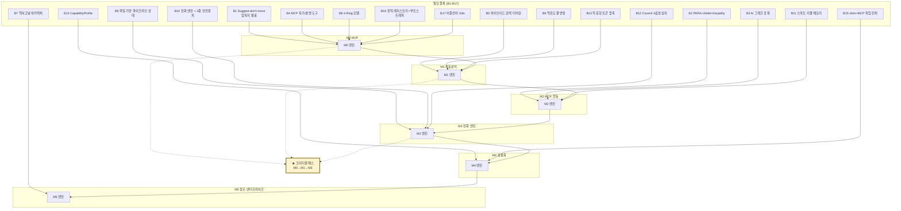
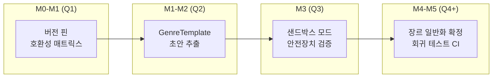
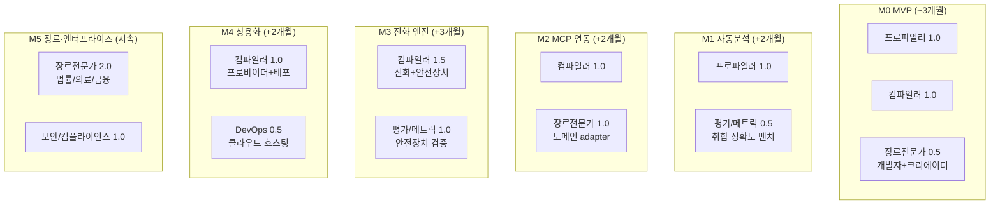
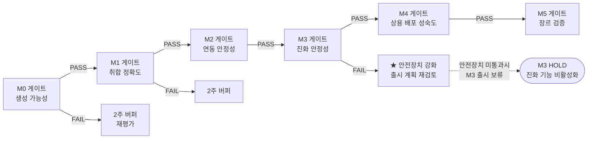
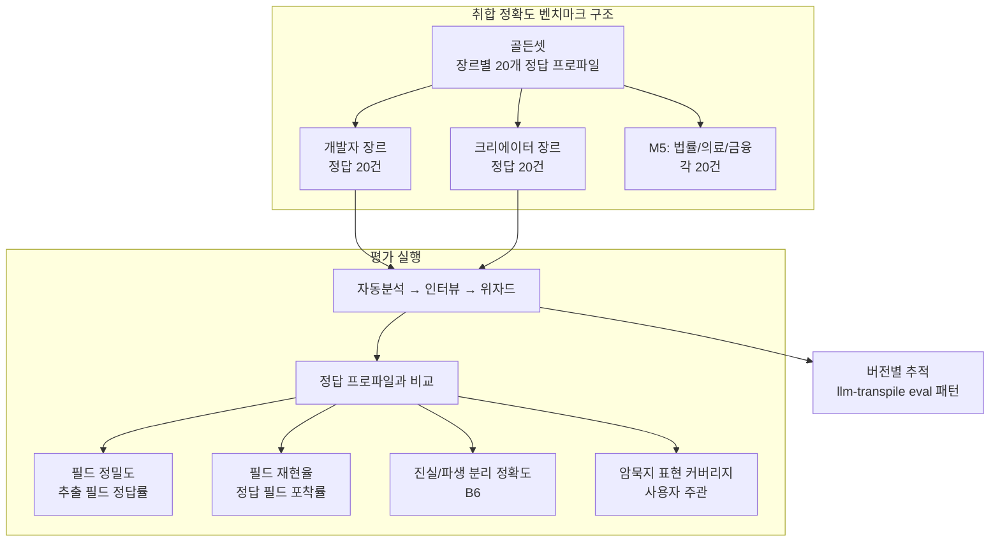

# BuildYourOwnHarness — 기술 로드맵

> **문서 목적**: BYOH(BuildYourOwnHarness) 서비스가 7개 기존 프로젝트의 검증된 빌딩 블록(B1-B17)을 재사용하면서, 결측 생성 계층(프로파일러·컴파일러·장르 템플릿·검증)을 **어떤 순서로, 어떤 의존관계 아래에서, 어떤 평가 게이트를 거쳐 구축할지**를 정의한다. 본 로드맵은 `00_RESEARCH_REPORT.md`의 빌딩 블록 카탈로그(§5)와 결측 계층 분석(§6)을 실행 가능한 마일스톤으로 전환한다.
>
> **작성일**: 2026-06-24 · **근거**: `00_RESEARCH_REPORT.md`(B1-B17, 결측 계층) · **개월 수는 추정치**

---

## 1. 로드맵 철학

BYOH는 "바퀴를 다시 발명"하지 않는다. epiccounty 워크스페이스 7개 프로젝트는 이미 **개인용 AI 하네스의 완결된 부품 세트**로 검증되었다(리서치 보고서 §7.1). 따라서 로드맵의 3가지 축은 다음과 같다.

### 1.1 속도 확보: 빌딩 블록 재사용 최우선

새 코드를 최소화하고, 이미 검증된 17개 빌딩 블록을 **설정·템플릿·조합 코드**로 소비한다. 부품 자체의 신뢰도는 이미 코드 수준에서 입증되었으므로(리서치 보고서 §1.3), BYOH의 핵심 리스크는 "부품 제작"이 아니라 **"사용자 암묵지를 정확히 포착해 올바른 부품 조합을 생성하는가"**에 있다. 각 마일스톤은 재사용 블록을 명시하고, 순수 신규 코드는 결측 계층(프로파일러·컴파일러·장르 템플릿·검증)에만 집중한다.

### 1.2 점진적 장르 확장: 좁혀서 출발, 일반화는 뒤로

장르 일반화는 BYOH 최대의 기술 부채 후보다(리서치 보고서 §6.2 - "장르 추상화 부재"). 따라서 M0은 **1-2개 장르(개발자 + 크리에이터)** 로 좁혀 시작하고, 검증된 장르 템플릿 패턴을 추상화한 뒤 M5에서 법률·의료·금융으로 확장한다. 일반화 부채를 조기에 갚으려다 "모든 장르에 얕은" 시스템이 되는 것을 방지한다.

### 1.3 진화 통제 병행: 자유도와 안전장치를 같은 속도로

맞춤 하네스가 스스로 학습·진화하는 능력(B10)은 BYOH의 차별점이지만, 동시에 최고 위험원이다. 보상 해킹과 파괴적 망각은 진화 엔진 없이는 발생하지 않지만, 진화 엔진이 3중 안전장치(Critic/Seesaw/Stagnation) 없이 작동하면 **사용자 신뢰를 단번에 상실**한다. 따라서 진화 기능(M3)은 반드시 B10의 세 안전장치와 동시에 출시되며, "진화 기능만 먼저" 같은 단계적 노출은 허용하지 않는다.

---

## 2. 단계별 마일스톤 타임라인

모든 개월 수는 **추정치**이며, 1명 풀타임 기준이다(역할은 §6 참조). 병렬 인력 투입 시 단축 가능.

> **크리티컬 패스**: M0(최소 컴파일러) → M1(자동 취합) → M3(진화 엔진 + 3중 안전장치 동반). M2(MCP 연동)는 M1과 M3 사이 병렬 가능하나, M3의 자가학습 데이터 소스가 되므로 M3 착수 전 완료 필수. 크리티컬 패스의 세 가지 핵심 게이트는 §4.1(의존 패스 3종)과 §7.2(M0 생성 가능성 / M1 취합 정확도 / M3 진화 안정성 — Critic·Seesaw·Stagnation 3중 안전장치 전체)에서 정량 기준으로 분해된다.

---

## 3. 마일스톤 상세

### 3.1 M0 — MVP (추정 ~3개월)

**목표**: 비기술 사용자가 "내 하네스 만들기" 인터뷰+위자드를 거쳐, 개발자 또는 크리에이터 장르의 **실행 가능한 최소 하네스**를 생성·설치할 수 있다. 자동분석 없이 순수 인터랙티브 취합으로 증명한다.

> **[MVP 장르 범위 정합]** MVP 장르는 **2종(developer + creator)** 로 확정한다. 이는 `01_PROJECT_PLAN.md` §6.1 F5("장르 템플릿 2종: developer, creator", 리서치 §7.3 권고 "MVP는 1-2개 장르로 좁혀 출발")과 일치한다. `02_ARCHITECTURE.md` §6.2가 4장르(developer/researcher/creator/business) 템플릿을 'MVP'로 표기한 것은 **아키텍처 참조용 전체 템플릿 라이브러리 설계도**이며, 그중 M0에서 실제 출시하는 것은 developer·creator 2종이다(researcher/business는 `01_PROJECT_PLAN.md` §6.2 F8 '확장 기능'으로 분류, M5에서 추가). 2장르 좁히기는 장르 일반화 부채(§5.2)를 조기에 통제하기 위한 의도적 MVP 범위 축소다.

**핵심 산출물**:
1. **수동 프로파일링 엔진** — 인터뷰(LLM 대화) + 위자드(단계별 양식) 하이브리드. 결과물은 `UserProfile.json`(암묵지·데이터 소스·장르·목표).
2. **장르 템플릿 v0.1** — 2개: `developer.json`(B8 4-Ring 골격 + SE 지식 그래프), `creator.json`(B2 PARA + B1 Suggest 루프).
3. **최소 하네스 컴파일러** — `UserProfile + 장르 템플릿 → 하네스 번들`. 번들에는 `spec → go → check` 최소 파이프라인(B8 Ring 1의 부분 집합) + 1개 MCP 도구(B4 자기-설명 원칙).
4. **dry-run(시뮬레이션) 게이트** — 컴파일 직후·설치 직전에 번들이 샌드박스에서 실제로 동작하는지 검증(정적 스키마/메타 검증을 넘어 런타임 동작 검증). `byoh compile --dry-run`은 번들을 임시 디렉토리에 전개해 `spec → go → check` 최소 파이프라인 1회 더미 실행 + MCP 도구 1회 더미 호출(`tools/list`)을 수행하고, 의존 실행 계층 도구(obsidian-forge/alcove/epic-harness)가 미설치인 환경에서는 우아한 폴백(스킵 + 경고)으로 통과 여부를 보고한다. dry-run PASS 번들만 `install` 단계로 넘어간다.
5. **원클릭 설치 스크립트** — B16의 `install.sh`/`install.ps1` 부트스트래퍼 패턴 재사용.

**재사용 빌딩 블록**: B1(Suggest-don't-move 취합 원형), B4(MCP 자기-설명 도구), B8(4-Ring 모델 중 Ring 1 최소), B16(정적 레지스트리 + 부트스트래퍼), **B17(이중언어 i18n — 인터뷰/위자드 UI의 ko/en 처리, 한국 사용자 타겟)**. B17은 §4.2에 명시된 대로 M0뿐 아니라 모든 마일스톤에서 횡단 적용된다.
**의존 기존 프로젝트**: epic-harness(파이프라인 스킬 템플릿), alcove(MCP 도구 설명 패턴), epiccounty.com(설치 스크립트).

> **🔧 epic-harness 레퍼런스 (M0 차용 자산)**
> | 자산 | 소스 경로 | BYOH M0 적용점 |
> |---|---|---|
> | `go` 3모드 (`go:plan`/`go:build`/`go:integrate`) | `registry/skills/go/SKILL.md` | 산출물 3(최소 파이프라인 spec→go→check)의 go 단계 |
> | `spec` SKILL.md (`SPEC-{ts}.md` R1/AC1) | `registry/skills/spec/SKILL.md` | 산출물 3 spec 단계 — 번호 요구사항 명세 (인터뷰 Profile → R/AC) |
> | `hooks/hooks.json` 6훅 | `hooks/hooks.json` | 산출물 3 Ring 0 골격 |
> | `registry/scripts/install.js` | `registry/scripts/install.js` (SessionStart 훅 호출) | 산출물 5 원클릭 설치 — SessionStart 자동설치 패턴 차용 |
> | `gen-skills`/`lint-skills` | `Makefile` | 산출물 4 dry-run 게이트의 스킬 검증 규칙 차용 (frontmatter+name+description, CSO compliance) |

**인스콥**:
- 인터뷰 + 위자드 2모드 (자동분석은 M1)
- 개발자·크리에이터 2장르
- spec/go/check 3단계 파이프라인 (ship/evolve는 후속)
- 컴파일 후 설치 전 dry-run 게이트 (런타임 동작 검증)
- 로컬 설치 (클라우드 호스팅은 M4)

**아웃스콥**:
- 기존 자료 자동 스캔 (→ M1)
- alcove/Episteme 자동 설정 (→ M2)
- 자가학습 진화 (→ M3)
- 멀티프로바이더 (→ M4)

**성공 기준**:
- 5명 파일럿 사용자가 30분 이내 인터뷰+위자드 완료 후 실행 가능한 하네스 생성
- 생성된 하네스로 1개 실제 작업(코드 작성 or 콘텐츠 초안) 완료율 ≥ 80%
- 설치 성공률 ≥ 90% (macOS + Linux)
- dry-run 게이트 PASS율 ≥ 95% (컴파일된 번들의 런타임 동작 검증)

**리스크**:
- *인터뷰 질문 설계의 주관성* → 완화: B1의 Suggest-don't-move 원칙 적용(AI가 후보를 제안, 사용자는 승인만). 파일럿 사용자 피드백으로 질문 세트를 반복 개선(이터레이션).
- *2장르 템플릿의 과일반화* → 완화: 장르별로 별도 템플릿 파일 유지, 공통 코드는 M1 이후 추출.

---

### 3.2 M1 — 자동분석 통합 (추정 +2개월)

**목표**: 사용자가 기존에 가진 자료(로컬 파일, 노트, 코드베이스)를 자동 스캔·인덱싱하여 프로파일 후보를 추출한다. 순수 인터뷰(M0)의 주관성을 데이터 기반 보완하는 **하이브리드 3단계 취합**(자동분석 → 인터뷰 → 위자드, 리서치 보고서 §7.2 권고 1)을 완성한다.

**핵심 산출물**:
1. **자료 스캐너** — 로컬 디렉토리/Obsidian 볼트/Notion export 읽기 → 정규화.
2. **인덱싱 파이프라인** — B5 하이브리드 검색 티어링(vector → BM25 → grep)으로 자료 인덱스 구축.
3. **자동 후보 추출기** — 인덱스에서 장르·키워드·작업 패턴 후보 추출 → `UserProfile`의 *파생* 필드(B6 역유도 불변량: AI 추론은 파생 표시).
4. **적응형 압축 적용** — 대용량 자료 스캔 시 B13 4단계 압축으로 토큰 비용 통제.

**재사용 빌딩 블록**: B5(하이브리드 검색 티어링), B6(역유도 불변량 - 진실 vs 파생 분리), B13(적응형 토큰 압축).
**의존 기존 프로젝트**: alcove(BM25 tantivy 인덱서, NgramTokenizer), Episteme(역유도 관계 패턴), llm-transpile(압축 API `transpile(text, format, fidelity, budget)`).

**인스콥**:
- 로컬 파일 + Markdown + 코드베이스 스캔
- 자동 후보 추출 + 인간 승인 루프(B1 상태머신: suggested → confirmed)
- 스캔 결과의 파생 표시(B6)

**아웃스콥**:
- 외부 SaaS(Notion API, Gmail) 실시간 연동 (→ M5)
- 자동 후보의 자동 적용(항상 인간 승인 필요)

**성공 기준**:
- 자동분석 후보의 사용자 승인률 ≥ 60% (즉, AI 추론이 절반 이상 적중)
- 순수 인터뷰(M0) 대비 프로파일 완성 시간 40% 단축
- 10GB 자료 스캔 시 토큰 비용 B13 미적용 대비 50% 절감

**리스크**:
- *자동 추론의 오염(사용자 사실이 아닌 AI 환각이 진실로 둔갑)* → 완화: B6 역유도 불변량 엄격 적용. 자동 추출값은 기본 `derived=true`, 사용자 편집 시에만 `truth=true`로 승격.
- *자료 포맷 다양성* → 완화: M1은 Markdown/코드/일반 텍스트로 제한, PDF 등은 B1의 `process_one` PDF→Markdown 변환 재사용.

---

### 3.3 M2 — MCP 생태계 연동 (추정 +2개월)

**목표**: 생성된 하네스가 기존 epiccounty 생태계 도구(alcove RAG, Episteme 지식 그래프, obsidian-forge 볼트)와 **자동으로 연동**된다. 사용자가 프로파일에서 "지식 검색 원함" 체크 시, 해당 MCP 서버 설정이 컴파일러에 의해 자동 생성된다.

**핵심 산출물**:
1. **alcove 설정 자동생성** — 프로파일의 지식 소스 → alcove doc-repo/project-repo 구성 + `.alcove/` 인덱스 부트스트랩.
2. **Episteme 도메인 확장** — SE 외 장르(크리에이터 등) 엔티티 타입 추가. 헥사고날 구조(B7)의 adapter 교체로 도메인 적용.
3. **obsidian-forge 볼트 통합** — 사용자 볼트를 PARA + Karpathy 3-Layer(B2)로 구조화 + 그래프 강화(B3) 자동 실행.
4. **스마트 리콜 메모리** — 사용자 메모리 그래프에 B11 복합 점수(recency 25% + importance 35% + freq 15% + FTS 25%) 적용.
5. **의존 도구 bootstrap 순서 검증기** — BYOH가 생성한 번들의 실행은 기존 도구(obsidian-forge/alcove/Episteme/epic-harness)에 위임하므로, 사용자 환경에 이들이 **미설치이거나 버전이 불일치**일 때의 부트스트랩 순서·검증 단계를 정의한다. 표준 순서: (1) `epiccounty status`로 설치·버전 핀(§5.1) 사전 검증 → (2) 미설치 도구는 핀된 버전 자동 설치 제안(B16 부트스트래퍼 재사용) → (3) 버전 불일치 시 경고 + 호환 범위 표시 → (4) 모든 의존 도구가 준비된 후 번들의 MCP/스킬 활성화. 이 검증기는 M0 dry-run 게이트(런타임 폴백)의 사전 단계로 작동한다.

**재사용 빌딩 블록**: B2(PARA + Zettelkasten + Karpathy 3-Layer), B3(AI 그래프 강화), B11(스마트 리콜 메모리 그래프).
**의존 기존 프로젝트**: alcove(16 MCP 도구, TierClassifier), Episteme(KnowledgeGraph, 역유도), obsidian-forge(strengthen_graph, AiClient).

**인스콥**:
- alcove/Episteme/obsidian-forge 3개 도구 자동 설정
- 장르별 엔티티 타입 확장 (크리에이터: `Idea`, `Draft`, `Inspiration`)
- 메모리 그래프 구축 + 감쇠 정책(B11: 30일 반감기)

**아웃스콥**:
- 제3자 MCP 서버 마켓플레이스 (→ M5)
- 다중 볼트 동기화 (단일 볼트 우선)

**성공 기준**:
- 자동 연동된 하네스에서 MCP 도구 호출 성공률 ≥ 95%
- 크리에이터 장르에서 Episteme 확장 엔티티로 지식 그래프 구축, 노드 수 ≥ 50개(파일럿 사용자 기준)
- 메모리 리콜 정확도(사용자 주관 평가) ≥ 4/5점
- 의존 도구 미설치 환경에서 bootstrap 순서 검증기가 올바른 순서·폴백을 보고하는 비율 100% (4단계 전 단계 검증 로그 채점)

**리스크**:
- *7개 프로젝트 API 버전 드리프트* → 완화: B16 정적 레지스트리로 각 도구 버전 핀, `epiccounty status`로 사전 검증. M2 착수 전 전 도구 호환성 매트릭스 작성.
- *obsidian-forge의 Obsidian 강결합* → 완화: 볼트 구조 추상화 계층(리서치 보고서 §2.1.4 제약)을 M2에서 처음 도입, 향후 Notion 등으로 확장 예정.

---

### 3.4 M3 — 진화 엔진 (추정 +3개월)

**목표**: 맞춤 하네스가 사용 패턴을 관찰해 **스스로 스킬을 생성·개선**한다. 단, B10의 3중 안전장치(Critic/Seesaw/Stagnation)와 **반드시 동시 출시**한다(철학 3). 진화 기능만 단계적 노출은 금지.

> **[안전장치 MVP 범위 정합 — 검증자가 놓친 위험 회피]** `01_PROJECT_PLAN.md` §6.1 F6은 '결정론적 검증 게이트(Critic only)'를 MVP로 허용하고, §6.2 F9로 Seesaw+Stagnation을 '확장 기능'으로 분류한다. 그러나 **Critic만 탑재된 진화 엔진은 Seesaw 부재로 파괴적 망각을, Stagnation 부재로 정체 시 비롤백을 각각 통제할 수 없다** — 즉 '학습할수록 망가지는' 신뢰 붕괴 시나리오가 MVP 단계에서 발생할 수 있다. 따라서 본 로드맵은 **진화 엔진 활성화(M3) 시점에는 3중 안전장치 전체 동반을 강제**하며(§7.2 M3 게이트 3종 전부 PASS 필수), F6의 'Critic only MVP'는 **진화 엔진 자체가 M3 이전(M0-M2)에는 비활성화**라는 전제 아래 해석한다: M0-M2에서는 진화가 일어나지 않으므로 Critic-only 검증 게이트(생성된 번들의 정적 품질 검증용)만으로 충분하고, 진화가 처음 켜지는 M3에서는 3중 전부가 동시에 필요하다.

**핵심 산출물**:
1. **진화 엔진 이식** — epic-harness Ring 3(Observe → Analyze → Evolve → Gate → Reload)의 맞춤 하네스 버전. 매 도구 호출 `ObsRecord` 수집.
2. **3중 안전장치 통합** — Critic(보상 해킹 방어, 결정론적 in-loop), Seesaw(파괴적 망각 게이트), Stagnation(3세션 정체 시 `evolved_backup/` 롤백).
3. **파일 기반 파이프라인 상태** — B9 패턴으로 긴 진화 작업의 복구 보장(`PIPELINE-{timestamp}.json`, 45분 타임아웃 크래시 감지).
4. **Council 심의 게이트** — 고위험 진화 결정(스킬 신규 생성·프롬프트 전면 수정) 시 B12 4음성(Architect/Skeptic/Pragmatist/Critic) 반-앵커링 심의.

**재사용 빌딩 블록**: B9(파일 기반 파이프라인 상태), B10(진화 엔진 + 3중 안전장치), B12(Council 4음성 반-앵커링).
**의존 기존 프로젝트**: epic-harness(`src/evolve/{critic,seesaw,metrics,skills,edits}.rs`, `src/store/orbit_store.rs`, `registry/skills/council/`).

> **🔧 epic-harness 레퍼런스 (M3 차용 자산 — 모듈 구조 그대로 복제)**
> | 자산 | 소스 경로 | BYOH M3 적용점 |
> |---|---|---|
> | `EditType` 6종 | `src/shared/evolution.rs`, `src/evolve/edits.rs` | 진화 에디터 타입 — AddSkill/ModifySkill/AddInstinct/ModifyConfig/AddGuardRule/ModifyPrompt |
> | `SkillOpt` 미니배치 | `src/evolve/skills.rs` | 패턴 감지→진화 스킬 생성 알고리즘 (우세에러≥60% & ≥2파일 → 재사용) |
> | `evolved/` 디렉토리 | `~/.harness/projects/{slug}/evolved/` | 진화 스킬 저장 경로 (`~/.byoh/<slug>/evolved/`) + `MAX_EVOLVED_SKILLS=10` |
> | `anti-anchoring` 독립컨텍스트 | `registry/skills/council/SKILL.md` | 산출물 4 Council 심의 — 각 음성이 대화·타 음성 없이 질문만 수신 |
> | 임계값 세트 | `src/config.rs`, `src/evolve/metrics.rs` | `STAGNATION_LIMIT=3`, `IMPROVEMENT_THRESHOLD=2%`, 거절버퍼 TTL=10세션 — 인스콥 게이트 기본값 (장르별 오버라이드는 02 §7.1) |
> | `MAX_CONCURRENT_AGENTS=6` | `src/orchestrate/state.rs` | 산출물 4 Council 병렬 심의 동시성 상한 |

**인스콥**:
- ObsRecord 수집 + 패턴 감지(repeated_same_error, fix_then_break, long_debug_loop, thrashing)
- 진화 스킬 생성 + 게이트(본문 ≥20자, SKILL.md 존재, `MAX_EVOLVED_SKILLS=10`)
- 거절 버퍼 + TTL(10세션), 프롬프트 자동튜닝
- 3중 안전장치 전체

**아웃스콥**:
- 다중 하네스 간 진화 지식 공유 (→ M5 팀 협업)
- 진화 알고리즘 자체의 메타진화 (1단계 진화만)

**성공 기준**:
- 진화 후 하네스의 작업 성공률이 진화 전 대비 ≥ 10% 향상(A/B: `avg_score_with` vs `avg_score_without`)
- **Critic가 보상 해킹 시도 100% 차단**(결정론적 검증이므로 100% 목표)
- Seesaw 회귀 감지 후 1세션 이내 복구율 ≥ 90%
- Stagnation 롤백 후 사용자 체감 품질 회복 ≥ 4/5점
- 30일 운용 중 파괴적 망각 사고 0건

**리스크**:
- *진화 통제 실패(최고 위험)* → 완화: B10 세 안전장치 없이 진화 기능 출시 금지(철학 3 강제). M3 게이트는 안전장치 단위 테스트 + 통합 시뮬레이션(고의 보상 해킹 시나리오 포함) 통과 필수.
- *진화 스킬의 장르 오염(개발자 스킬이 크리에이터 하네스로 유입)* → 완화: 진화 스킬에 장르 태그 부여, 타 장르 스킬은 게이트에서 거절.
- *파일 기반 상태의 경쟁 조건* → 완화: B9의 `phase_history` 우선 규칙 + generation 기반 무효화 재사용.

---

### 3.5 M4 — 멀티프로바이더 + 배포 상용화 (추정 +2개월)

**목표**: 사용자가 자신의 예산·프라이버시 요구에 맞춰 LLM 프로바이더를 선택하고, 생성된 하네스를 **클라우드에 호스팅**하여 팀/기기 간 사용한다.

**핵심 산출물**:
1. **CapabilityProfile 통합** — B14 타입 안전 프로바이더 추상화. 프로파일의 "선호 LLM" → 프로바이더 매칭(툴호출 지원 여부, 컨텍스트 윈도우 등).
2. **shim + MCP 위임 런처** — B15 패턴으로 에이전트 실행 통제. claudy의 `LaunchOrchestrator<P,S,R>` 골든-패스 재사용.
3. **배포 파이프라인** — B16 정적 레지스트리 + GitHub Releases + 다중 설치(스크립트/Homebrew/cargo-binstall). `epiccounty` CLI 패턴 확장.
4. **클라우드 호스팅** — 생성된 하네스의 설정 동기화 서버(사용자 프로파일 + 진화 상태 클라우드 백업).

**재사용 빌딩 블록**: B14(CapabilityProfile), B15(shim + MCP 위임 런처), B16(정적 레지스트리 + 부트스트래퍼).
**의존 기존 프로젝트**: claudy(`src/providers/capabilities.rs`, `src/application/launch_orchestrator.rs`, 포트 트레이트), epiccounty.com(`cli/core/src/registry.rs`, `static/install.sh`).

**인스콥**:
- Anthropic/OpenRouter/ollama 호환 프로바이더 지원
- macOS/Linux/Windows 크로스플랫폼 설치
- 클라우드 설정 동기화(진화 상태 포함)

**아웃스콥**:
- 온프레미스 엔터프라이즈 배포 (→ M5)
- 자체 LLM 파인튜닝 (프로바이더 선택만)

**성공 기준**:
- 3개 프로바이더 전환 시 하네스 기능 정상 동작률 ≥ 95%
- 클라우드 동기화 후 다른 기기에서 동일 진화 상태 복원율 100%
- 설치 후 첫 실행까지 평균 시간 ≤ 5분

**리스크**:
- *프로바이더별 능력 차이로 진화 품질 편차* → 완화: B14 CapabilityProfile로 능력 선언, 부족한 능력(예: 툴호출 미지원) 시 해당 기능 게이트.
- *클라우드 의존도 증가(오프라인 사용성 저하)* → 완화: 동기화는 옵션, 로컬 우선 아키텍처 유지(리서치 보고서 §2.3.1 "오프라인 우선 단일 바이너리" 원칙 준수).

---

### 3.6 M5 — 장르 확장 + 엔터프라이즈 (지속, 추정 +6개월~)

**목표**: 고규제 장르(법률·의료·금융)로 확장하고, 팀 협업과 컴플라이언스 기능을 추가한다. 일반화 부채(§5.2)를 갚으면서 장르 라이브러리를 확장한다.

**핵심 산출물**:
1. **고규제 장르 템플릿** — 법률(판례 그래프, 인용 추적), 의료(임상 가이드라인, 환자 데이터 마스킹), 금융(규제 컴플라이언스 체크).
2. **팀 협업 계층** — 다중 사용자 프로파일 머지, 진화 지식 공유(조직 단위 `evolved/` 저장소), 권한 관리.
3. **컴플라이언스 프레임워크** — 감사 로그, 데이터 분류(리서치 보고서와 무관하나 OSN 보안 정책 참조 가능), 지역별 데이터 주권.
4. **제3자 MCP 마켓플레이스** — 커뮤니티 장르 템플릿·도구 등록.

> **🌐 커뮤니티 레퍼런스 (M5 장르 확장 후보)** — awesome-claude-plugins(2026-06)에 이미 존재하는 장르 특화 플러그인을 M5 템플릿의 출발점으로 삼는다:
> | 고규제 장르 | 커뮤니티 참조 | 활용 |
> |-----------|-------------|------|
> | 법률 | #95 `anthropics/claude-for-legal`(8k★, 13 플러그인) — 법률 워크플로 스위트 | 법률 워크플로 스킬 구조의 출발점 |
> | 금융 | #40 `anthropics/financial-services`(32k★), #98 financial-services-plugins(7k★) | 규제 컴플라이언스 체크 스키마 |
> | 보안(인접) | #66 Anthropic-Cybersecurity-Skills(17k★, 5 프레임워크 매핑) | 감사 로그·데이터 분류 설계 참조 |
>
> 마켓플레이스(산출물 4)의 모델은 #33 `wshobson/agents`(37k★, 84 플러그인 마켓플레이스)와 #41 `anthropics/claude-plugins-official`(30k★, 234 플러그인 공식 디렉터리)를 참조한다.

**재사용 빌딩 블록**: B7(헥사고날 - 도메인 교체로 장르 확장), B17(이중언어 i18n - 다국어 장르), 그 외 M0-M4 성숙도 전체.
**의존 기존 프로젝트**: 전 생태계(장르별 도메인 adapter 신규 작성).

**인스콥**:
- 3개 고규제 장르 템플릿
- 팀(조직) 단위 하네스 공유
- 감사 로그 + 데이터 분류

**아웃스콥**:
- 장르별 인증(의료 HIPAA, 금융 PCI-DSS 등 공식 인증 획득) — 별도 컴플라이언스 프로젝트

**성공 기준**:
- 각 고규제 장르에서 도메인 전문가 검증 커버리지 ≥ 80%
- 팀 협업 시 진화 지식 충돌 해결률 ≥ 90%
- 감사 로그로 모든 진화 결정 추적 가능률 100%

**리스크**:
- *고규제 장르의 오용 책임* → 완화: 면책 조항 + "전문가 검토 필수" 게이트, 의료·법률 자동 결정 금지.
- *장르 일반화 부채 폭발* → 완화: §5.2의 부채 상환 일정 준수, 각 장르 추가 시 공통 추상화 회귀 테스트.

---

## 4. 의존관계 그래프: 빌딩 블록 ↔ 마일스톤 매핑

### 4.1 크리티컬 패스 분석

| 패스 | 이유 | 차단 시 영향 |
|------|------|-------------|
| **M0 → M1** | 자동 취합은 수동 프로파일링의 `UserProfile` 스키마에 의존 | M1 착수 지연 |
| **M1 → M3** | 진화 엔진의 학습 데이터(자동분석된 사용 패턴)가 M1 산출물에 의존 | M3 자가학습 품질 저하 |
| **M3 안전장치** | B10 없는 진화 = 보상 해킹·파괴적 망각 위험 | 사용자 신뢰 상실, 서비스 회귀 불가 |
| **M2 (병렬 가능)** | M1 완료 후 M3 착수 전까지 독립 진행 가능 | M3 착수 전 미완료 시 진화 데이터 소스 부족 |

### 4.2 재사용 밀도 (블록당 사용 마일스톤 수)

- 단일 사용: B3, B9, B11, B12, B13, B14, B15 (각 1회) — 해당 마일스톤에서 집중 구현
- 다중 사용: B1(M0+M1+Suggest 루프 전반), B5(M1+M2 검색), B6(M1+M3 진실/파생), B8(M0+M3 4-Ring), B16(M0+M4 배포)
- **B17(i18n)은 모든 마일스톤에서 횡단 적용** (한국 사용자 타겟)

---

## 5. 기술 부채/리스크 관리

### 5.1 7프로젝트 API 버전 드리프트 부채

**원인**: BYOH가 7개 독립 저장소의 API(각자 자체 버전/릴리스 주기)에 의존. epic-harness의 `HookInput` 스키마, alcove의 MCP 도구 시그니처, llm-transpile의 `transpile()` API 등이 독립 진화.

**완화 일정**:
- **M0 착수 전**: B16 정적 레지스트리로 7개 도구 버전 핀(예: `alcove=0.5.x`, `epic-harness=1.x`). `epiccounty status` 확장으로 호환성 매트릭스 자동 검증.
- **M2 착수 시점**: 호환성 매트릭스 회귀 테스트 CI 도입. BYOH 빌드 시 핀된 버전과 로컬 설치 버전 불일치 시 경고.
- **지속**: 각 도구 릴리스 시 BYOH 통합 테스트 자동 트리거(월 1회).

### 5.2 장르 일반화 부채

**원인**: M0-M1은 2장르(개발자·크리에이터) 하드코드에 가깝다. M5 장르 확장 시 공통 추상화 없이 장르별 중복 코드 누적 위험.

**완화 일정**:
- **M1 종료 시점**: 2장르 템플릿에서 공통 스키마 추출(`GenreTemplate` 인터페이스 초안). B7 헥사고날 원칙 적용.
- **M2 진행 중**: Episteme 도메인 adapter 패턴(리서치 보고서 §2.3.4 "adapter 교체로 다른 도메인 적용")을 장르 템플릿에 일반화.
- **M5 착수 전**: 3개 이상 장르가 통과할 수 있는 공통 `GenreTemplate` 인터페이스 확정. 각 장르 추가 시 회귀 테스트로 기존 장르 미손상 검증.

### 5.3 진화 통제 부채

**원인**: M3에서 진화 엔진 도입 후, 안전장치의 효과가 실제 사용 데이터로만 검증된다. 초기에는 미지의 보상 해킹 패턴이 존재할 수 있다.

**완화 일정**:
- **M3 출시 게이트**: 3중 안전장치 단위 테스트 + 고의 보상 해킹 시나리오 통합 테스트 필수 통과.
- **M3 출시 후 30일**: "샌드박스 모드" 운용(진화 제안은 생성만, 자동 적용 금지, 인간 승인 필수). 30일 후 자동 적용 옵션 개방.
- **지속**: B10의 A/B 속성(`avg_score_with` vs `avg_score_without`)으로 진화 스킬 퇴출 자동화 임계치(`avg_with < avg_without − 0.02`) 모니터링.

### 5.4 부채 상환 타임라인

---

## 6. 인력/역할

### 6.1 핵심 역할 정의

| 역할 | 책임 | 주력 빌딩 블록 |
|------|------|---------------|
| **프로파일러 엔진 엔지니어** | 인터뷰·자동분석·위자드 하이브리드 취합 파이프라인 | B1, B5, B6, B13 |
| **컴파일러 엔진 엔지니어** | UserProfile → 하네스 번들 변환, 설정/스킬/도구 코드 생성 | B8, B9, B10, B14, B15, B16 |
| **장르 도메인 전문가** | 장르별 템플릿 설계(엔티티 타입, 검색 가중치, 프롬프트), 도메인 지식 검증 | B2, B3, B7, B11 |
| **평가/메트릭 엔지니어** | 벤치마크 설계, 취합 정확도 측정, 진화 안정성 메트릭, 평가 게이트 운영 | B10(A/B 속성), B12(Council 검증) |

### 6.2 마일스톤별 필요 역할

> **(1.0 = 풀타임, 0.5 = 반타임)**. M0-M1은 최소 2.5인(프로파일러 1.0 + 컴파일러 1.0 + 장르전문가 0.5)로 착수 가능. M3부터 평가/메트릭 전담 필수(진화 통제 검증).

### 6.3 역할-마일스톤 매트릭스

| 역할 \ 마일스톤 | M0 | M1 | M2 | M3 | M4 | M5 |
|----------------|----|----|----|----|----|----|
| 프로파일러 엔진 | ●● | ●● | ● | ○ | ○ | ○ |
| 컴파일러 엔진 | ●● | ● | ●● | ●● | ●● | ● |
| 장르 도메인 전문가 | ● | ○ | ●● | ○ | ○ | ●● |
| 평가/메트릭 | ○ | ● | ○ | ●● | ● | ● |

(●● = 주력, ● = 참여, ○ = 경량 참여/컨설팅)

---

## 7. 평가 게이트

각 마일스톤은 **정량 게이트** 통과 시에만 다음 단계로 진행한다. 게이트 미충족 시 2주 버퍼 후 재평가.

### 7.1 게이트 흐름

### 7.2 게이트별 통과 기준 (정량)

| 게이트 | 차원 | 통과 기준 | 측정 방법 |
|--------|------|----------|----------|
| **M0** | 생성 가능성 | 파일럿 5명 생성 성공률 ≥ 80% | end-to-end 시나리오 |
| **M0** | 채택률 | 생성 하네스로 실작업 완료율 ≥ 80% | 사용자 설문 + 작업 로그 |
| **M0** | 설치 신뢰성 | 설치 성공률 ≥ 90% (macOS+Linux) | 자동화 설치 테스트 |
| **M1** | 취합 정확도 | 자동 후보 승인률 ≥ 60% | 승인/거절 로그 |
| **M1** | 효율 | 프로파일 완성 시간 40% 단축 (vs M0) | 시간 측정 |
| **M1** | 토큰 비용 | 스캔 토큰 50% 절감 (vs B13 미적용) | 토큰 카운트 비교 |
| **M2** | 연동 안정성 | MCP 도구 호출 성공률 ≥ 95% | 호출 로그 |
| **M2** | 리콜 정확도 | 사용자 평가 ≥ 4/5점 | 주관 평균 |
| **M3** | 진화 효과 | 작업 성공률 ≥ 10% 향상 (A/B) | `avg_score_with/without` |
| **M3** | **안전장치(Critic)** | **보상 해킹 100% 차단** | 결정론적 테스트 |
| **M3** | 안전장치(Seesaw) | 회귀 1세션 내 복구율 ≥ 90% | 시뮬레이션 |
| **M3** | 안전장치(Stagnation) | 30일 파괴 망각 사고 0건 | 운용 로그 |
| **M4** | 프로바이더 호환 | 3프로바이더 정상 동작률 ≥ 95% | 전환 테스트 |
| **M4** | 동기화 신뢰 | 진화 상태 복원율 100% | 크로스기기 테스트 |
| **M5** | 장르 검증 | 도메인 전문가 커버리지 ≥ 80% | 전문가 리뷰 |

> **M3 안전장치 게이트는 절대 타협 불가**. Critic 100% 차단 미달 시 M3 진화 기능은 비활성화된 채 M4로 진행(철학 3 강제).

---

## 8. 벤치마크/평가 계획

### 8.1 llm-transpile eval 패턴 재사용

llm-transpile은 `make eval` 평가 스위트를 보유(리서치 보고서 §2.5.2: Markdown 27.4% / HTML 98.7% / **전체 91.8% 압축**, 99.0% 손실 없는 단어 커버리지). 이 패턴을 BYOH 평가에 재사용한다. '전체 91.8%'는 포맷 무관 평균 압축률 베이스라인으로, BYOH 자료 스캔 시 B13 압축 단계 적용 전후 토큰 절감 비교의 기준점이 된다:

- **고정 골든셋**: llm-transpile의 eval처럼 버전 관리되는 정답 데이터셋 유지.
- **포맷/장르별 측정**: 압축률을 포맷별로 측정하듯, BYOH는 취합 정확도를 장르별로 측정.
- **손실 없는 커버리지**: llm-transpile의 "99.0% 단어 커버리지"에 대응하는 BYOH 지표 = "사용자 암묵지 표현 커버리지"(인터뷰 후 사용자가 "내 의도가 정확히 반영되었다"고 평가한 항목 비율).

> **🌐 커뮤니티 채택률 — 보조 검증 지표**: awesome-claude-plugins(리서치 §4.2)의 스타·구독 수를 장르 수요의 외부 근거로 활용한다. 예: creator 장르 벤치마크 우선순위는 #7 ui-ux-pro-max(94k★)·#21 taste-skill(47k★)의 높은 채택이 뒷받침. 단, 스타 수는 보조 지표일 뿐 정량 벤치마크(§8.2 골든셋)를 대체하지 않는다.

### 8.2 장르별 취합 정확도 벤치마크 설계

### 8.3 평가 지표 정의

| 지표 | 정의 | 목표(M1 기준) | 측정 도구 |
|------|------|-------------|----------|
| **필드 정밀도** | 자동 추출 필드 중 정답과 일치한 비율 | ≥ 70% | 골든셋 비교 |
| **필드 재현율** | 정답 필드 중 자동 추출이 포착한 비율 | ≥ 65% | 골든셋 비교 |
| **진실/파생 분리 정확도** | B6 기준 사용자 사실(`truth`)과 AI 추론(`derived`) 올분류율 | ≥ 95% | 라벨링 검증 |
| **암묵지 표현 커버리지** | 사용자가 "내 의도 정확히 반영" 평가 항목 비율 | ≥ 75% | 사용자 설문 |
| **진화 안정성 지수** | 30일간 파괴적 망각 사고 수 + 회귀 미복구 수 | 0 | 운용 로그 |
| **A/B 진화 효과** | `avg_score_with − avg_score_without` | ≥ +0.10 | `metrics.json` |

### 8.4 평가 주기

- **마일스톤 게이트 시**: 전체 골든셋 실행(정량 게이트, §7).
- **주간**: 개발자 장르 골든셋 20건 회귀 실행(취합 정확도 저하 조기 감지).
- **M3 출시 후 일일**: 진화 안정성 지수 자동 모니터링(임계치 초과 시 알림).

---

## 9. 다른 산출물과의 연결

| 본 로드맵 섹션 | 관련 산출물 | 연결점 |
|---------------|-----------|--------|
| §3 마일스톤 산출물 | `01_PROJECT_PLAN.md` §6(F1–F6: MVP 기능), §8(KPI) | 마일스톤을 기능·KPI로 구체화 |
| §3 재사용 블록 배치 | `02_ARCHITECTURE.md` §2(컨테이너 매핑), §5(컴파일러), §6(장르 템플릿 라이브러리) | B1-B17을 컴포넌트·컨테이너로 배치 |
| §3.1 M0 프로파일링 | `03_INTERVIEW_DESIGN.md` §2(하이브리드 3단계 흐름), §6(프로파일 스키마, B1 구체화) | B1 Suggest-don't-move 구체화 |
| §4 의존관계 | `00_RESEARCH_REPORT.md` §5 | 빌딩 블록 카탈로그 원본 |
| §5 기술 부채 | `00_RESEARCH_REPORT.md` §7.3 | 리스크 원본 |
| §8 벤치마크 | `00_RESEARCH_REPORT.md` §2.5.2 | llm-transpile eval 결과 |

---

*본 로드맵은 2026-06-24 기준 `00_RESEARCH_REPORT.md`의 빌딩 블록 분석에 근거한다. 개월 수는 추정치이며, 역할 투입·외부 의존성 변화에 따라 조정된다. 각 마일스톤 착수 시 §7 게이트 기준을 재확정할 것.*
