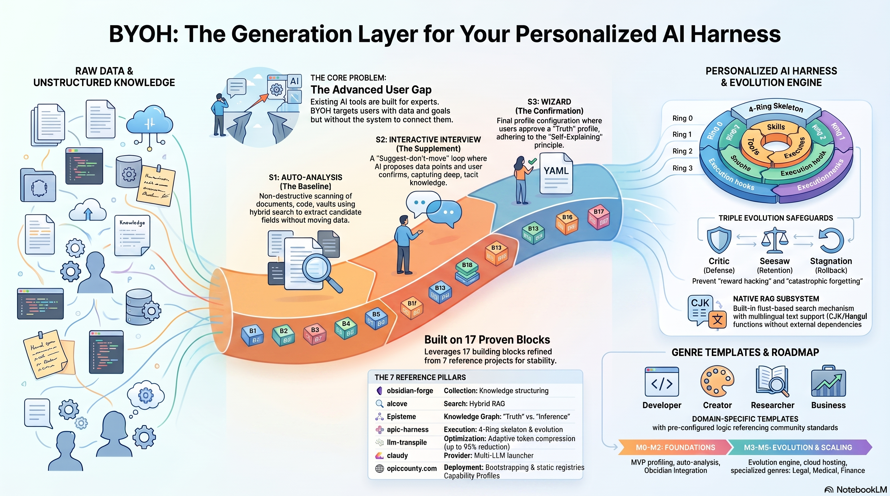

<div align="center">

**[English](../../../README.md)** | [한국어](../ko/README.md) | [日本語](../ja/README.md) | **简体中文** | [Español](../es/README.md) | [Deutsch](../de/README.md) | [Français](../fr/README.md) | [Português](../pt/README.md) | [Русский](../ru/README.md) | [العربية](../ar/README.md)

# BuildYourOwnHarness (BYOH)

### 专属于你的 AI 智能体

*不是通用模板，而是根据你的角色、专业和目标编译出的定制化工作台。*



</div>

大多数 AI 配置给你一套固定功能，然后说"自己摸索吧"。BYOH 反其道而行：BYOH 会先访谈你，**搞清楚你实际在做什么**，然后生成专属的智能体工作台——技能、记忆、流水线——开箱即用，无需手动调教。

## 适合哪些人

- **开发者** —— 想要一个已经了解自己技术栈、测试风格和交付节奏的智能体
- **研究者** —— 需要将文献检索、引用追踪和综合分析串联在一起的完整流水线
- **创作者** —— 想要一个匹配自己写作风格和项目结构的创作伙伴
- **业务分析师** —— 需要决策框架和报告流水线，而不是裸聊天

如果你曾想过"要是 AI 真的了解我的上下文就好了"——这正是 BYOH 要解决的问题。

## 60 秒上手

BYOH 的设计初衷就是由**你的 AI 智能体**来驱动——不是让你敲命令。安装插件，然后直接对话即可。对话本身就是访谈、向导和构建过程。

```
1. Install the plugin      # Claude Code / Codex / agy —— 自动安装二进制
2. "Build me a harness"    # 你的智能体扫描仓库并编译出结果
```

下次会话时，你的主机会自动加载这套工作台——智能体、技能、记忆和流水线全部按你的工作方式调校到位。

## 安装插件（推荐）

使用的是 **Claude Code、Codex 或 agy**？安装插件即可。它打包了 MCP 服务器，并**在首次加载时自动安装二进制**——无需 Rust 工具链，无需手动配置：

**Claude Code：**
```bash
claude plugin marketplace add epicsagas/BuildYourOwnHarness
claude plugin install byoh@epicsagas
```

**agy（Antigravity）：**
```bash
agy plugin install /path/to/BuildYourOwnHarness
agy plugin enable byoh
```

**Codex：**
```bash
codex plugin marketplace add /path/to/BuildYourOwnHarness
codex plugin add byoh@epicsagas
```

### 使用其他兼容 MCP 的主机？

BYOH 说 MCP 协议，因此 Cursor、Zed、Continue 等也能用。安装一次[二进制](#安装)，然后把主机指向服务器即可：

```bash
byoh serve   # stdio MCP 服务器
```

```json
{ "mcpServers": { "byoh": { "command": "byoh", "args": ["serve"] } } }
```

> **注意：** 仓库目前为私有。请使用上面的路径。公开后将出现在 `epicsagas/plugins` 共享市场中。

## 智能体主导模式 —— 主路径

主机连接好之后，你不需要输命令——只需开口对话。你的智能体会直接调用 BYOH 的 MCP 工具，对话本身就是访谈、构建和进化循环：

> **你：** *我是一名后端 Go 开发者，这个月要交付一个支付 API。给我搭一套工作台。*
>
> **智能体：** *(通过 `profile_scan` 扫描你的仓库，通过 `profile_interview` 提几个有针对性的问题，把角色锁定为 `developer`)* → 编译出一个 `HarnessBundle` → 把智能体、技能、记忆以及一套安全交付流水线安装到 Claude Code 中。完成——下次会话时，你的智能体就已经**能熟练驾驭你的技术栈了**。

同样的流程，按建议的工具调用顺序排列：

```
profile_create → profile_scan → profile_interview → profile_confirm
           → compile → compile_dry_run → render_plugin → install_plugin
           → (可选) registry_clone_skill → (之后) evolve_cycle
```

可用工具：`profile_read`、`profile_create`、`profile_scan`、`profile_interview`、`profile_confirm`、`genre_list`、`compile`、`compile_dry_run`、`render_plugin`、`install_plugin`、`evolve_cycle`、`registry_clone_skill`、`catalog_search`、`catalog_vendor`。

想让智能体**手把手带你**走完整个流程吗？只需说一句 *"build my harness"*——内置的 `byoh-guide` 智能体会编排整个流程。

## 插件目录

目录基于 [`quemsah/awesome-claude-plugins`](https://github.com/quemsah/awesome-claude-plugins) 的 README 构建——这是一份社区维护的、按 Stars 排序的 Top 100 Claude 插件仓库列表。BYOH 提供预构建 bundle（**每周一 03:17 UTC 更新**），所以 `byoh catalog index` 几秒就完成；传 `--no-bundle` 可直接解析上游列表。

```bash
# 一次性索引——几秒钟下载预构建包
byoh catalog index

# 索引后完全离线搜索，无需网络
byoh catalog search "memory" --genre developer --limit 5

# 将插件添加到工作台
# 自动从克隆仓库中提取 license、keywords 和 genre
byoh catalog vendor obra/superpowers --genre developer
```

LLM 智能体（通过 `catalog_search` / `catalog_vendor` MCP 工具）可以自主完成整个流程——*"给我的工作台加个 memory 插件"*——你也可以直接用 CLI 驱动。

## 进阶用户：CLI（可选）

上述每一个流程都可以从终端完成。CLI 是**辅助性的**——适合脚本化、CI 场景，或者当你不想聊天时使用——但智能体主导的路径才是**推荐的正道**。

### 用 CLI 构建你的第一个工作台

```bash
byoh profile init me --paths ./src ./docs   # 自动扫描项目
byoh profile interview me                   # 约 5 分钟的问答
byoh profile confirm me --genre developer   # 锁定角色

byoh compile me --no-dry-run                # 校验 + 写出 HarnessBundle（dry-run 为默认）
byoh render me --target claude              # 或: codex | agy | all（默认: all）
byoh install me --scope local               # 渲染到 dist/，仅激活到此项目的 .claude/
byoh install me --scope global              # ...或 ~/.claude + ~/.codex + ~/.gemini（原 --host）
byoh install me --scope publish             # ...或添加 LICENSE + .gitignore 并输出 git 说明

byoh run me                                 # 以你的工作台启动
byoh evolve me                              # 根据会话反馈改进工作台
```

BYOH 会询问你的职责、专业水平、使用工具和 30 天目标。问卷会自动适配——研究者和开发者收到的问题不同。`evolve` 执行三重门控循环（Critic / Seesaw / Stagnation），无法绕过——进化过程安全且可审计。

## 底层原理

BYOH 的合成引擎将你的档案标签与技能注册表匹配，按依赖关系排序成流水线，输出 `HarnessBundle`——一个可以渲染为任意支持主机原生格式的 git 制品。

- **四环安全模型** —— 从内置技能（Ring 1）到社区/未信任技能（Ring 4），逐级加强验证
- **三重门控进化** —— 每次 `evolve` 必须通过 Critic（质量）、Seesaw（回归）、Stagnation（平台期）三道关卡，无法绕过
- **目标导向流水线** —— 声明 30 天目标（产品发布、研究报告、安全交付……）后自动叠加对应技能阶梯

架构：六边形架构——`domain / ports / adapters / application / compiler / evolve / templates / deploy / i18n / obs / security / cli`。完整架构指南见 `AGENTS.md`。

## 完整 CLI 参考

```bash
# 档案管理
byoh profile init <slug> [--paths ...]       # 非破坏性项目扫描
byoh profile interview <slug>                # 引导式问答
byoh profile confirm <slug> --genre <g>      # 确认并锁定档案

# 构建
byoh compile <slug> [--no-dry-run]          # dry-run 为默认，写 bundle 需 --no-dry-run
byoh render <slug> [--target <host>]        # claude | codex | agy | all（默认: all）
byoh install <slug> [--target <host>] [--scope local|global|publish] [--host] [--force]  # dist/ 树; --scope 决定安装位置（local=此项目, global=HOME, publish=+LICENSE/.gitignore+git 步骤）。--host 是 --scope global 的旧版。

# 运行与进化
byoh run <slug>
byoh evolve <slug>

# 社区技能
byoh vendor add <src> --genre <g> --id <id> [--keywords k1,k2] [--trust] [--sha <s>]
byoh vendor list
byoh vendor remove <id> --genre <g>

# 目录
byoh catalog index [--no-bundle] [--limit N]
byoh catalog search "<query>" [--genre <g>] [--tags k1,k2] [--limit N]
byoh catalog vendor <owner/repo> [--genre <g>] [--keywords k1,k2]
```

## 安装

仅当你**不**使用插件（插件会自动安装二进制），或者想在非插件 MCP 主机上使用 BYOH 时才需要。

### 二进制安装（无需 Rust 工具链）

**macOS / Linux：**
```bash
curl --proto '=https' --tlsv1.2 -LsSf \
  https://github.com/epicsagas/BuildYourOwnHarness/releases/latest/download/install.sh | sh
```

**Windows（PowerShell）：**
```powershell
irm https://github.com/epicsagas/BuildYourOwnHarness/releases/latest/download/install.ps1 | iex
```

**从源码构建：**
```bash
cargo install byoh --git https://github.com/epicsagas/BuildYourOwnHarness
```

```bash
byoh --version   # 验证安装
```

## 构建与开发

```bash
cargo build --release
cargo clippy --all-targets -- -D warnings
cargo test                        # 单元测试 + 端到端测试
cvp                               # 并行执行：check → clippy → test → fmt → build
```

`mcp` feature（stdio MCP 服务器）默认开启。BYOH 不内置任何知识库——如需检索能力，请把生成的工作台指向一个文档服务器，例如 [alcove](https://github.com/epicsagas/alcove)。

## 致谢

BYOH 站在多个社区项目的肩膀上：

- **插件目录** — 取自 [`quemsah/awesome-claude-plugins`](https://github.com/quemsah/awesome-claude-plugins)，一份按 Stars 排序的 Top 100 Claude 插件仓库社区列表。没有它就没有目录。
- **配套工具** — 设计为与 [alcove](https://github.com/epicsagas/alcove)（文档服务器 / RAG）、[Episteme](https://github.com/epicsagas/Episteme)（知识图谱）、[obsidian-forge](https://github.com/epicsagas/obsidian-forge)（库自动化）协同。
- **开源技术栈** — 基于 [clap](https://docs.rs/clap)、[serde](https://serde.rs)、[ureq](https://docs.rs/ureq) 和 Rust 生态构建。

目录条目和引入的社区技能各自遵循其许可证（引入时自动检测）。BYOH 本身是 Apache-2.0。

## 许可证

Apache-2.0.
